# Airflow

## What is Apache Airflow?

Airflow is a *scheduler for workflows* such as data pipelines, similar to Luigi and Oozie. Fundamentally, Airflow is an orchestrator of a sequence of tasks.

It was designed primarily for tasks that move, analyze, and transform data. Most tutorials will assume you will be using it for this purpose. But it could also schedule a tweet to your mom on her birthday or call random pay phones. Airflow doesn’t care.

Airflow does this by giving you a language and templates to define sequences of tasks. These tasks can be anything a computer can do: running a script, querying a database, sending an email, waiting for a file to appear on a server.

Airflow manages when these sequences should run, what order to run the tasks in each sequence, and what to do if a task fails. It also manages the resources necessary to run these tasks, scheduling tasks as computing resources become available.


**Airflow’s primary responsibilities are:**
* Task *scheduling and triggering*, including error handling and logging of what happened.
Managing the resources necessary to run these tasks. Resources can range from one server to entire clusters. When a task is due to be run, Airflow decides when and how to run it depending on the resources available.
* *Providing a structured way for defining a sequence of tasks* (they are just objects in Python).
* *Setting and storing variables and external connection configurations* to be referenced by tasks. This helps manage the databases and services tasks will need to talk to.

Now, you are ready to go to official documentation and read the first pages from it.

**Meet the main Principles:**
> https://airflow.apache.org/ 

* **Scalable**
Airflow has a modular architecture and uses a message queue to orchestrate an arbitrary number of workers. Airflow is ready to scale to infinity.

* **Dynamic**
Airflow pipelines are defined in Python, allowing for dynamic pipeline generation. This allows for writing code that instantiates pipelines dynamically.

* **Extensible**
Easily define your own operators and extend libraries to fit the level of abstraction that suits your environment.

* **Elegant**
Airflow pipelines are lean and explicit. Parametrization is built into its core using the powerful Jinja templating engine.


Project Info:
https://airflow.apache.org/project.html

AirFlow tutorial https://github.com/tuanavu/airflow-tutorial

## What is a Workflow?
* a sequence of tasks 
* started on a schedule or triggered by an event 
* frequently used to handle big data processing pipelines

## A typical workflows

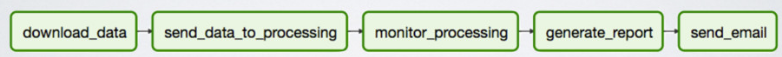

1. download data from source
2. send data somewhere else to process
3. Monitor when the process is completed
4. Get the result and generate the report
5. Send the report out by email

## A traditional ETL approach

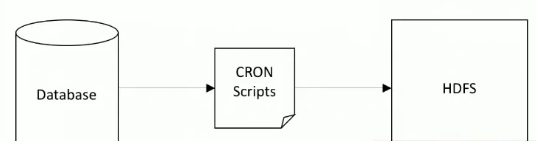

Example of a naive approach:
* Writing a script to pull data from database and send it to HDFS to process.
* Schedule the script as a cronjob.

### Problems

**Failures:**
* retry if failure happens (how many times? how often?)

**Monitoring:**
* success or failure status, how long does the process runs?

**Dependencies:**
* Data dependencies: upstream data is missing.
* Execution dependencies: job 2 runs after job 1 is finished.

**Scalability:**
* there is no centralized scheduler between different cron machines.

**Deployment:**
* deploy new changes constantly

**Process historic data:**
* backfill/rerun historical data

## Apache Airflow

* The project joined the Apache Software Foundation’s incubation program in 2016.
* A workflow (data-pipeline) management system developed by Airbnb
    * A framework to define tasks & dependencies in python
    * Executing, scheduling, distributing tasks accross worker nodes.
    * View of present and past runs, logging feature
    * Extensible through plugins
    * Nice UI, possibility to define REST interface
    * Interact well with database
* Used by more than 200 companies: Airbnb, Yahoo, Paypal, Intel, Stripe,…

### Airflow DAG

Workflow as a **Directed Acyclic Graph (DAG)** with multiple tasks which can be executed independently.
*Airflow DAGs are composed of Tasks.*


Several modules ago you ran the Apache airflow for the first time, and now we need to give an overview of the main concepts and get a better understanding of things like DAGs, DAG Run, Task Instance.

Documentation (read including ‘Scope’ and ‘Context Manager’ sub modules):
https://airflow.apache.org/concepts.html#dags 


Pay attention to the sentence ‘DAGs are defined in standard Python files that are placed in Airflow’s `DAG_FOLDER’ from doc.

First, those python files are called ‘DAGfile’.

Second, we will have a closer look on what `DAG_FOLDER` is when we will talk about configuration and `DagBags`.  

### Operators and Tasks 
Documentation (read including ‘DAG Assignment’ and ‘Bitshift Composition’ sub modules):
https://airflow.apache.org/concepts.html#operators 
https://airflow.apache.org/concepts.html#tasks 


### TaskInstances
Documentation:
https://airflow.apache.org/concepts.html#task-instances 

### DagRuns
Documentation:
https://airflow.apache.org/scheduler.html#dag-runs 


The DagRun is an instantiation of a DAG in time. It’s similar to an instance of the class, with DAG as a class and DAG Run as an instance (it's just a metaphor to understand the logic behind DAG and DAGRun, not the current implementation in code).


Now watch a short video, which explains all this stuff in Airflow UI and after that go to the next module to read the article: “Understanding Apache Airflow key concepts”.  It will add more clarity to understanding Airflow Key Concepts and Architecture in common.

Apache Airflow in Production: A Fictional Example
https://www.youtube.com/watch?v=iTg-a4icf_I 


### What makes Airflow great?

* Can handle upstream/downstream dependencies gracefully (Example: upstream missing tables)
* Easy to reprocess historical jobs by date, or re-run for specific intervals
* Jobs can pass parameters to other jobs downstream
* Handle errors and failures gracefully. Automatically retry when a task fails.
* Ease of deployment of workflow changes (continuous integration)
* Integrations with a lot of infrastructure (Hive, Presto, Druid, AWS, Google cloud, etc)
* Data sensors to trigger a DAG when data arrives
* Job testing through airflow itself
* Accessibility of log files and other meta-data through the web GUI
* Implement trigger rules for tasks
* Monitoring all jobs status in real time + Email alerts
* Community support

### Airflow applications
* **Data warehousing**: cleanse, organize, data quality check, and publish/stream data into our growing data warehouse
* **Machine Learning**: automate machine learning workflows
* **Growth analytics**: compute metrics around guest and host engagement as well as growth accounting
* **Experimentation**: compute A/B testing experimentation frameworks logic and aggregates
* **Email targeting**: apply rules to target and engage users through email campaigns
* **Sessionization**: compute clickstream and time spent datasets
* **Search**: compute search ranking related metrics
* **Data infrastructure maintenance**: database scrapes, folder cleanup, applying data retention policies, …

### The Hierarchy of Data Science

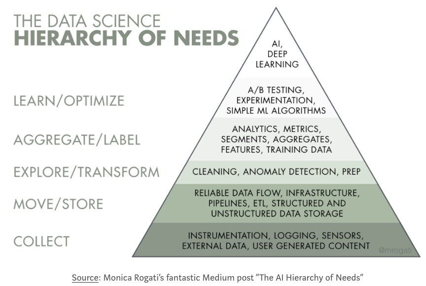

This framework puts things into perspective. Before a company can optimize the business more efficiently or build data products more intelligently, layers of foundational work need to be built first. Data is the fuel for all data products.

Unfortunately, most data science training program right now only focus on the top of the pyramid of knowledge. There is a discrepancy between the industry and the colleges or any data science training program. I hope this tutorial is helpful for anyone who tries to fill out the gap.


## Apache Airflow key concepts

> https://medium.com/@dustinstansbury/understanding-apache-airflows-key-concepts-a96efed52b1a

An example data processing workflow.


Airflow is a WMS that defines tasks and and their dependencies as code, executes those tasks on a regular schedule, and distributes task execution across worker processes. Airflow offers an excellent UI that displays the states of currently active and past tasks, shows diagnostic information about task execution, and allows the user to manually manage the execution and state of tasks.

### Workflows are “DAGs”

Workflows in Airflow are collections of tasks that have directional dependencies. Specifically, Airflow uses directed acyclic graphs — or DAG for short — to represent a workflow. Each node in the graph is a task, and edges define dependencies amongst tasks (The graph is enforced to be acyclic so that there are no circular dependencies that can cause infinite execution loops).

On the top how our example workflow is represented in Airflow as a DAG. Notice the similarity in the structure of the execution plan for our example workflow tasks in Figure 1.1 and the structure of the DAG in Figure 3.2.

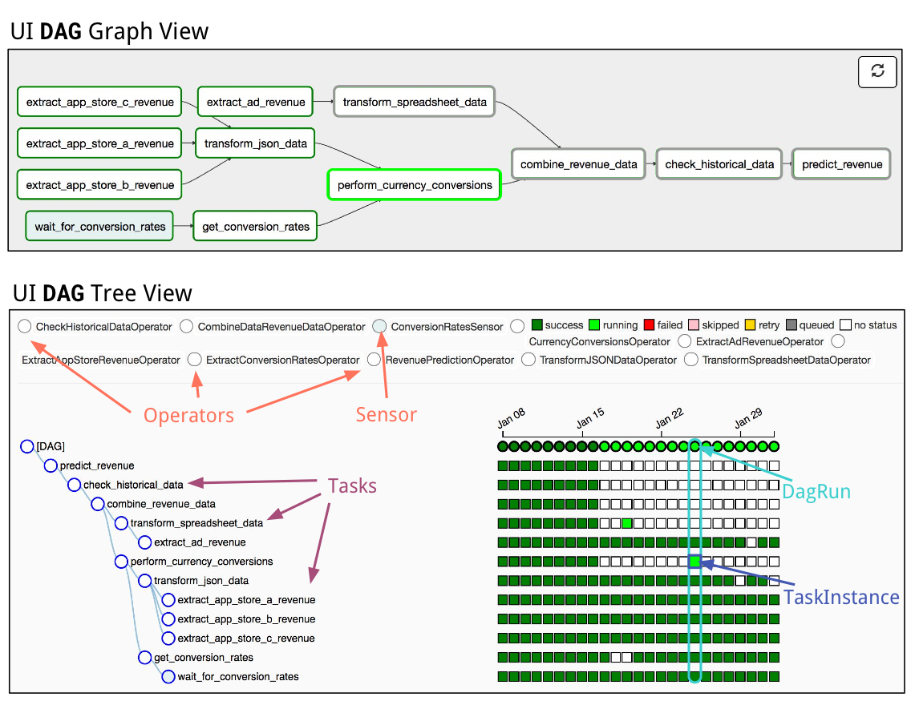
Screenshots from the Airflow UI, Representing the example workflow DAG. Top Subpanel: The Graph View of the DagRun for Jan. 25th. Dark green nodes indicate TaskInstances with “success” states. The light green node depicts a TaskInstance in the “running” state. Bottom Subpanel: The Tree View of the example_workflow DAG. The main components of Airflow are highlighted in screen shot, including Sensors, Operators, Tasks, DagRuns, and TaskInstances. DagRuns are represented as columns in the graph view — the DagRun for Jan. 25th is outlined in cyan. Each square in the graph view represents a TaskInstance — the TaskInstance for the (“running”) perform_currency_conversion task on Jan. 25th is outlined in blue.

At a high level, a DAG can be thought of as a container that holds tasks and their dependencies, and sets the context for when and how those tasks should be executed. 
Each DAG has a set of properties:
* most important of which are its `dag_id` - a unique identifier amongst all DAGs, 
* `start_date`, the point in time at which the DAG’s tasks are to begin executing,
* `schedule_interval` - or how often the tasks are to be executed. 
* each DAG can be initialized with a set of `default_arguments` - inherited by all tasks in the DAG.

example workflow in Airflow:
```python
# each Workflow/DAG must have a unique text identifier
WORKFLOW_DAG_ID = 'example_workflow_dag'

# start/end times are datetime objects
# here we start execution on Jan 1st, 2017
WORKFLOW_START_DATE = datetime(2017, 1, 1)

# schedule/retry intervals are timedelta objects
# here we execute the DAGs tasks every day
WORKFLOW_SCHEDULE_INTERVAL = timedelta(1)

# default arguments are applied by default to all tasks 
# in the DAG
WORKFLOW_DEFAULT_ARGS = {
    'owner': 'example',
    'depends_on_past': False,
    'start_date': WORKFLOW_START_DATE,
    'email': ['example@example_company.com'],
    'email_on_failure': True,
    'email_on_retry': False,
    'retries': 5,
    'retry_delay': timedelta(minutes=5)
}

# initialize the DAG
dag = DAG(
    dag_id=WORKFLOW_DAG_ID,
    start_date=WORKFLOW_START_DATE,
    schedule_interval=WORKFLOW_SCHEDULE_INTERVAL,
    default_args=WORKFLOW_DEFAULT_ARGS,
)
```

### `Operators`, `Sensors`, and Tasks

Although the DAG is used to organize tasks and set their execution context, DAGs do not perform any actual computation. 
Instead, tasks are the element of Airflow that actually “do the work” we want performed. Tasks can have two flavors: 
    * they can either execute some explicit *operation*, in which case they are an **Operator**, or they can pause the execution of dependent tasks until some criterion has been met, in which case they are a Sensor. 
    In principle, **Operators** can perform any function that can be executed in Python. 
    * **Sensors** can check the state of any process or data structure.

Operator and Sensor classes to implement our example workflow.
```python
##################################################
# Examples of Custom Sensors / Operators (NoOps) #
##################################################

class ConversionRatesSensor(BaseSensorOperator):
    """
    An example of a custom Sensor. Custom Sensors generally overload
    the `poke` method inherited from `BaseSensorOperator`
    """
    def __init__(self, *args, **kwargs):
        super(ConversionRatesSensor, self).__init__(*args, **kwargs)

    def poke(self, context):
        print 'poking {}'.__str__()
        
        # poke functions should return a boolean
        return check_conversion_rates_api_for_valid_data(context)

class ExtractAppStoreRevenueOperator(BaseOperator):
    """
    An example of a custom Operator that takes non-default 
    BaseOperator arguments. 
    
    Extracts data for a particular app store identified by 
    `app_store_name`.
    """
    def __init__(self, app_store_name, *args, **kwargs):
        self.app_store_name = app_store_name
        super(ExtractAppStoreRevenueOperator, self).__init__(*args, **kwargs)

    def execute(self, context):
        print 'executing {}'.__str__()
        
        # pull data from specific app store
        json_revenue_data = extract_app_store_data(self.app_store_name, context)
        
        # upload app store json data to filestore, can use context variable for 
        # date-specific storage metadata
        upload_appstore_json_data(json_revenue_data, self.app_store_name, context)

class TransformAppStoreJSONDataOperator(BaseOperator):
    """
    An example of a custom Operator that takes non-default 
    BaseOperator arguments.
    
    Extracts, transforms, and loads data for an array of app stores 
    identified by `app_store_names`.
    """
    def __init__(self, app_store_names, *args, **kwargs):
        self.app_store_names = app_store_names
        super(TransformJSONDataOperator, self).__init__(*args, **kwargs)

    def execute(self, context):
        print 'executing {}'.__str__()
        
        # load all app store data from filestores. context variable can be used to retrieve
        # particular date-specific data artifacts
        all_app_stores_extracted_data = []
        for app_store in self.app_store_names:
            all_app_stores_extracted_data.append(extract_app_store_data(app_store, context))
        
        # combine all app store data, transform to proper format, and upload to filestore 
        all_app_stores_json_data = combine_json_data(all_app_stores_extracted_data)
        app_stores_transformed_data = transform_json_data(all_app_stores_json_data)
        upload_data(app_stores_transformed_data, context)

```

Note that generally **Operators** and **Sensors** are defined in separate files and imported into the same namespace we define the DAG. However, we could have added these class definitions to the same DAG-definition file as well.

Formally, Airflow defines a task as an instantiations of either the Sensor or Operator classes. Instantiating a task requires providing a unique `task_id` and DAG container in which to add the task (Note: in versions ≥ 1.8, there is no longer a DAG object requirement). 
The code block below shows how we would instantiate all the tasks needed to perform our example workflow. (Note: We assume that all Operators that are being referenced in our examples have been defined in or imported into our namespace).

```python
########################
# Instantiating Tasks  #
########################

# instantiate the task to extract ad network revenue
extract_ad_revenue = ExtractAdRevenueOperator(
    task_id='extract_ad_revenue',
    dag=dag)

# dynamically instantiate tasks to extract app store data
APP_STORES = ['app_store_a', 'app_store_b', 'app_store_c']
app_store_tasks = []
for app_store in APP_STORES:
    task = ExtractAppStoreRevenueOperator(
        task_id='extract_{}_revenue'.format(app_store),
        dag=dag,
        app_store_name=app_store,
        )
    app_store_tasks.append(task)

# instantiate task to wait for conversion rates data avaibility
wait_for_conversion_rates = ConversionRatesSensor(
    task_id='wait_for_conversion_rates',
    dag=dag)

# instantiate task to extract conversion rates from API
extract_conversion_rates = ExtractConversionRatesOperator(
    task_id='get_conversion_rates',
    dag=dag)

# instantiate task to transform Spreadsheet data
transform_spreadsheet_data = TransformAdsSpreadsheetDataOperator(
    task_id='transform_spreadsheet_data',
    dag=dag) 

# instantiate task transform JSON data from all app stores
transform_json_data = TransformAppStoreJSONDataOperator(
    task_id='transform_json_data',
    dag=dag,
    app_store_names=APP_STORES)

# instantiate task to apply currency exchange rates
perform_currency_conversions = CurrencyConversionsOperator(
    task_id='perform_currency_conversions',
    dag=dag)

# instantiate task to combine all data sources
combine_revenue_data = CombineDataRevenueDataOperator(
    task_id='combine_revenue_data',
    dag=dag)  

# instantiate task to check that historical data exists
check_historical_data = CheckHistoricalDataOperator(
    task_id='check_historical_data',
    dag=dag)

# instantiate task to make predictions from historical data
predict_revenue = RevenuePredictionOperator(
    task_id='predict_revenue',
    dag=dag)  
```

This task instantiation code is executed in the same file/namespace as the DAG definition. We can see that the code for adding tasks is concise and allows for in-line documentation via comments. Lines 10–19 demonstrate one of the strengths of defining workflows in code. 
We are able to dynamically define three separate tasks for extracting data from each of the app stores using a for loop. Though this approach may not buy us much in this small example, the benefits are huge as the number of app stores increases.

### Defining Task Dependencies

A key strength of Airflow is the concise and intuitive conventions for defining dependencies among tasks. The code below shows how we would define the task dependency graph for our example workflow:
```python
###############################
# Defining Tasks Dependencies #
###############################

# dependencies are set using the `.set_upstream` and/or 
# `.set_downstream` methods
# (in version >=1.8.1, can also use the
# `extract_ad_revenue << transform_spreadsheet_data` syntax)

transform_spreadsheet_data.set_upstream(extract_ad_revenue)

# dynamically define app store dependencies
for task in app_store_tasks:
    transform_json_data.set_upstream(task)

extract_conversion_rates.set_upstream(wait_for_conversion_rates)

perform_currency_conversions.set_upstream(transform_json_data)
perform_currency_conversions.set_upstream(extract_conversion_rates)

combine_revenue_data.set_upstream(transform_spreadsheet_data)
combine_revenue_data.set_upstream(perform_currency_conversions)

check_historical_data.set_upstream(combine_revenue_data)

predict_revenue.set_upstream(check_historical_data) 
```

Again, this code is run in the same file/namespace as the DAG definition. Task dependencies are set using the `set_upstream` and `set_downstream` operators (Though, in version ≥ 1.8, it’s also possible to use the bitshift operators `<<` and `>>` to perform the same operations more concisely). A task can have multiple dependencies (e.g. `combine_revenue_data`), or none at all (e.g. all `extract_*` tasks).

The Airflow DAG created by the above code, as rendered by Airflow’s UI (we’ll soon get to the UI in more detail). The DAG has a dependency structure that is very similar the execution plan. When the DAG is being executed, Airflow will also use this dependency structure to automagically figure out which tasks can be run simultaneously at any point in time (e.g. all the `extract_*` tasks).

### DagRuns and TaskInstances

Once we’ve defined a DAG — i.e. we’ve instantiated tasks and defined their dependencies — we can then execute the tasks based on the parameters of the DAG. 
A key concept in Airflow is that of an `execution_time`. When the Airflow scheduler is running, it will define a regularly-spaced schedule of dates for which to execute a DAG’s associated tasks. The execution times begin at the DAG’s `start_date` and repeat every `schedule_interval`. 

For our example the scheduled execution times would be (‘2017–01–01 00:00:00’, ‘2017–01–02 00:00:00’, ...). For each `execution_time`, a DagRun is created and operates under the context of that execution time. Thus a DagRun is simply a DAG with some execution time.

All the tasks associated with a `DagRun` are referred to as `TaskInstances`. 
A `TaskInstance` is a task that has been instantiated and has an `execution_date` context (see Bottom Subpanel). 

`DagRuns` and `TaskInstances` are central concepts in Airflow. 
Each `DagRun` and `TaskInstance` is associated with an entry in Airflow’s metadata database that logs their state (e.g. “queued”, “running”, “failed”, “skipped”, “up for retry”). Reading and updating these states is key for Airflow’s scheduling and execution processes.

### Airflow’s Architecture


At its core, Airflow is simply a queuing system built on top of a metadata database. The database stores the state of queued tasks and a scheduler uses these states to prioritize how other tasks are added to the queue. This functionality is orchestrated by four primary components (refer to the Left Subpanel):
1. **Metadata Database**: this database stores information regarding the state of tasks. Database updates are performed using an abstraction layer implemented in SQLAlchemy. This abstraction layer cleanly separates the function of the remaining components of Airflow from the database.
2. **Scheduler**: The Scheduler is a process that uses DAG definitions in conjunction with the state of tasks in the metadata database to decide which tasks need to be executed, as well as their execution priority. The Scheduler is generally run as a service.
3. **Executor**: The Executor is a message queuing process that is tightly bound to the Scheduler and determines the worker processes that actually execute each scheduled task. There are different types of Executors, each of which uses a specific class of worker processes to execute tasks. For example, the LocalExecutor executes tasks with parallel processes that run on the same machine as the Scheduler process. Other Executors, like the CeleryExecutor execute tasks using worker processes that exist on a separate cluster of worker machines.
4. **Workers**: These are the processes that actually execute the logic of tasks, and are determined by the Executor being used.

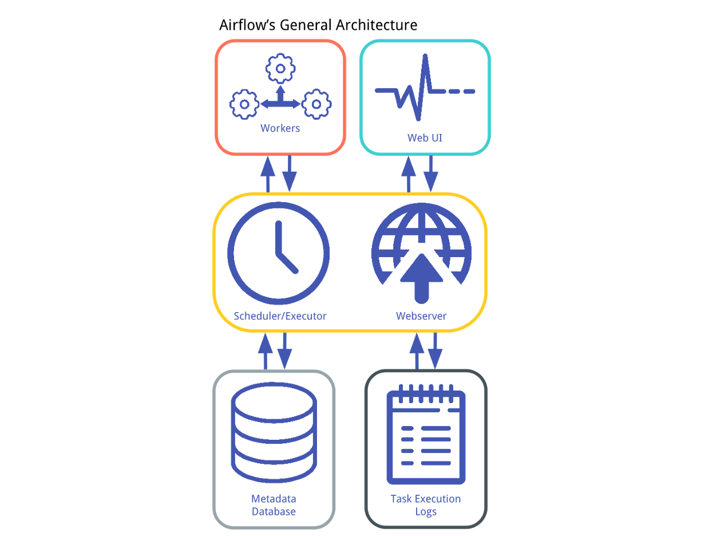

## Scheduler Operation

At first, the operation of Airflow’s scheduler can seem more like black magic than a logical computer program. That said, understanding the workings of the scheduler can save you a ton of time if you ever find yourself debugging its execution. To save the reader from having to dig through Airflow’s source code (though we DO highly recommend it!), we outline the basic operation of the scheduler in pseudo-code:

```
Step 0. Load available DAG definitions from disk (fill DagBag)

While the scheduler is running:
	Step 1. The scheduler uses the DAG definitions to 
	        identify and/or initialize any DagRuns in the
	        metadata db.
	
	Step 2. The scheduler checks the states of the 
	        TaskInstances associated with active DagRuns, 
		resolves any dependencies amongst TaskInstances, 
		identifies TaskInstances that need to be executed, 
		and adds them to a worker queue, updating the status 
		of newly-queued TaskInstances to "queued" in the
		datbase.
	
	Step 3. Each available worker pulls a TaskInstance from 
		the queue and starts executing it, updating the 
	        database record for the TaskInstance from "queued" 
	        to "running".
	
	Step 4. Once a TaskInstance is finished running, the 
	        associated worker reports back to the queue 
	        and updates the status for the TaskInstance 
	        in the database (e.g. "finished", "failed", 
	        etc.)
	
	Step 5. The scheduler updates the states of all active 
	        DagRuns ("running", "failed", "finished") according 
	        to the states of all completed associated 
	        TaskInstances.
	
	Step 6. Repeat Steps 1-5
```

## Web UI

In addition to the primary scheduling and execution components, Airflow also includes components that support a full-featured Web UI including:
1. **Webserver**: This process runs a simple Flask application which reads the state of all tasks from the metadata database and renders these states for the Web UI.
2. **Web UI**: This component allows a client-side user to view and edit the state of tasks in the metadata database. Because of the coupling between the Scheduler and the database, the Web UI allows users to manipulate the behavior of the scheduler.
3. **Execution Logs**: These logs are written by the worker processes and stored either on disk or a remote file store (e.g. GCS or S3). The Webserver accesses the logs and makes them available to the Web UI.

Though these additional components are not necessary to the basic operation of Airflow, they offer functionally that really sets Airflow apart from other current workflow managers. Specifically the UI and integrated execution logs allows users to inspect and diagnose task execution, as well as view and manipulate task state.

## Command Line Interface

In addition to the Scheduler and Web UI, Airflow offers robust functionality through a command line interface (CLI). In particular, we found the following commands to be helpful when developing Airflow:
* `airflow test DAG_ID TASK_ID EXECUTION_DATE`. Allows the user to run a task in isolation, without affecting the metadata database, or being concerned about task dependencies. This command is great for testing basic behavior of custom Operator classes in isolation.
* `airflow backfill DAG_ID TASK_ID -s START_DATE -e END_DATE`. Performs backfills of historical data between `START_DATE` and `END_DATE` without the need to run the scheduler. This is great when you need to change some business logic of a currently-existing workflow and need to update historical data. (Note that backfills do not create DagRun entries in the database, as they are not run by the SchedulerJob class).
* `airflow clear DAG_ID`. Removes TaskInstance records in the metadata database for the `DAG_ID`. This can be useful when you’re iterating on the functionality of a workflow/DAG.
* `airflow resetdb`: though you generally do not want to run this command often, it can be very helpful if you ever need to create a “clean slate,” a situation that may arise when setting up Airflow initially (Note: *this command only affects the database, and does not remove logs*).


## Defining the DAG

> https://airflow.apache.org/docs/apache-airflow/stable/scheduler.html#dag-runs

To define a DAG you need to import the relevant classes and instantiate the DAG with default parameters:
```python
from datetime import datetime
from airflow import DAG

default_args = {
  'owner': 'your_user',
  'start_date': datetime(2018, 1, 1)
}
with DAG('gridu_dag', default_args=default_args, schedule_interval='@once') as dag:
    pass
```

```python
# Normal DAG without Context Manager
args = {
    'owner': 'airflow',
    'start_date': airflow.utils.dates.days_ago(2),
}

dag = DAG(
    dag_id='example_dag',
    default_args=args,
    schedule_interval='0 0 * * *',
)

run_this_last = DummyOperator(
    task_id='run_this_last',
    dag=dag,  # You need to repeat this for each task
)

run_this_first = BashOperator(
    task_id='run_this_first',
    bash_command='echo 1',
    dag=dag,  # You need to repeat this for each task
)

run_this_first >> run_this_last
```

```python
# DAG with Context Manager

args = {
    'owner': 'airflow',
    'start_date': airflow.utils.dates.days_ago(2),
}

with DAG(dag_id='example_dag', default_args=args, schedule_interval='0 0 * * *') as dag:

	run_this_last = DummyOperator(
	    task_id='run_this_last'
	)

	run_this_first = BashOperator(
	    task_id='run_this_first',
	    bash_command='echo 1'
	)

	run_this_first >> run_this_last
```

> `schedule_interval`: each DAG must have its own `schedule_interval`. This param has a default setting: schedule every 15 minutes, so if you don’t want your DAG to run each 15 minutes, set it to None. None is used when you only want to trigger dags manually. Note that `None` here is not a string “None” but rather a Python NoneType object. 
> `start_date` param expects `datetime` object

When you use context manager to define the DAG, you don’t need to pass `dag_id` as a task argument, because it is automatically linked to the DAG. Also, always remember to give each task a DAG-wide unique ID.

For each task, no matter what type of Operator it is, you can define a huge number of arguments, described and defined in BaseOperator.

For example:
    * retries - the number of retries that should be performed before failing the task
    * retry_delay - delay between retries
    * on_failure_callback - a function to be called when a task instance of this task fails. A context dictionary is passed as a single parameter to this function. Context contains references to related objects to the task instance and is documented under the macros section of the API.
    * run_as_user -  unix username to impersonate while running the task
    * task_concurrency - When set, a task will be able to limit the concurrent runs across execution_dates

To see a full list of possible options for customization look at docstring in BaseOperator: https://airflow.apache.org/docs/stable/_api/airflow/models/index.html#airflow.models.BaseOperator


Tasks are represented by operators that either perform an action, transfer data, or trigger if something has been done. In the first case they are called Operators, and in the second case -  Sensors.

Read short tutorial documentation: https://airflow.apache.org/tutorial.html#tasks 

Default args are the settings that will be shared by tasks of our DAG. These settings can be passed to individual tasks as arguments when creating them, but to avoid duplication we can define a DAG-wide dictionary with arguments to be passed to each task in the DAG. This is the best place to set common arguments like owner and a start date of our DAG.

> N.B. DAG can also be initialized with default parameters using params keyword argument. These parameters become accessible in templates (will be covered later). The difference is that default_args are something that remains unchanged between DAG runs while parameters may be passed when triggering DAG run and thus can be different for each run. Check parameters section of DAG class documentation for more information on this: https://airflow.apache.org/docs/stable/_api/airflow/models/dag/index.html#airflow.models.dag.DAG

In our example, we used a context manager to create a DAG (available since 1.8). All the tasks for the DAG should be indented to indicate that they are part of this DAG. Without this context manager, you'd have to set the dag parameter for each of your tasks.

Airflow will generate DAG runs from the `start_date` with the specified `schedule_interval`. 
Once a DAG is active, Airflow continuously checks in the database if all the DAG runs have successfully run since the start_date. Any missing DAG runs are automatically scheduled. With `schedule_interval='0 0 * * *'` we've specified a run at every hour 0; the DAG will run each day at 00:00  after 'start_date': datetime(2018, 1, 1).

See crontab.guru for help with deciphering cron schedule expressions. Alternatively, you can use strings like '@daily' and '@hourly' (you see them previously in Dag Run documentation)

Pay attention to param: 'owner'. It's the user that ‘owns’ the DAG. This info can be found in UI, and more info about this is to follow in ‘Security’ module.
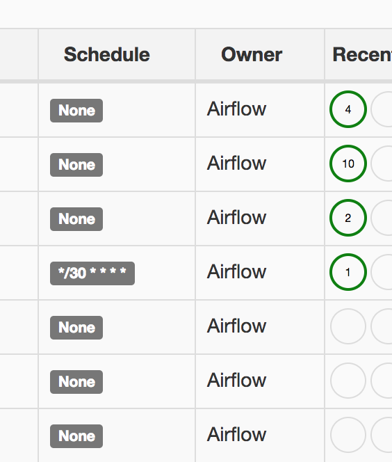

Right now our DAG is empty. We want our DAG to have some ‘steps’.

For that, we have to add tasks to the DAG that will be executed. A task is just an instantiated operator class with all the specific information required for execution passed to the constructor.

> Pay attention: Change the name of your DAG when you change the start date.

*Changing the `start_date`* of a DAG creates *a new entry in Airflow's database*, which could confuse the Scheduler because there will be two DAGs with the same name but different schedules.

*Changing the name of a DAG* also *creates a new entry in the database*, which powers the *dashboard*, so follow a consistent naming convention since changing a DAG's name doesn't delete the entry in the database for the old name.


## The DAGBag.

**The DagBag** is a collection of DAGs, parsed out of a folder tree and it has high-level configuration settings. This makes it easier to run distinct environments, for example, production and development, tests, or for different teams or security profiles. What would have been  system-level settings are now dagbag level, so that one system can run multiple, independent sets of settings.

In `airflow.cfg` you can define only one path for the dags folder in `dags_folder =` param. So, how can you use it and add other directories to load DAGs?

The solution is to put a file that will load DAGs into DABBag from defined list of directories (look at the code below):
Call this file something like `add_dag_bags.py`:
```python
""" add additional DAGs folders """
from airflow.models import DagBag

dags_dirs = ['path/to/dag_dir_1', 'path/to/dag_dir_2', 'path/to/dag_dir_3']

for dir in dags_dirs:
 dag_bag = DagBag(dir)

 if dag_bag:
    for dag_id, dag in dag_bag.dags.items():
        globals()[dag_id] = dag
```

Remember that  you need to have words `DAG` or `airflow` in filename to make Airflow load it, check ‘notes’ under DAG description: https://airflow.incubator.apache.org/concepts.html#dags 

So, Airflow will run your `add_dag_bags.py` and add DAGs from your additional DAGFolders. If all is okay with your DAGs, you will see them in UI. If you want to have deeper understanding of this process, check this article: https://medium.com/@xnuinside/how-to-load-use-several-dag-folders-airflow-dagbags-b93e4ef4663c 

Please note that if you load DAGs from additional DAGBags this way, you will not see the Traceback in UI, only in Webservers log. Also, you can not list such DAGs with ‘airflow list_dags’ because all such commands and features only work with DAGs loaded directly from  folder set in dags_folder config entry.

## Dynamically Generating DAGgs
> https://www.astronomer.io/guides/dynamically-generating-dags

The simplest way of creating a DAG in Airflow is to define it in the DAGs folder. Anything with a `.py` suffix will be scanned to see if it contains the definition of a new DAG.

```python
from datetime import datetime
from airflow import DAG
from airflow.operators.python_operator import PythonOperator

default_args = {'owner': 'airflow',
                'start_date': datetime(2018, 1, 1)
               }

dag = DAG('hello_world',
          schedule_interval='@daily',
          default_args=default_args,
          catchup=False)

def hello_world_py():
    print('Hello World')

with dag:
    t1 = PythonOperator(
        task_id='hello_world',
        python_callable=hello_world_py)
```

### Add DAGs dynamically based on input parameter

Multiple DAGs can be registered from the same file, but to improve maintainability and avoid namespace conflicts, it is advisable to keep one file per one unique DAG. However, if multiple unique DAGs are required with the same base code, it is possible to create these DAGs dynamically based on any number of configuration parameters.

A common use case for this is when pulling data from multiple APIs or database that have a similar incoming structure, require similar transform logic, and need to be loaded according to a similar pattern.

#### Create_DAG method

To create new dags, we're going to create a dag template within the create_dag function. The code here is almost identical to the previous code above when only one dag was being created but now it is wrapped in a method that allows for custom parameters to be passed in.
```python
from datetime import datetime
from airflow import DAG
from airflow.operators.python_operator import PythonOperator

def create_dag(dag_id,
               schedule,
               dag_number,
               default_args):

    def hello_world_py(*args):
        print('Hello World')
        print('This is DAG: {}'.format(str(dag_number)))

    dag = DAG(dag_id,
              schedule_interval=schedule,
              default_args=default_args)

    with dag:
        t1 = PythonOperator(
            task_id='hello_world',
            python_callable=hello_world_py,
            dag_number=dag_number)

    return dag
```

We can then set a simple loop (`range(1, 10)`) to generate these unique parameters and pass them to the global scope, thereby registering them as valid DAGs to the Airflow scheduler.
```python
from datetime import datetime
from airflow import DAG
from airflow.operators.python_operator import PythonOperator

def create_dag(dag_id,
               schedule,
               dag_number,
               default_args):

    def hello_world_py(*args):
        print('Hello World')
        print('This is DAG: {}'.format(str(dag_number)))

    dag = DAG(dag_id,
              schedule_interval=schedule,
              default_args=default_args)

    with dag:
        t1 = PythonOperator(
            task_id='hello_world',
            python_callable=hello_world_py,
            dag_number=dag_number)

    return dag


# build a dag for each number in range(10)
for n in range(1, 10):
    dag_id = 'hello_world_{}'.format(str(n))

    default_args = {'owner': 'airflow',
                    'start_date': datetime(2018, 1, 1)
                    }

    schedule = '@daily'

    dag_number = n

    globals()[dag_id] = create_dag(dag_id,
                                  schedule,
                                  dag_number,
                                  default_args)
```

### Adding DAGs based on Variable value

Taking this a step further, the input parameters don't have to exist in the dag file itself. Another common form of generating dags is by setting values in a Variable object.

We can retrieve this value by importing the Variable class and passing it into our range. Because we want the interpreter to register this file as valid regardless of whether the variable exists, the default_var is set to 10.
```python
from datetime import datetime
from airflow import DAG
from airflow.models import Variable
from airflow.operators.python_operator import PythonOperator

def create_dag(dag_id,
               schedule,
               dag_number,
               default_args):

    def hello_world_py(*args):
        print('Hello World')
        print('This is DAG: {}'.format(str(dag_number)))

    dag = DAG(dag_id,
              schedule_interval=schedule,
              default_args=default_args)

    with dag:
        t1 = PythonOperator(
            task_id='hello_world',
            python_callable=hello_world_py,
            dag_number=dag_number)

    return dag

number_of_dags = Variable.get('dag_number', default_var=10)
number_of_dags = int(number_of_dags)

for n in range(1, number_of_dags):
    dag_id = 'hello_world_{}'.format(str(n))

    default_args = {'owner': 'airflow',
                    'start_date': datetime(2018, 1, 1)
                    }

    schedule = '@daily'

    dag_number = n

    globals()[dag_id] = create_dag(dag_id,
                                  schedule,
                                  dag_number,
                                  default_args)
```
If we look at the scheduler logs, we can see this variable is being pulled into the DAG and added an additional DAG to the DagBag based on the value.

Then we can go to the main UI and see all of the new DAGs that have been created.

### Adding DAGs based on Connections
Creating DAGs based on a variable or set of variables is a very powerful feature of Airflow. But what if we want our number of DAGs to correspond to the number of connections (to an API, database, etc.) that are created in the "Connections" tab? In that case, we wouldn't want to have to create an additional variable unnecessarily every time we made a new connection -- that would be redundant.

Instead, we can pull the connections we have in our database by instantiating the "Session" and querying the "Connection" table. We can even filter our query so that this only pulls connections that match a certain criteria.

```python
from datetime import datetime
from airflow import DAG, settings
from airflow.models import Connection
from airflow.operators.python_operator import PythonOperator

def create_dag(dag_id,
               schedule,
               dag_number,
               default_args):

    def hello_world_py(*args):
        print('Hello World')
        print('This is DAG: {}'.format(str(dag_number)))

    dag = DAG(dag_id,
              schedule_interval=schedule,
              default_args=default_args)

    with dag:
        t1 = PythonOperator(
            task_id='hello_world',
            python_callable=hello_world_py,
            dag_number=dag_number)

    return dag

session = settings.Session()

conns = (session.query(Connection.conn_id)
                .filter(Connection.conn_id.ilike('%MY_DATABASE_CONN%'))
                .all())

for conn in conns:
    dag_id = 'hello_world_{}'.format(conn[0])

    default_args = {'owner': 'airflow',
                    'start_date': datetime(2018, 1, 1)
                    }

    schedule = '@daily'

    dag_number = conn

    globals()[dag_id] = create_dag(dag_id,
                                  schedule,
                                  dag_number,
                                  default_args)
```

Notice that like before we are accessing the Models library to bring in the `Connection` class (as we did previously with the `Variable` class). We are also accessing the `Session()` class from settings, which will allow us to query the current database session.

We can see that all of the connections that match our filter have now been created as a unique DAG. The one connection we had which did not match (`SOME_OTHER_DATABASE`) has been ignored.

## pipeline branching

Real pipelines sometimes have steps that should only be executed if a specific condition is met and skipped otherwise.

For example we need to create essential tables in a database only if they don’t yet exist to make our pipeline work without any preliminary manual set up.

So, we have a condition: table existence, and 2 paths to follow: create a new table or do nothing. This is called pipeline branching.

Branching is one of the most important and widely used mechanisms in workflows and orchestration. You need to use branching when further actions depend on the result of previous ones: one result leads to one sequence of steps, another result make pipeline follow another “branch”.

How can we do it in Airflow?
For such cases Airflow offers `BranchOperator`. `BranchOperator` it’s a subset of `PythonOperator`. All the branching logic (which way to follow and when) must be defined in a function passed in python_callable argument.

The official documentation gives an idea of using the  `BranchOperator`.

Documentation: https://airflow.apache.org/docs/stable/concepts.html?highlight=branch#branching

Now, read more about branching with examples: https://medium.com/@guillaume_payen/use-conditional-tasks-with-apache-airflow-98bab35f1846 


> Note that you need to use Branching only if you need to decide, based on some condition, which task to execute. If you just need to run tasks in parallel, simply use upstream, downstream, and not `BranchOperator`.

## TriggerRules
> https://airflow.apache.org/concepts.html#trigger-rules 
> Also check the source code of TriggerRule class to get the full variety of trigger rules: https://github.com/apache/airflow/blob/master/airflow/utils/trigger_rule.py

As mentioned in the previous module the default value for `trigger_rule` is `ALL_SUCCESS` and can be explained like “trigger this task when all direct upstream tasks were successful”.

Also, check out this hands-on with `BranchOpearator` and `TriggerRule`

## More about Operators

Different Operators generate certain types of tasks that become nodes in the DAG when instantiated. All operators derive from `BaseOperator` and inherit many attributes and methods that way. 
> Refer to the `BaseOperator` documentation for more details.

There are 3 main types of operators:
- **Operators** that performs an action, or tell another system to perform an action
- **Transfer** operators move data from one system to another
- **Sensors** are a special type of operator that keep running until a certain criterion is met.

Operators describe a single task in a workflow (DAG). The DAG will make sure that operators run in the correct order; except ones with dependencies operators generally run independently. In fact, they may run on two completely different machines.

Examples of operators are:
    - **BashOperator** - executes a bash command
    - **PythonOperator** - calls an arbitrary Python function
    - **EmailOperator** - sends an email using SMTP server configured
    - **SqlOperator** - executes a SQL command. **MySqlOperator**, **SqliteOperator**, **PostgresOperator**, **MsSqlOperator**, **OracleOperator**, **JdbcOperator**
    - **SimpleHttpOperator** – makes an HTTP request that can be used to trigger actions on a remote system.
    - **Qubole Operator**: allows users to run and get results from Presto, Hive, Hadoop, Spark Commands, Zeppelin Notebooks, Jupyter Notebooks, Data Import / Export Jobs on the configured Qubole account.

The actions are not actually executed by Airflow but rather passed to the relevant execution engine like RDBMS or a Python program.

You can find operators in modules `airflow.operators` and `airflow.providers`.

Ideally a single operator (and task) is one idempotent, atomic step in your pipeline: create a table, update a file, run a script. Some single action.

### Sensors

Airflow provides operators for many common tasks. Sensors are special Operators type. The main difference from Operators is that Sensor waits for a certain time or file, database row, S3 key, etc. Sensor ‘pokes’ some ‘object’, ‘database’, ‘filesystem’ and etc. until it satisfies some condition you defined.

Examples include a specific file landing in HDFS or S3, a partition appearing in Hive, or a specific time of the day. Or checking that a file was updated: the sensor will read files info until it identifies that the file has been updated. A bit different example is `ExternalTaskSensor` that waits for task to complete in a different DAG. In other words there are plenty of different sensors.

Sensors are derived from `BaseSensor` and run a `poke()` method at a `specified poke_interval`  until it returns `True`.

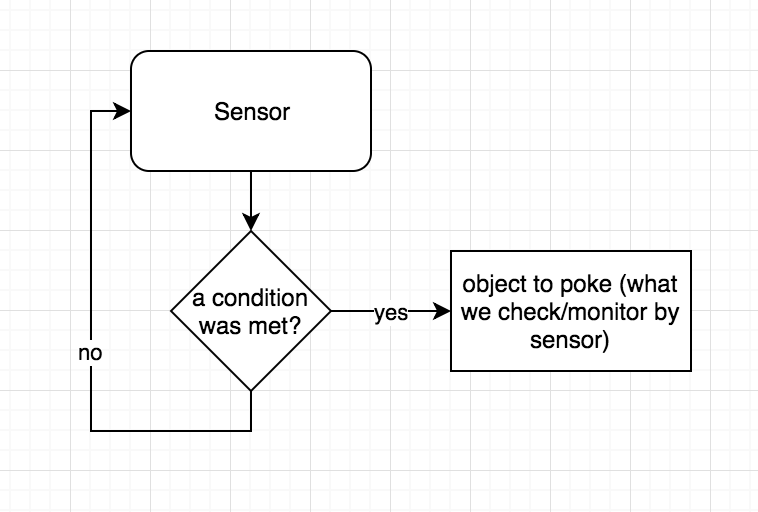


Sensors, examples:
- **ExternalTaskSensor** - `airflow.sensors.external_task_sensor` Waits for a task to complete in a different DAG
- **HivePartitionSensor**: waits for a specific value of partition of hive table to get created
- **S3KeySensor**: S3 Key sensors are used to wait for a specific file or directory to be available on an S3 bucket.
- **BashSensor** - `airflow.sensors.bash` Executes a bash command/script and returns True if and only if the return code is 0.
- **FileSensor** - `airflow.sensors.filesystem` Waits for a file or folder to land in a filesystem. If the path given is a directory then this sensor will only return true if some files exist inside of it (either directly, or within a subdirectory)
- **GCSObjectUpdateSensor** - `airflow.providers.google.cloud.sensors.gcs` Checks if an object is updated in Google Cloud Storage.
- **HttpSensor** - `airflow.providers.http.sensors.http` Executes a HTTP get statement and returns False on failure: 404 not found or response_check function returned False

You can find more in `airflow.sensors` and `airflow.providers`

#### Main arguments (Sensor settings):

Those settings are used by any type of sensor:
    `poke_interval` - Time in seconds that the job should wait in between each try
        `soft_fail` - Set to true to mark the task as SKIPPED on failure
        `timeout` - Time in seconds before the task times out and fails. You can define how long to wait for the condition until failing the task. Default value - 60 * 60 * 24 * 7 sec.

## Variables, Templating, Macros, Execution context

### Variables

> Read the official doc about Variables: https://airflow.apache.org/concepts.html#variables 

`Variables` is a feature of Apache Airflow that allows to store cluster-wide  variables which can be accessed from tasks and easily changed/added/removed with Airflow UI or CLI.

Find Variables in UI: `Admin → Variables`
You can store plain text and json inside Variable.

From Python code, you can access variables with class:
```python
from airflow.models import Variable
```

To load json from **Variable** use `Variable.get()` with `deserialize_json=True`

### Templating

> official doc:https://airflow.apache.org/concepts.html#jinja-templating 

In Variables official doc you see example with ` echo {{ var.value.<variable_name> }} `

This example shows how to access Airflow Variables from templates.


Templates are a possibility to generate string operator parameters from variables or by calling python functions. Keep in mind that not all arguments of Operator are treated as templates, some of them are considered as “ready-to-use” strings.

Let’s look at one more example of using templates to generate parameter for a task.
Command template:
```
gsutil_cp_command = "gsutil -m cp -r gs://{{ params.source_path }} gs://{{ params.dest_path }}/{{ ds }}"
```

With this line we define command to invoke gsutil to copy the data between buckets. Notice we have our bucket names parameters being rendered with Jinja.

We are using the Airflow builtin `{{ ds }}` variable to add current  date to path. The variable has  format `YYYYMMDD`. This way target directory is updated every day the DAG runs without need to make any changes in DAG code or parameters.

Task:
```python
gsutil_cp_pipeline = BashOperator(
    task_id=task_name,
    bash_command=gsutil_cp_command,
    params={'source_path': source_bucket + task_path, 'dest_path': target_bucket},
    dag=daily_incremental
    )
```

Note that the `bash_command` parameter in our `BashOperator` object uses the command template described above, and passes the `source_path` and `dest_path` parameters to render it. This block constructs a task from the result of each unique namespace and pipeline pairing, using the `source_bucket`, `target_bucket`, `task_name` and `task_path` variables as input.

This way you can generate several tasks with one command but different params.

In the template example, we see `builtin`  `param {{ ds }}`. Out of the box, Airflow provides a list of such `builtin` so called ``default` variables:


https://airflow.apache.org/docs/apache-airflow/stable/macros-ref.html?highlight=macros#default-variables


### Macros

> https://airflow.apache.org/docs/apache-airflow/stable/macros-ref.html?highlight=macros#default-variables
> https://airflow.readthedocs.io/en/stable/tutorial.html#templating-with-jinja 

Macros are a way to expose objects to your templates and live under the macros namespace in your templates.


### Execution context

Context - is a dict with special content inside, that could be passed to each task of your DAG. Inside context dict you can find:
```
   'END_DATE': ds,
   'conf': configuration,
   'dag': task.dag,
   'dag_run': dag_run,
   'ds': ds,
   'ds_nodash': ds_nodash,
   'end_date': ds,
   'execution_date': self.execution_date,
   'latest_date': ds,
   'macros': macros,
   'params': params,
   'run_id': run_id,
   'tables': tables,
   'task': task,
   'task_instance': self,
   'task_instance_key_str': ti_key_str,
   'test_mode': self.test_mode,
   'ti': self,
   'tomorrow_ds': tomorrow_ds,
   'tomorrow_ds_nodash': tomorrow_ds_nodash,
   'ts': ts,
   'ts_nodash': ts_nodash,
   'yesterday_ds': yesterday_ds,
   'yesterday_ds_nodash': yesterday_ds_nodash
```

Execution context is provided to a `PythonOperator` task by default.  

You can access context this way:
```python
def your_function_with_context(kwargs):
        for key in kwargs:
                print(key)

task = PythonOperator(task_id=”print_context”, python_callable=your_function_with_context)
```

Execution context is passed to python callable as a kwargs dict.

## SubDAGs and XCOMs

### SubDAGs

> articles: https://github.com/geosolutions-it/evo-odas/wiki/Airflow---about-subDAGs,-branching-and-xcom#subdags 
> Using SubDAGs in Airflow https://www.astronomer.io/guides/subdags/ 

SubDAGs are literally DAGs which are parts of other DAGs. They can be very useful to group several tasks into one (SubDAG task).


### Xcoms

> article about Xcoms: https://github.com/geosolutions-it/evo-odas/wiki/Airflow---about-subDAGs,-branching-and-xcom#xcom 
> The official documentation: https://airflow.apache.org/concepts.html#xcoms 

Xcom is Airflow functionality to make communication between task instances possible. One task can push a message to Xcom, another task or tasks can read this message.

#### How Xcom works inside

Sometimes you need to use Xcom in more tricky ways like, for example, get multiple values or get Xcom from previous DAG runs. To better understand how Xcom works and how to get the results that mentioned above read this article:


https://medium.com/analytics-vidhya/airflow-xcom-pull-and-push-under-the-hood-multiple-value-from-different-dags-and-etc-2b9b3a942299? 
[airflow_examples](airflow_examples)

#### Xcom as a Python Class
Xcom is data model that defined as a SQL-alchemy class with additional methods on it. You may  enter Apache Airflow sources and will take a look on it: https://github.com/apache/airflow/blob/v1-10-stable/airflow/models/xcom.py#L41 

Now, step away from this code and return to how you as developer do Xcom pull and push? You usually use same-named methods in Jinja templates in operators like `{{ ti.xcom_push(…) }}` or you use in in Python function (callable object) with `PythonOperator` or smth relative with `context[‘ti’].xcom_pull(key=None, task_ids=’push_values’)`. And those both ways use the same methods under the hood: task’s instances methods pull and push.

#### Task Instances methods

**xcom_push**

> https://github.com/apache/airflow/blob/v1-10-stable/airflow/models/taskinstance.py#L1485

This is a method xcom_push of task instance, that you are using to send some values in Xcom table in Apache Airflow Backend Database. As you can see in this copy-pasted from sources part of code:
```python
XCom.set(
    key=key, 
    value=value, 
    task_id=self.task_id,
    dag_id=self.dag_id,
    execution_date=execution_date or self.execution_date)
```
It just call method `set` of `Xcom` object with params. You can take a look on this method by your self (link on Xcom’s sources was upper). Note:

- `execution_date` always exist as a field of you xcom-record and this is import. 
- you can pass different from execution date manually, so, yes, you can provide `execution_date` as an argument to `xcom_push`
```python
context['ti'].xcom_push(key='some_key',  value='some_value'     execution_date=) # xcom_push with sending different execution date
```

**xcom_pull**

> https://github.com/apache/airflow/blob/v1-10-stable/airflow/models/taskinstance.py#L1517

This code always send `execution_date` as param to the `xcom_pull`, so this is how you *get Xcoms only from current DAGRun* — because under the hood it sends two params — `execution_date` and `dag_id`. \So this is how you get values only relative to your DAGRun. 
Xcom pull always by default search for records with 1-to-1 `execution` date and `dag_id`.

**How can I get Xcom that pulled by task of another DAG?** >> 
1. How I can get Xcoms with execution_date, that different from current run?
2. How I can get Xcoms from different DAG (different dag_id)?

* Get Xcoms for previous runs
Now take a look on xcom_pull arguments: https://github.com/apache/airflow/blob/v1-10-stable/airflow/models/taskinstance.py#L1524

We can pass to Xcom Pull several arguments:
```python
dag_id: Optional[str] = None   # answer on our question #2 
include_prior_dates: bool = False  # answer on our question number #1
```
- `dag_id` arg all clear it takes 1 string — `dag_id` that pushed Xcom, that you want to obtain.
- `include_prior_dates` is a flag. If it’s a `True` Airflow will search records with the same execution date, but also with earliest. 

So if you have `execution_date 2019–12–03 23:00:00` and set `include_prior_dates=True`, it can find xcom record, that was pushed previous, for example if our DAG runs hourly, at previous run in 2019–12–03 22:00:00.

It can be useful if you have a task, that at the start of your DAGRun take Xcom from previous run, for example, to get left border for data, that you want to process.

By default, tasks instance method `xcom_pull` return to you latest value that match the request. But sometime you want get more when one value, so, you need get_many method from Xcom class. Yes. You can use Xcom class methods directly, just with providing necessary args, for example:
```python
from airflow.models import XCom
XCom.get_many(
    execution_date=make_aware(datetime(2019, 12, 3, 0, 51, 00, 00)),
    dag_ids=["write_to_xcom"], include_prior_dates=True)
```
You can find in Xcom class also methods, that maybe can be useful to you.

* Be aware of ‘key’ Xcom argument

Pay attention to this description in docstring of Xcom pull method. 
*By default Xcom search records with `key = return_value`, so if you want get record with all keys or just remove key-filter you must set it to `key=None` **! Don’t forget about it.**

> The default key is 'return_value', also available as a constant `XCOM_RETURN_KEY`. This key is automatically given to XComs returned by tasks (as opposed to being pushed manually). To remove the filter, pass `key=None`.

## Airflow Plugins

> https://airflow.apache.org/docs/apache-airflow/stable/howto/custom-operator.html

Airflow allows you to create new Operators, Hooks, Sensors and other entities to suit the requirements of you or your team. The extensibility is one of the many reasons which makes Apache Airflow powerful.

Also, you can use this functionality for modifying Airflow Web UI: add new pages (views) and menu links.

## Debug and test Apache Airflow

> small note about tools for Debug Apache Airflow http://michael-harmon.com/blog/AirflowETL.html#Debugging-Airflow-Codes- 
> Test mode for unit tests:https://www.youtube.com/watch?v=UqVkNK4OXrI 
> Documentation: https://airflow.apache.org/docs/apache-airflow/stable/howto/use-test-config.html

> Example of tox.ini for Airflow Project (if you use tox to run test): https://gist.github.com/xnuinside/0a0cccf8321ad736628ec2b8ad166d2b

> Apache Airflow Meetup: Testing in Airflow Time: 15 min https://www.youtube.com/watch?v=qUwz20v7lcc 

> The article with code examples: https://blog.usejournal.com/testing-in-airflow-part-1-dag-validation-tests-dag-definition-tests-and-unit-tests-2aa94970570c

If you have difficulties testing your custom `Operators`, you can find examples of unit tests in Airflow sources: https://github.com/apache/incubator-airflow/tree/master/tests/operators 


### How about frameworks?

Apache Airflow is quite a young product. It graduated from Apache Airflow incubator at the end of 2018. Today, there are not so many testing tools, and there is still no “silver-bullet” solution. We want to say a few words about some of them that we think can grow and be added to Airflow must-have toolkit. You can spend some time reading about them, then put this knowledge to the bookshelf till the moment when you realize you really need this.

**Airflow Breeze**
Airflow Breeze is an easy-to-use integration test environment managed via Docker Compose . The environment is easy to use locally and it is also used by Airflow's CI Travis tests.

> https://github.com/PolideaInternal/airflow/blob/simplified-development-workflow/BREEZE.rst#airflow-breeze 


**Whirl** (not just instrument for tests)

> Fast iterative local development and testing of Apache Airflow workflows https://github.com/godatadriven/whirl 


## Connections, REST API, cli and other

Apache Airflow is a powerful tool with various features. In our course and our code practice, we haven’t touched upon all aspects of it. In this module, we want to talk about some more features that are regularly used working with Apache Airflow.

### Connections 

Airflow allows us to define global connections (i.e. some parameters used to connect to external systems: DBs, cloud storages,etc.). Those global connections can be easily accessed by all Airflow operators using a connection id.

> Define connection examples: http://michael-harmon.com/blog/AirflowETL.html#An-Example-ETL-Pipeline-With-Airflow- 

> Connections concept: https://airflow.apache.org/concepts.html#concepts-connections 

> Managing connections with UI: https://airflow.apache.org/howto/manage-connections.html 

### Airflow Command line

Airflow has a powerful command line functionality that allows to do most of  actions available in UI and even more.

We’ve already used it in our course, but we haven’t covered many possible options and tools.

> documentation: https://airflow.apache.org/cli.html 


### Airflow REST API

Airflow provides a REST API with Airflow Webserver.

It’s useful when you need to communicate with Apache Airflow from external systems.

> Docs - http://apache-airflow-docs.s3-website.eu-central-1.amazonaws.com/docs/apache-airflow/latest/stable-rest-api-ref.html#section/Overview
> List of Endpoints - https://github.com/apache/airflow/blob/2.0.0rc1/docs/apache-airflow/upgrading-to-2.rst#migration-guide-from-experimental-api-to-stable-api-v1


### Queues:

> https://airflow.apache.org/concepts.html#queues 

If you have used CeleryExecutor in code practice tasks and have several worker instances, you can make use of queues to define the worker that will always execute the Sensor task which checks for file in the local filesystem. Knowing this worker for sure will allow you to create the ‘run’ file in the container that checks for its existence.

The easiest way to configure a Celery-based worker to listen to specific queue is to pass queue name in command line. Below is the example docker-compose configuration for worker with custom queue:
```
  airflow-worker-1:

        image: "apache/airflow"

        container_name: "airflow-worker-1"

        command:

          - worker

          - "-cn"

          - airflow-worker-1

          - "--queues"

          - default,filesensor

        entrypoint: airflow

        volumes:

          - ./compose_data/airflow/dags:/usr/local/airflow/dags

          - ./compose_data/airflow/plugins:/usr/local/airflow/plugins

          - ./compose_data/airflow/airflow.cfg:/usr/local/airflow/airflow.cfg:ro

        depends_on:

          - postgres

          - redis
```

Here queue `filesensor` is only listened by this worker and task with this queue set will be executed on this worker only.

### Pools:

> https://airflow.apache.org/concepts.html#pools 

The pool parameter can be used in conjunction with priority_weight to define priorities in the queue, and which tasks get executed first as slots open up in the pool. The default priority_weight is 1, and can be bumped to any number. When sorting the queue to evaluate which task should be executed next, we use the priority_weight, summed up with all of the priority_weight values from tasks downstream from this task. You can use this to bump a specific important task and the whole path to that task gets prioritized accordingly.

## Packaged DAGs

> https://airflow.apache.org/docs/stable/concepts.html#packaged-dags

Let’s imagine that you need to use a specific third-party module to resolve a business issue. Installing new dependency in `dev/test/prod` environments is not a good idea. In this case you can use one of the concepts of Airflow called ‘Packaged DAGs’.

As you can see, one of the main use cases for them - installing extra modules which are not available by default on the system you are running Airflow on.

### Code Practice

In this module you need to add one more operator that will send notifications about Trigger DAG completion to Slack. For that purpose you will use a third-party module ‘slackclient’.

Since Grid Dynamics’s workspace has secure policies related to connection custom applications you need to create your own workspace.

Steps:
1/ Follow instructions below to create your workspace: https://slack.com/get-started#/
2. Create an application. Name it as you want. https://api.slack.com/
3. After creation you will see basic information about your application.
In the ‘Add features and functionality’ section click on ‘Permissions’ then in ‘Scopes’ under ‘Bot’ section add an OAuth scope called ‘chat:write:public’. After installation you will see a generated token that you need to save to a new connection in Airflow UI.

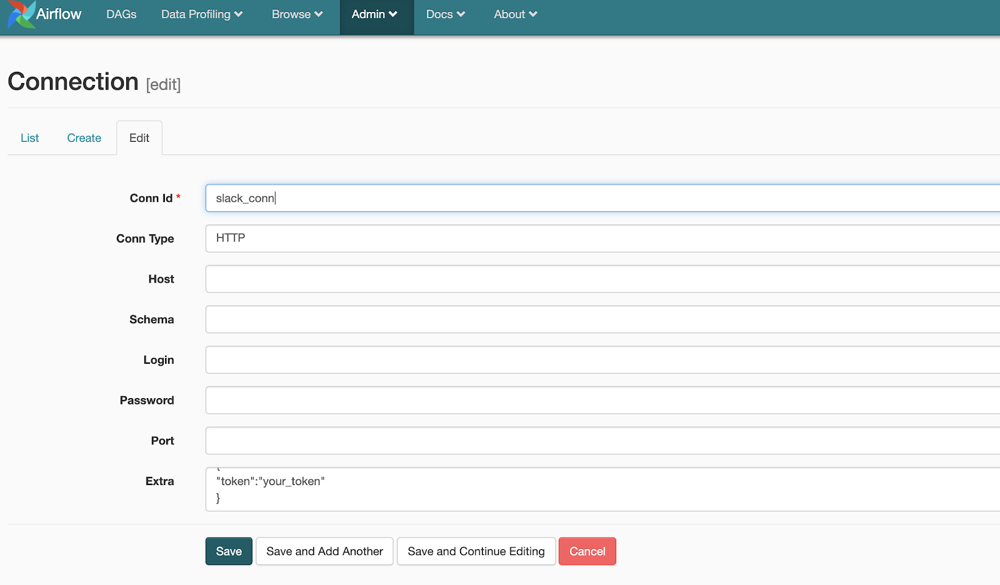

Create a `PythonOperator` that will send a message with DAG id and execution date to specific slack channel.
You can use the following code:
```python
from slack import WebClient
from slack.errors import SlackApiError

slack_token = get_from_connection
client = WebClient(token=slack_token)

try:
    response = client.chat_postMessage(channel="channel_name", text="Hello from your app! :tada:")
except SlackApiError as e:
    # You will get a SlackApiError if "ok" is False
    assert e.response["error"]  # str like 'invalid_auth', 'channel_not_found'
```

> For more information how to send messages you can refer to the following documentation: https://slack.dev/python-slackclient/basic_usage.html#sending-a-message

Once the above steps are completed, package your Trigger DAG to zip archive with necessary dependencies and check that everything works as expected.

## Secrets backend

In Airflow 1.10.10 was introduced a ‘secrets backend’. Before it there are only two options for sourcing creds — environment variables and metastore database.  This change gives you flexibility to easily use other sources.
If your credentials are already stored elsewhere, or you would prefer that they are stored elsewhere, then there would be no need to worry about loading them into the metastore, or into environment variables. This in itself is convenient. But it opens up some new possibilities.
For example, this would make it possible for a dev team to share one single source for credentials instead of having to distribute credentials to all developers in a text file. This would make it possible to ensure that all devs are always in sync, using the same credentials definitions.

With the new feature we can store and retrieve Airflow connections or Airflow variables from AWS SSM Parameter Store, Hashicorp Vault Secrets or you can roll your own.

For more information, read the official documentation: https://airflow.apache.org/docs/1.10.10/howto/use-alternative-secrets-backend.html#hashicorp-vault-secrets-backend

Description in Confluence is also useful to read: https://cwiki.apache.org/confluence/display/AIRFLOW/AIP-33+Secrets+backend

Astronomer prepared a good article: https://www.astronomer.io/guides/airflow-and-hashicorp-vault/

## Queues and DAG Serialization

One of the possible ways to improve performance is load balancing. Let’s imagine particular DAG includes tasks which require a lot of resources or should be assigned to specific executors. In this case a ‘queue’ parameter should be specified.

Read official description: https://airflow.apache.org/docs/stable/concepts.html#queues

Additionally, read CeleryExecutor architecture and how components communicate with each other: https://airflow.apache.org/docs/stable/executor/celery.html#architecture

Another way of improving performance is using DAG Serialization. In this case Webserver’s performance on the startup will be improved.

For better understanding read the following documentation: https://airflow.apache.org/docs/stable/dag-serialization.html

DAG Serialization part

In order to enable DAG Serialization you need to set the following parameters in core section in airflow.cfg:
* store_serialized_dags = True
* store_dag_code = True

You can also update the following default configurations based on your needs
* min_serialized_dag_update_interval = 30
* min_serialized_dag_fetch_interval = 10

To check new configuration you can login into PostgreSQL service using the following command: docker exec -it container_id psql db_username db_password and make sure that serialized_dag table is not empty

## Functional DAGs

In this section you will encounter a feature named Airflow functional DAG definition. This feature allows you explicitly declare message passing while implicitly declaring task dependencies. At the same time, it introduces a new way to easily declare PythonOperators using a simple decorator.

Let’s look at the code example below and step by step explanation.
```python
import json
from datetime import datetime, timedelta
from airflow.operators.email_operator import EmailOperator
from airflow.operators.http_operator import SimpleHttpOperator
from airflow import DAG, task

default_args = {
    'owner': 'airflow',
    'depends_on_past': False,
    'start_date': datetime(2019, 12, 27),
    'retries': 1,
    'retry_delay': timedelta(minutes=1),
}

with DAG('send_server_ip', default_args=default_args, schedule_interval=None) as dag:
  get_ip = SimpleHttpOperator(
    task_id='get_ip', endpoint='get', method='GET', xcom_push=True
  )
  @dag.task(multiple_outputs=True)        
  def prepare_email(raw_json: str) -> Dict[str, str]:
    external_ip = json.loads(raw_json)['origin']
    return {
      'subject':f'Server connected from {external_ip}',
      'body': f'Seems like today your server executing Airflow is connected from the external IP {external_ip}<br>'
    }

  email_info = prepare_email(get_ip.output)
  send_email = EmailOperator(
      task_id='send_email',
      to='example@example.com',
      subject=email_info['subject'],
      html_content=email_info['body']
  )
```
**Python function decorator:**
Let’s look at the function, named prepare_email. You might be wondering how it works, now we don’t have any explicit  declaration of PythonOperator, you can do it implicitly with `dag.task` decorator.
- enable us to easily transform a python function into PythonFunctionalOperator.
- should also allow passing args/kwargs to the PythonOperator from the decorator args/kwargs. Ex: Set task_id for the operator task(task_id='random').
- add multiple_outputs flag that unrolls a dictionary into several keyed XCom values. In the future, when you will use context, you could take values as ordinal values from XCom context['task_instance'].xcom_pull(task_ids='pushing_task').
- 2 ways to use it:
    `@dag.task`: Uses dag object, does not need the DAG context, task automatically assigned to DAG.
    `@airflow.decorators.task`: Makes function an operator, but does not automatically assign it to a DAG (unless declared inside a  DAG context).
- Make it easier to set op_arg and op_kwargs from __call__, effectively enabling function-like operations based on XCom values.
Example: instead of PythonOperator{ … op_args/op_kwargs=*...* ....}, we can just explicitly pass arguments to the function, like def prepare_email(raw_json: str) -> Dict[str, str]:.
- Should allow multiple calls in the same DAG or a different DAG, generating new task ids programmatically if needed.
- Add get_current_context to get current Airflow context in a decorated function.
Example: @dag.task(get_current_context=True).

### XComArg:
For understanding further code, we have to introduce a new concept, named XComArg. XComArg is just a class, that carrying operator and key
```python
def __init__(self, opertor: BaseOperator, key: str=XCOM_RETURN_KEY):
    self._operator = operator
    self._key = key
```


and invoking Xcom.pull when result of operator is needed:
```python
def resolve(self, context: dict) -> Any:
    """Pull XCom value for the existing arg"""
    return self._opertor.xcom_pull(
        context=context,
        task_ids=self._operator.task_id,
        key = self._key,
        dg_id=self._operator.daag.dag_id
    )
```

- Explicit way to pass around results between operators.
- This object is a reference to an XCom value that has not been created and will need to be resolved in the future.
- It can generate new XComArgs that point to the same operator but have a different key by using the key accessor. E.g: `output['train']`. Example: 
```python
def __getitem__(self, key: str) -> 'XComArg':
    """Return an XComArg for the specifified key and the sme operator as the current one"""
    return XComArg(self._opertor, key)
```
- To do so, it includes as class attributes both the originating operator instance and a key (both needed to pull the XCom)
- Has a property operator that allows access to the origin operator.

Add `.output` and `resolve XComArg` templated fields in `BaseOperator`.

Part of code: `email_info = prepare_email(get_ip.output)`, could be a bit confusing, because output returns `XComArg`, but in the signature of method prepare_email we expect str instead of XComArg object. 
Let’s go through it together.

- Re-use the already existing template_fields attribute to resolve XComArg if found. Add a clause in the render_template method that resolves if isinstance(XComArg). This step is crucial in working with XComArg, we just parse our arguments, and if the argument is an instance of XComArg, invoke resolve method on XComArg object.
```python
def _resolve(context: dict, value: Any, recursion=True):
    """Given an object "value", it resolves if it's a XComArg or does recursion if list of tuple"""
    if isinstance(value, XComArg):
        return value.resolve(context)
    elif recursion and isinstance(value, tuple):
        return tuple(_resolve(context, i, false) for i in value)
    elif recursion and isinstance(value, dict):
        return {k: _resolve(context, v, False) for k,v in value.items()}
    else:
        return value
```

- Add an easy way to generate XComArgs for existing operators: add new property output pointing to ‘return_value’ key by default.
- Adding dependencies between operators that generate and use an XComArg if found in template_fields.

Hands-on exercise:

In the triggered DAG, you will have to change all Python Operators to PythonFunctionalOperator.


Links:

[AIP-31: Airflow functional DAG definition - Airflow](https://cwiki.apache.org/confluence/pages/viewpage.action?pageId=148638736)
[Airflow XComArg Documentation](http://apache-airflow-docs.s3-website.eu-central-1.amazonaws.com/docs/apache-airflow/latest/_api/airflow/models/xcom_arg/index.html)


Practice:

In order to train the acquired knowledge, you can write a simple ETL DAG consisting of three steps:

Download data from https://data.bloomington.in.gov/dataset/117733fb-31cb-480a-8b30-fbf425a690cd/resource/8673744e-53f2-42d1-9d05-4e412bd55c94/download/monroe-county-crash-data2003-to-2015.csv, this dataset is represent a collection of car accident.
Count the number of accidents per year.
Print results to the console.
Requirements:

This DAG has to consist of three Functional operators.
The data from the source can be skewed.

## KEDA

KEDA stands for Kubernetes Event-Driven Autoscaler. KEDA allows users to define autoscaling using external state of things like Kafka Topics, RabbitMQ queue size, and PostgreSQL queries. Read this topic to get a knowledge of how to use Airflow with KEDA.
https://www.astronomer.io/blog/the-keda-autoscaler/

## TaskGroup

### Main concept

Currently, the `SubDagOperator` launches a completely different DAG and then monitors it as a separate entity. This has lead to all sorts of edge case (e.g. when workers have different executors than the scheduler). Also currently, there are many handling logics for subdags in the codebase, which increase the maintenance burden.

This AIP propose to introduce the `TaskGroup` concept as an alternative to `SubDagOperator`. `TaskGroup` is a simple UI grouping concept for tasks. Tasks in the same `TaskGroup` are grouped together on the UI. 
All the tasks stay on the same original DAG. This allows us to consolidate all subdag tasks into a single task at the UI level, while all tasks will be organized in the same dag and handled by the same scheduler.

### How it works
- This proposal introduces TaskGroup as a utility class. 
- All tasks created in the context of a TaskGroup are added to the group. 
- The `task_id` of the tasks within the group are pre-fixed with the group_id of the TaskGroup. 
- The TaskGroup is passed to the UI as a dictionary. 
- The UI then renders the graph based on the grouping information. Internally, all tasks remain on the same DAG. 
- There is thus no change to how the scheduler works.

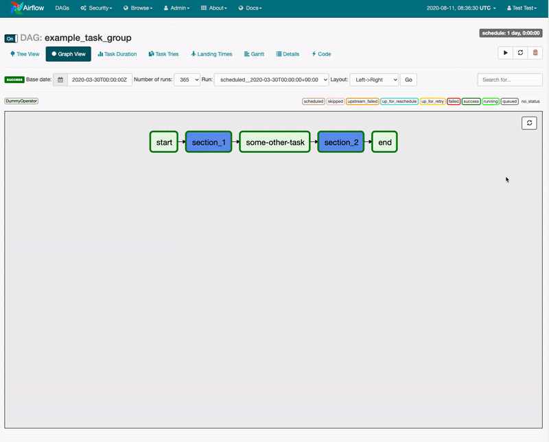

TaskGroup is modelled as a tree. Every TaskGroup has zero or more children. The children can be either a TaskGroup or a BaseOperator.

*Every DAG has a root TaskGroup*. [When a DAG is first created](https://github.com/apache/airflow/blob/e588d05636ae6fabe4960cd8727fbef711f0e6d9/airflow/models/dag.py#L339), its `task_group` is initialized to a `TaskGroup` with `group_id` and `parent_group` set to `None`. This is the root `TaskGroup`. 
All subsequently created TaskGroup and tasks are added to the root TaskGroup unless they are explicitly given a TaskGroup.

### How to put tasks to TaskGroup entity.

When a BaseOperator is constructed with a `task_group` specified, or if it is constructed within the contextmanager of a TaskGroup, it is added to the TaskGroup. 
The only way to add a task to a TaskGroup is during the task's construction. Once it is added, the `task_id` of this task is prefixed with the `group_id` and cannot be changed. 
If no TaskGroup is explicitly given and no other TaskGroup exists, a task is added to the root TaskGroup of the DAG.

### `task_id` of a task within a TaskGroup.

The `task_id` of `BaseOperator` is changed to a property. It is prefixed with its TaskGroup's group_id which itself is prefixed with the group_id of its parent TaskGroup.

### Setting dependencies inside and outside of TaskGroup.

Dependency relationships can be defined between a TaskGroup and a BaseOperator as well as between a TaskGroup and another TaskGroup. 
TaskGroup acts as a collection of BaseOperator. The `>>` and `<<` operators apply the operation over all tasks within the TaskGroup.

### How Webserver handle TaskGroup.

The root TaskGroup of the dag is converted to a dict called "nodes" and passed to the UI. The dict represents the tree structure of the nested TaskGroup. It also has some meta data such as `tooltip` and `ui_color` of the TaskGroup.

```python
from airflow.models.dag import DAG
from airflow.operators.dummy_operator import DummyOperator
from airflow.utils.dates import days_ago
from airflow.utils.task_group import TaskGroup

def create_section():
    """Create tasks in the outer section."""
    dummies = [DummyOperator(task_id=f'task-{i + 1}') for i in range(5)]

    with TaskGroup("inside_section_1") as inside_section_1:
        _ = [DummyOperator(task_id=f'task-{i + 1}',) for i in range(3)]

    with TaskGroup("inside_section_2") as inside_section_2:
        _ = [DummyOperator(task_id=f'task-{i + 1}',) for i in range(3)]
    dummies[-1] >> inside_section_1
    dummies[-2] >> inside_section_2

with DAG(dag_id="example_task_group", start_date=days_ago(2)) as dag:
    start = DummyOperator(task_id="start")
    with TaskGroup("section_1", tooltip="Tasks for Section 1") as section_1:
        create_section()
    some_other_task = DummyOperator(task_id="some-other-task")
    with TaskGroup("section_2", tooltip="Tasks for Section 2") as section_2:
        create_section()

    end = DummyOperator(task_id='end')
    start >> section_1 >> some_other_task >> section_2 >> end
```
Links:
AIP-34 TaskGroup: A UI task grouping concept as an alternative to SubDagOperator - https://cwiki.apache.org/confluence/display/AIRFLOW/AIP-34+TaskGroup%3A+A+UI+task+grouping+concept+as+an+alternative+to+SubDagOperator

Practice example:

To train your knowledge, you can follow the link and copy code example for SubDag. Then, change it so that inside a single Dag, you have an example of SubDag and TaskGroup at the same time. After that, in airflow UI, you will see a visual difference between SubDag and TaskGroup.

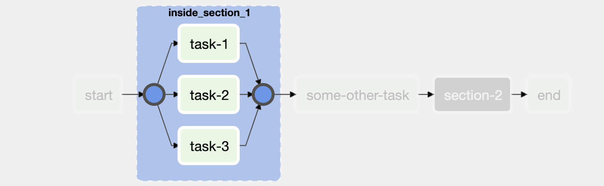


## Smart Sensors

In Airflow 2.0 was introduced another interesting feature named *Smart Sensor*.

The Smart Sensor is a service (run by a builtin DAG) which greatly reduces airflow’s infrastructure cost by consolidating some of the airflow long running light weight tasks.

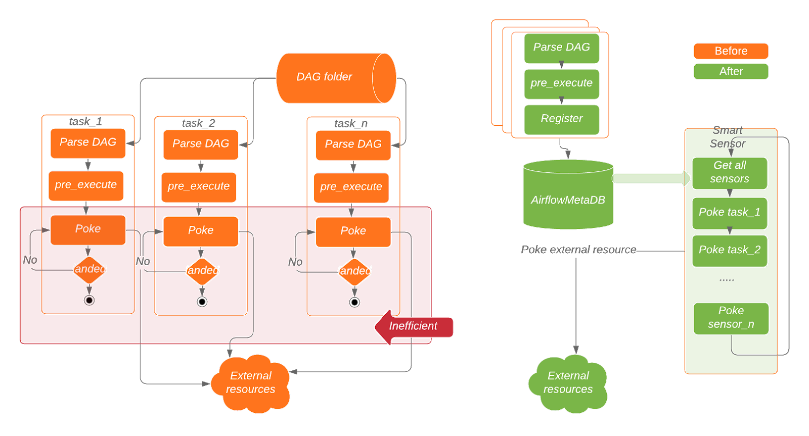

Instead of using one process for each task, the main idea of the Smart Sensor service is to improve the efficiency of these long running tasks by using centralized processes to execute those tasks in batches.

To do that, we need to run a task in two steps, the first step is to serialize the task information into the database; and the second step is to use a few centralized processes to execute the serialized tasks in batches.

In this way, we only need a handful of running processes.

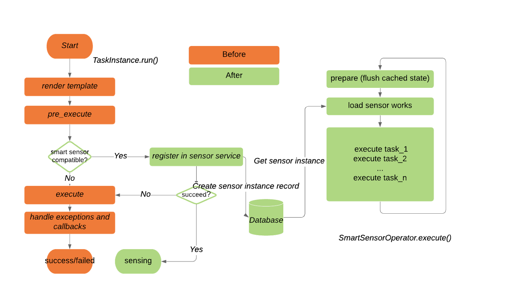

he Smart Sensor service is supported in a new mode called “Smart Sensor mode”. In Smart Sensor mode, instead of holding a long running process for each sensor and poking periodically, a sensor will only store poke context at `sensor_instance` table and then exits with a ‘sensing’ state.

When the Smart Sensor mode is enabled, a special set of builtin Smart Sensor DAGs (named `smart_sensor_group_shard_xxx`) is created by the system. 
- These DAGs contain SmartSensorOperator task and manage the Smart Sensor jobs for the airflow cluster. 
- The SmartSensorOperator task can fetch hundreds of ‘sensing’ instances from sensor_instance table and poke on behalf of them in batches. 
- Users don’t need to change their existing DAGs.

> To get more detailed information, watch the following video: https://www.youtube.com/watch?v=gSdy3Jxk75k


### enable/disable Smart Sensor

In order to enable/disable Smart Sensor you need to add the following settings in airflow.cfg:
```
[smart_sensor]
use_smart_sensor = true
shard_code_upper_limit = 10000
# Users can change the following config based on their requirements
shards = 5
sensors_enabled = NamedHivePartitionSensor, MetastorePartitionSensor
```

* `use_smart_sensor`: This config indicates if the Smart Sensor is enabled.
* `shards`: This config indicates the number of concurrently running Smart Sensor jobs for the airflow cluster.
* `sensors_enabled`: This config is a list of sensor class names that will use the Smart Sensor. The users use the same class names (e.g. HivePartitionSensor) in their DAGs and they don’t have the control to use Smart Sensors or not, unless they exclude their tasks explicitly.

Enabling/disabling the Smart Sensor service is a system level configuration change. It is transparent to the individual users. *Existing DAGs don't need to be changed for enabling/disabling the Smart Sensor*. Rotating centralized Smart Sensor tasks will not cause any user’s sensor task failure.

Currently, only a few sensors might be used by the Smart Sensor without any changes. If a specific sensor has an attribute poke_context_fields, that include all key names used for initializing a sensor object, it can be used by Smart Sensor.

FileSensor does not have a `poke_context_fields` attribute but we can create a custom sensor that will have it.

* Define new sensor and inherit it from `FileSensor`
* Add `poke_context_fields` class attribute that contains all key names. In our case it would be filepath and `fs_connection_id`
* Add your custom sensor to `sensors_enabled` parameter
* Replace `FileSensor` in `trigger_dag` with your own.
* Make sure that `smart_sensor_group_shard` DAG appeared in WebServer and trigger trigger_dag
* As a result, a custom file sensor should appear’ in state and then run using `smart_sensor_group_shard` DAG

## Airflow Core Components

We have made a long way throughout our course, and have got hands-on experience with Apache Airflow. Now’s the time to sum up and refine our knowledge. Let’s take a look at the whole Airflow and its components.

> A little article about Apache Airflow core components https://www.astronomer.io/guides/airflow-components/ 

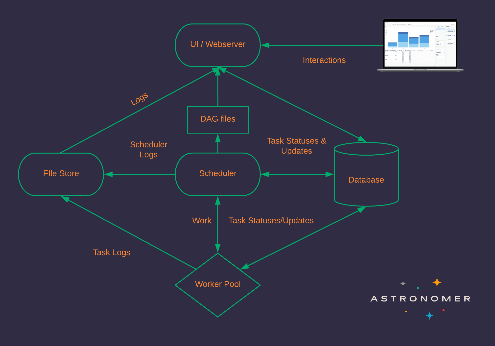

### Airflow Scheduler
In one of the articles we’ve read in this course there was a detailed description of Scheduler work.

Read it one more time:
    Step 0. Load available DAG definitions from disk (fill DagBag)

While the scheduler is running:
    Step 1. The scheduler uses the DAG definitions to identify and/or initialize any DagRuns in the metadata db.

    Step 2. The scheduler checks the states of the TaskInstances associated with active DagRuns, resolves any dependencies amongst TaskInstances, identifies TaskInstances that need to be executed, and adds them to a worker queue, updating the status of newly-queued TaskInstances to "queued" in the database.
        
    Step 3. Each available worker pulls a TaskInstance from the queue and starts executing it, updating the database record for the TaskInstance from "queued"  to "running".
        
    Step 4. Once a TaskInstance is finished running, the  associated worker reports back to the queue and updates the status for the TaskInstance in the database (e.g. "finished", "failed", etc.)
        
    Step 5. The scheduler updates the states of all active DagRuns ("running", "failed", "finished") according to the states of all completed associated TaskInstances.
        
    Step 6. Repeat Steps 1-5

If you have difficulties with some of the terms described in the text above, please check the previous modules in course.

Now’s the time to finish our course, and we’ll do it with a beautiful article about Apache Airflow Paradigm, and conference talk about Airflow weaknesses and features from its creator Maxime Beauchemin. You will find the link in the next module.

## Functional Data Engineering: a modern paradigm for batch data processing

> https://maximebeauchemin.medium.com/functional-data-engineering-a-modern-paradigm-for-batch-data-processing-2327ec32c42a

## Weaknesses and feature of Apache Airflow

> Airflow Meetup: Challenges and Opportunities Ahead https://www.youtube.com/watch?v=xjvYmpQxuhQ 


