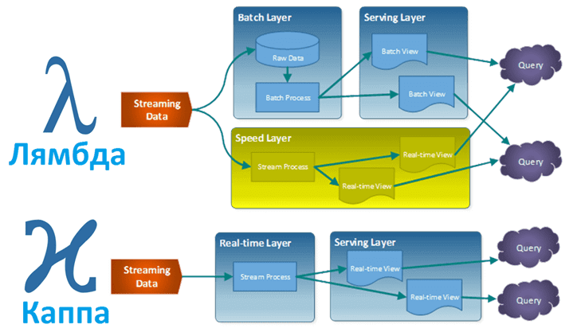

# Architectures for BigData processing

Logic components, that go into a big data architecture.


## Lambda vs Kappa



для Kappa характерны следующие достоинства:

* повторная обработка данных нужна только при изменении кода;
* требуется меньше ресурсов в связи с одним путем обработки данных;
* на сервисном уровне в качестве неканонического хранилища можно использовать практически любую базу данных.


### Lambda architecture

Lambda architecture is a
* data-processing architecture
* designed to handle massive quantities of data by taking advantage of both batch and stream-processing methods. 

This approach to architecture attempts to balance latency, throughput, and fault-tolerance by using batch processing to provide comprehensive and accurate views of batch data, while simultaneously using real-time stream processing to provide views of online data.

The rise of lambda architecture is correlated with the growth of big data, real-time analytics, and the drive to mitigate the latencies of map-reduce.

Lambda architecture describes a system consisting of three layers: 
* batch processing
* speed (or real-time) processing
* serving layer for responding to queries.


### Kappa architecture

**Kappa Architecture** is a 
* software architecture pattern
* simplification of Lambda Architecture
* system with the batch processing system removed (like lambda)
* To replace batch processing, data is simply fed through the streaming system quickly.

Rather than using a relational DB like SQL or a key-value store like Cassandra, the canonical data store in a Kappa Architecture system is an append-only *immutable log*. 
From the log, data is streamed through a computational system and fed into auxiliary stores for serving.


Функциональное уравнение, которое определяет запрос Big Data, в Каппа-архитектуре:
```
Query = K (New Data) = K (Live streaming data)
```

Для реализации Каппа-архитектуры используются следующие:
* канонические хранилища для постоянного логгирования событий, например, Apache Kafka, Apache Pulsar, Amazon Quantum Ledger Database, Amazon Kinesis, Amazon DynamoDB Streams, Azure Cosmos * DB Change Feed, Azure EventHub и другие подобные системы;
* фреймворки потоковых вычислений, например, Apache Spark, Flink, Storm, Samza, Beam, Kafka Streams, Amazon Kinesis, Azure Stream Analytics и другие streaming-системы;
* на сервисном уровне может использоваться практически любая база данных, резидентная (в памяти) или постоянная, в т.ч. хранилища специального назначения, например, для полнотекстового поиска.


## Links

> https://docs.microsoft.com/ru-ru/azure/architecture/data-guide/big-data/

> https://www.bigdataschool.ru/blog/kappa-architecture.html

https://www.machinelearningmastery.ru/a-brief-introduction-to-two-data-processing-architectures-lambda-and-kappa-for-big-data-4f35c28005bb/

https://docs.microsoft.com/ru-ru/azure/architecture/data-guide/big-data/

http://milinda.pathirage.org/kappa-architecture.com/