# Hadoop

Wrire ones, read more

### Simular to Google scalable distributed File System(DFS)

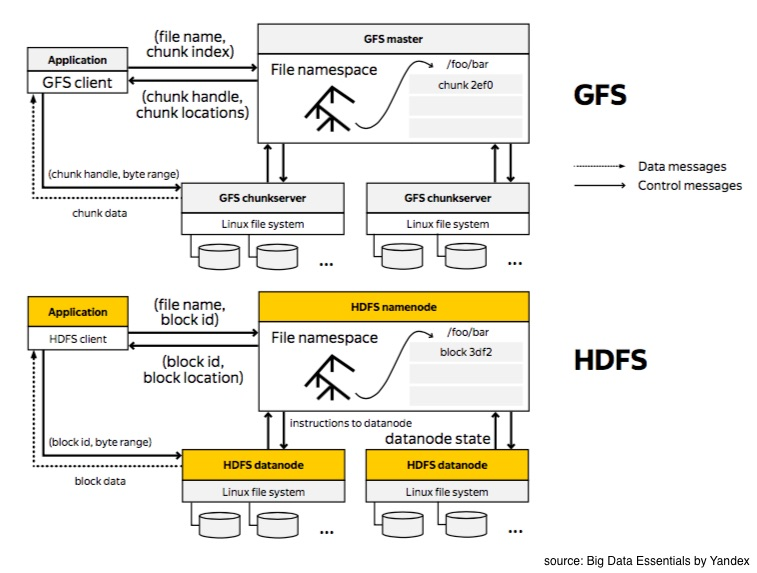

Hadoop Distributed File System, or HDFS for short, is an open source implementation of the Google File System. 
Google file system is written in C++, whereas HDFS is written in Java. 
HDFS provides a command line interface to communicate with the distributed file system. In addition to binary RPC protocol, you can also access data via HTTP protocol.

### Reading files from HDFS

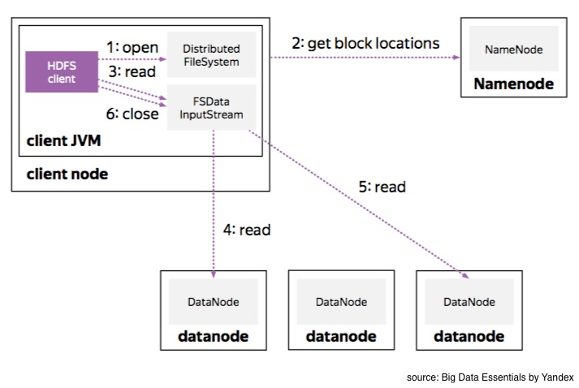

When reading files from HDFS first request the **name node** to get information about file blocks’ locations. These blocks are distributed over different machines but all of that complexity of handled by HDFS API. As the user, we only see a continuous stream of data. 
So if a data node dies and we retrieve the data from a replica, we don’t care as long as the data flows.

### Writing files into HDFS

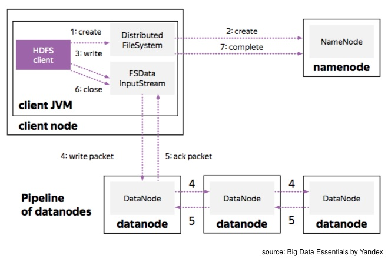

When you write a block of data into HDFS, Hadoop distributes three replicas over the storage. 
- The *first replica* is usually located on the same node if you write data from a data node machine, otherwise it’s chosen at random. 
- The *second replica* is usually placed in a different rack. 
- The *third replica* is located on a different machine in the same rack as the second replica.

These **data nodes** form a **pipeline** as your first client sends packets of data to the closest node. This node then transfers copies of packets through the pipeline. When the packet is received at all data nodes, the nodes send back acknowledgement packets. However, say if something goes wrong, then the client closes the pipeline to mark and replace the bad node so a new pipeline will be organized. HDFS takes care of all this complexity behind the scenes.

And because data nodes act as a **state machine** for each file block, whenever a data node in the pipeline fails, we can be sure that all the necessary replicas will be recovered while any unneeded nodes are removed. We’ll go into the details of this state machine later.

## Recovery Process

### Block and Replica States
To understand the recovery process of HDFS, let’s first introduce two concepts:

1) Replica: A physical data storage on a data node. Usually, there are several replicas with the same content on different data nodes.

2) Block: This is meta-info storage on a name node that provides information about replicas’ locations and their states.

Both replica and block have their own states. First, let’s take a look at the data node replica states.

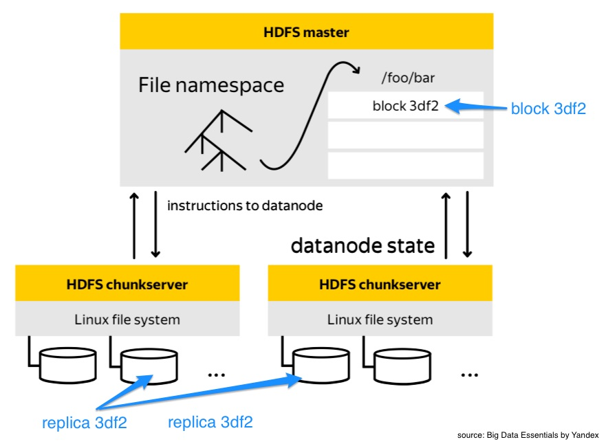

### Replica States and Transitions

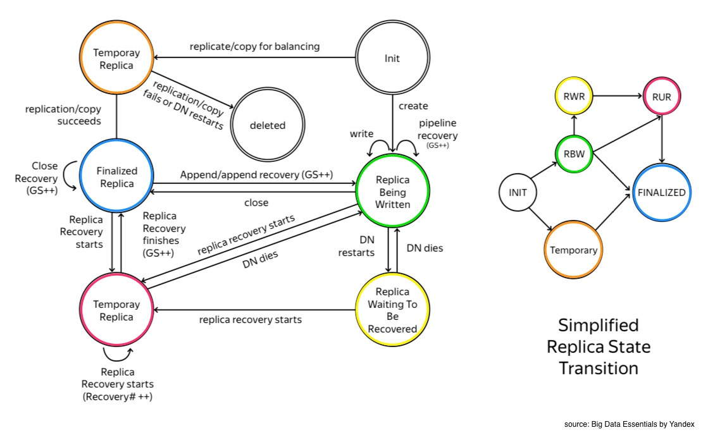

**Finalized Replica**
When a replica is in a finalized state, that means its content is frozen. ‘Frozen’ means that the meta-info for this block is aligned with its corresponding replicas’ states and data. This means you can safely read data from any data node and get the same exact content, preserving read consistency. Each block of data has a version number called Generation Stamp (GS). Finalized replicas are guaranteed to all have the same GS number.

**Replica Being Written to (RBW)**
In this state, the last block of a file is opened or reopened for appending. Bytes that are acknowledged by the downstream data nodes in a pipeline are visible for a reader of this replica. Additionally, the data-node and name node meta-info may not match during this state. In the case of failure, the data node will try to preserve as many bytes as possible with the goal of data durability.

**Replica Waiting to be Recovered (RWR)**
In short, this is the state of all RBW replicas after data node failure and recovery. RWR replicas will not be in any data node pipeline and therefore will not receive any new data packets. So they either become outdated and should be discarded, or they will participate in a special recovery process called a lease recovery if the client also dies.

**Replica Under Recovery (RUR)**
If the HDFS client lease expires, the replica transitions to RUR state. Lease expiration usually happens during the client’s site failure.

**Temporary**
As data grows and different nodes are added/removed from the cluster, data can become unevenly distributed over the cluster nodes. unevenly distributed data A Hadoop administrator can spawn a rebalancing process or a data engineer can increase the replication factor of data for durability. In these cases, newly generated replicas will be in a state called temporary. It’s pretty much the same state as RBW, except the data is not visible to the user unless finalized. In the case of failure, the whole data chunk is removed without any intermediate recovery state.

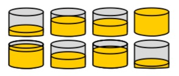


### Block States and Transitions

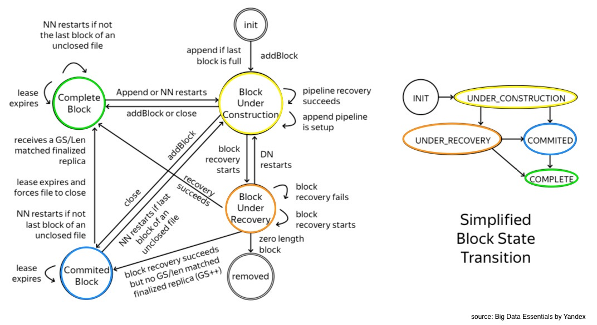

*Block Under Construction*
As soon as a user opens a file for writing, the name node creates the corresonding block in the under_construction state. It is always the last block of a file and its length and GS stamp are mutable. The name node block keeps track of the data pipeline and keeps a watchful eye over all RBW and RWR replicas. replica state transition

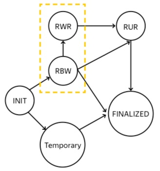

**Block Under Recovery**
Replicas transition from RWR to RUR state when the client dies or when a client’s lease expires. Consequently, the corresponding block transitions from under_construction to the under_recovery state. 

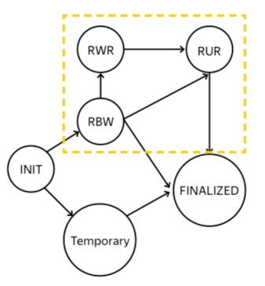

**Committed**
The under_construction block transitions to a committed state when a client successfully requests tge name node to close a file or to create a new consecutive block of data. ‘Committed’ that there are already some finalized replicas but not all are finalized. For this reason in order to serve a read request, the committed block needs to keep track of RBW replicas, until all the replicas are transitioned to the finalized state and HDFS client will be able to close the file.

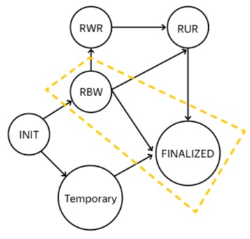

**Complete**
Finally in the complete state, all the replicas are in the finalized state and therefore are identical and have same GS stamps. The file can be closed only when all the blocks of a file are in ‘complete’ state.

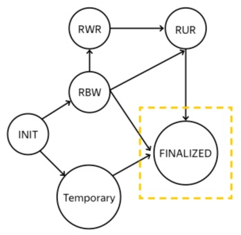

### Recovery Procedures

There are several types of recovery procedures:
- Block Recovery
- Replica Recovery
- Lease Recovery
- Pipeline Recovery

**Block Recovery**
During the block recovery process, the namenode has to ensure that all of the corresponding replicas of a block will transition to a common state, logically and physically, mean that all the corresponding replicas should have the same content. The NameNode choses a **primary datanode (PD)** which should contain a replica for the target block. PD requests a new GS, info, and location of other replicas from the NameNode. PD then contacts each relevant datanode to participate in the **replica recovery process**.

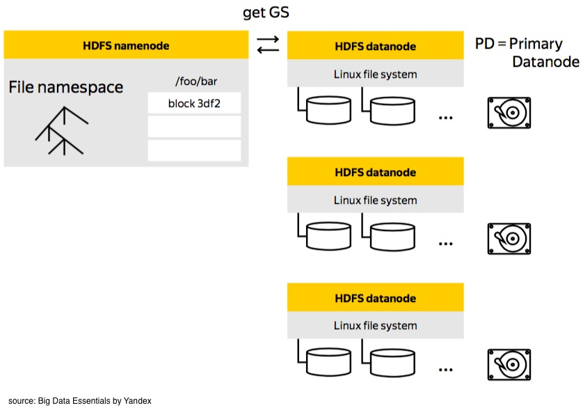

**Replica Recovery**
Replica recovery process include aborting active clients writing to a replica, aborting the previous replica or block recovery process, and participating in final replica size agreement process. During this phase, all the necessary info and data is propagated through the pipeline.

Lastly, PD notifies the NameNode of its success or failure. In case of failure, NameNode can retry block recovery.

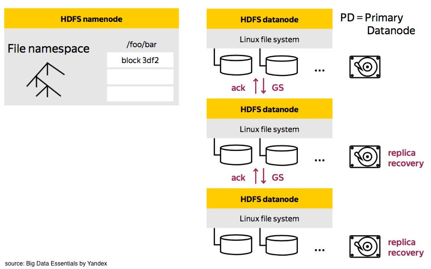

**Lease Recovery**
The Block Recovery Process can only happen as a part of a Lease Recovery Process

The **Lease Manager** manages all the leases at the NameNode where the HDFS clients request a lease every time they want to write to a file. The Lease Manager maintains soft and hard time limits where if the current lease holder doesn’t renew its lease during the soft limit, another client will take over the lease. If the hard limit is reached, the lease recovery process will begin.

Throughout this process, there are a couple important of guarantees:
- **Concurrency control** - event if the client is alive it won’t be able to write data to a file.
- **Consistency** - All replicas should draw back to a consistent state to have the same data and GS.

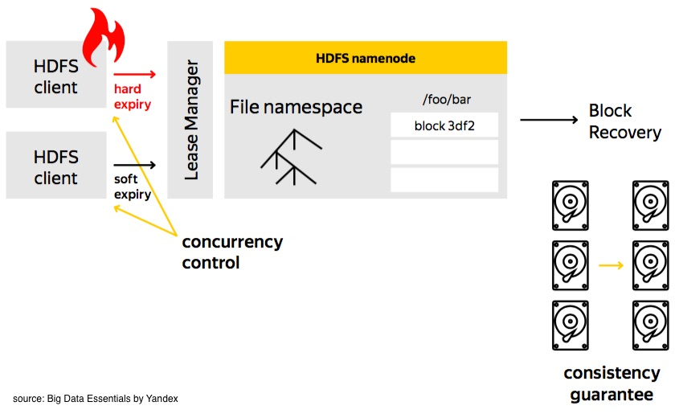

**Pipeline Recovery**
When you write to an HDFS file, HDFS client writes data block by block. Each block is constructed through a write pipeline and each block breaks down into pieces called packets. These packets are propagated to the datanodes through the pipeline

There are three stages to the pipeline recovery process:
1. **pipeline setup**: The client sends a setup message down through the pipeline. Each datanode opens a replica for writing and sends ack message back upstream the pipeline.
2. **data streaming**: In this part, data is buffered on the client’s site to form a packet, then propagated through the data pipeline. Next packet can be sent even before the acknowledgement of the previous packet is received.
3. **close**: This is used to finalize replicas, and shut down the pipeline

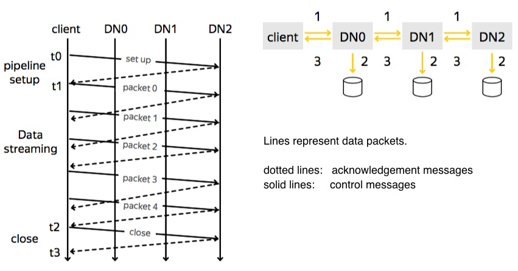


## Commands

Install `start-dfs.sh`

If you ever need help with the HDFS client API, use the following commands:
```
$ hdfs dfs -help
$ hdfs dfs -usage <utility_name>
```

Let’s do a read-only request to a name node.
```
$ hdfs dfs -ls -R -h /data/wiki
```

To get the file sizes of space used by all replicas, use -du.
```
$ hdfs dfs -du -h /data
```

 modify the structure of our file system by creating a directory called ‘deep’.
```
$ hdfs dfs -mkdir -p deep/nested/path
$ hdfs dfs -ls -R deep
```

remove the ‘deep’ folder. Remember to use -r to delete folders recursively.
```
$ hdfs dfs -rm -r deep
```

create empty files with touchz utility.
```
$ hdfs dfs -touchz file.txt
```

move it to another location with a different name.
```
$ hdfs dfs -mv file.txt another_file.txt
```

Use put to transfer a file from the local file system into HDFS.
```
$ hdfs dfs -put <source location> <HDFS destination>
```

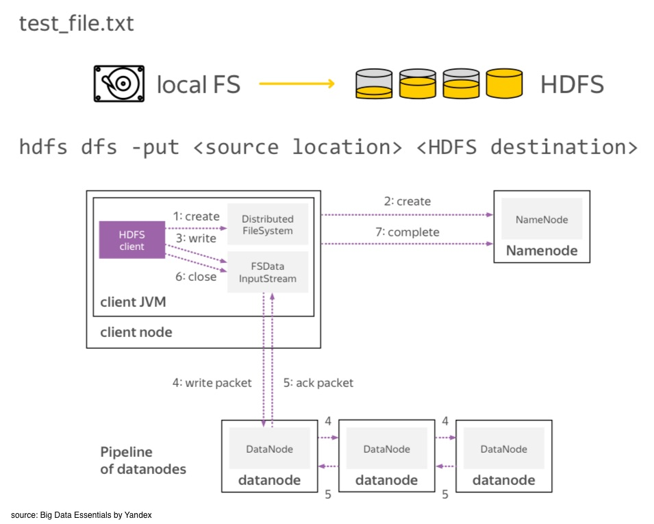

How do we read the content of a remote file?
In the local file system, we use cat, head, and tail to bring the content of a file to a screen.
In HDFS you can use a cat to bring the whole file to a screen.
```
$ hdfs dfs -cat hdfs_test_file.txt | head -4
```

To see the end of the file you can use tail utility. Note that the behavior of a local tail utility and the distributed tail utility is different. Local file system commands are focused on text files. In a distributed file system, we work with binary data. So, the HDFS tail command brings out onto the screen the last one kilobyte of a file.
```
$ hdfs dfs -cat hdfs_test_file.txt | tail -4
```

As with moving files from the local file system to HDFS, we can also download files from HDFS to the local file system by using get.
```
$ hdfs dfs -cp hdfs_test_file.txt hdfs_test_file_copy.txt
$ hdfs dfs -get hdfs_test* .
```

With the -getmerge utility, all of this data can be merged into one local file.
```
$ hdfs dfs -getmerge hdfs_test* hdfs_merged.txt
```

chown, which stands for ‘change ownership’ can be used to configure access permissions.
groups is useful to get information about your HDFS ID
setrep provides API to decrease and increase replication factor
```
$ time hdfs dfs -setrep -w 1 hdfs_test_file.txt
```

hdfs fsck, which stands for ‘file system checking utility’, can be used to request name node to provide you with the information about file blocks and the allocations
```
$ hdfs fsck /data/wiki/en_articles -files -blocks -locations
```

find is used to search by pattern recursively in the folder
```
$ hdfs dfs -find /data -name ''*part*'' - iname ''*Article*''
```

To create a new directory within the HDFS, use the command 
```
hadoop fs -mkdir <directory_name>
```

To copy a file from your host machine onto HDFS, use the command
```
hadoop fs -put ~/path/to/localfile /path/to/hadoop/directory
```

The reverse of put is get, which copies files from HDFS back to host file system.
```
hadoop fs -get /hadoop/path/to/file ~/path/to/local/storage
```

#### Example
hdfs dfs -mkdir /user/jovyan/assignment1
hdfs dfs -put ~/test.txt assignment1/test.txt or hdfs dfs -touchz assignment1/test.txt
hdfs dfs -ls /user/jovyan/assignment1/test.txt
hdfs dfs -chmod o-r /user/jovyan/assignment1/test.txt
hdfs dfs -cat /user/jovyan/assignment1/test.txt | head -10
hdfs dfs -mv /user/jovyan/assignment1/test.txt /user/jovyan/assignment1/test2.txt

• get blocks and their locations in HDFS for this file, show the command without an output
` hdfs fsck /data/wiki/en_articles_part/articles-part -files -blocks -locations`

• get the information about any block of the file, show the command and the block locations from the output
` hdfs fsck -blockId blk_1073971670`


## Calcultions

### How to estimate the memory usage of HDFS NameNode for a HDFS cluster?

**Formula**
```
1 PB / 64 MB / 3 * 300 B = 1024 * 1024 * 1024 / 64 / 3 * 300 = 1600 MB
```
```
Namenode 1PB / (64MB * 3) * 300 B = 1.56GB
```

If we have 1PB of information with replication factor 3 (which is the default) and block size of 64MB we can calculate the memory that we need like this:

1. First, we calculate the number of the blocks that we need to store in the NameNode which is `1PB/(64MB*3(replicas))`. The NameNode doesn’t store the information about each replica. So we need only the unique file blocks and that’s why we multiply each block by the number of replicas. One unique file block is actually consuming `block_size * replication_factor` in our storage. Or simply said NameNode meta info block size does not depend on replica number but storage capacity does!
2. Then we need just to multiply this blocks by the memory consumed for the metadata. `1PB/(64MB*3) ~= 5208333.33333` blocks to store in memory
```
5208333.33333 * 300B = 1562500000B ~= 1.5625 GB
```
So we need at least 1.6 GB memory to be available on our NameNode.

> Keep in mind that this is a perfect scenario where our files are perfectly dividable by the block size!

In real life the situation is not the same but we can still calculate the NameNode memory is we know what is the average file to block size ratio and how much files do we have in the cluster.

If we have 100 million files with average ratio 1.5 - our files are between 1 and 2 block size. In this case one file is actually represented by one inode object (around 150B*) and two block objects (150B*2).

So we need 450B to store one file metainformation or we need:
```
memory = 100M * 450B = 45GB
```
Or vice versa with 45GB of memory we can store 100 million files with `size/block_size ratio = 1.5`

### HDDs in your cluster have the following characteristics: average reading speed is 60 MB/s, seek time is 5 ms. You want to spend 0.5 % time for seeking the block, i.e. seek time should be 200 times less than the time to read the block. Estimate the minimum block size.


Block size: X
Block reading time : 5ms * 200 = 1s
Reading speed : 60 / 1s = X / 1s
X = 60MB

block_size / 60 MB/s * 0.5 / 100 >= 5 ms
block_size >= 60 MB/s * 0.005 s / 0.005 = 60 MB

***


Sizing NameNode Heap Memory
[File](./5424-1908-shvachko.pdf)
https://docs.cloudera.com/documentation/enterprise/5-10-x/topics/admin_nn_memory_config.html

10 Pb /(128Mb * 3) * 150 = 3 906 250 000 b ~- 3.9Gb


https://en.wikipedia.org/wiki/Write-ahead_logging
https://en.wikipedia.org/wiki/Network_File_System


Binary Datatypes


[avro](http://avro.apache.org/)
[RCFile](http://web.cse.ohio-state.edu/hpcs/WWW/HTML/publications/papers/TR-11-4.pdf)
[parquet](https://parquet.apache.org/)

Kinds of compression

Blok levels
File levels

## How does HDFS work?

Coupled with MapReduce, a framework for data processing that filters and divides up work among the nodes in a cluster, and it organizes and condenses the results into a cohesive answer to a query. 
Similarly, when HDFS takes in data, it breaks the information down into separate blocks and distributes them to different nodes in a cluster.

HDFS supports a traditional hierarchical file organization. An application or user can create directories and then store files inside these directories. The file system namespace hierarchy is like most other file systems -- a user can create, remove, rename or move files from one directory to another.


Data is written on the server once, and read and reused numerous times after that. HDFS has a **primary NameNode**, which keeps track of where file data is kept in the cluster.

HDFS exposes a file system namespace and enables user data to be stored in files. A file is split into one or more of the blocks that are stored in a set of DataNodes. The NameNode performs file system namespace operations, including opening, closing and renaming files and directories. The NameNode also governs the mapping of blocks to the DataNodes. The DataNodes serve read and write requests from the clients of the file system. In addition, they perform block creation, deletion and replication when the NameNode instructs them to do so.


## Components

**Namenode**: The master node/primary server. It manages the file system namespace and controls client access to files. maintains and manages the file system namespace and provides clients with the right access permissions.
The NameNode knows which DataNode contains which blocks and where the DataNodes reside within the machine cluster. 
The NameNode also manages access to the files, including reads, writes, creates, deletes and the data block replication across the DataNodes. stores the number of copies of a file, called the replication factor
The NameNode operates in conjunction with the DataNodes. As a result, the cluster can dynamically adapt to server capacity demand in real time by adding or subtracting nodes as necessary.

**DataNode**: The slave node. It performs read/write operations on the file system as well as block operations such as creation, deletion, and replication.

**Block**: The unit of storage. A file is broken up into blocks, and different blocks are stored on different datanodes as per instructions of the namenode.

Several datanodes can be grouped into a single unit and referred to as a **Rack**. The rack design depends on the big data architect and what they wish to achieve. A typical architecture may have a main rack and some replication racks for purposes of redundancy in case of failures.

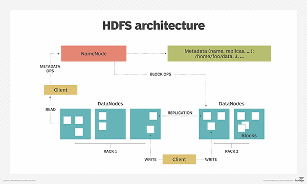

## Features of HDFS
There are several features that make HDFS particularly useful, including:

- **Data replication**. This is used to ensure that the data is always available and prevents data loss. For example, when a node crashes or there is a hardware failure, replicated data can be pulled from elsewhere within a cluster, so processing continues while data is recovered.
- **Fault tolerance and reliability**. HDFS' ability to replicate file blocks and store them across nodes in a large cluster ensures fault tolerance and reliability.
- **High availability**. As mentioned earlier, because of replication across notes, data is available even if the NameNode or a DataNode fails.
- **Scalability**. Because HDFS stores data on various nodes in the cluster, as requirements increase, a cluster can scale to hundreds of nodes.
- **High throughput**. Because HDFS stores data in a distributed manner, the data can be processed in parallel on a cluster of nodes. This, plus data locality (see next bullet), cut the processing time and enable high throughput.
- **Data locality**. With HDFS, computation happens on the DataNodes where the data resides, rather than having the data move to where the computational unit is. By minimizing the distance between the data and the computing process, this approach decreases network congestion and boosts a system's overall throughput.


## What are the benefits of using HDFS?
- **Cost effectiveness**. The DataNodes that store the data rely on inexpensive off-the-shelf hardware, which cuts storage costs. Also, because HDFS is open source, there's no licensing fee.
- **Large data set storage**. HDFS stores a variety of data of any size -- from megabytes to petabytes -- and in any format, including structured and unstructured data.
- **Fast recovery from hardware failure**. HDFS is designed to detect faults and automatically recover on its own.
- **Portability**. HDFS is portable across all hardware platforms, and it is compatible with several operating systems, including Windows, Linux and Mac OS/X.
- **Streaming data access**. HDFS is built for high data throughput, which is best for access to streaming data.


## MapReduce

Hadoop divides the job into tasks. There are two types of tasks:

* Map tasks (Splits & Mapping)
* Reduce tasks (Shuffling, Reducing)
Map -> Shuffle & Sort -> Reduce
Each step map reduce works with key value pairs

The complete execution process (execution of Map and Reduce tasks, both) is controlled by two types of entities called a

Jobtracker: Acts like a master (responsible for complete execution of submitted job)
Multiple Task Trackers: Acts like slaves, each of them performing the job
For every job submitted for execution in the system, there is one Jobtracker that resides on Namenode and there are multiple tasktrackers which reside on Datanode.


* A job is divided into multiple tasks which are then run onto multiple data nodes in a cluster.
* It is the responsibility of job tracker to coordinate the activity by scheduling tasks to run on different data nodes.
* Execution of individual task is then to look after by task tracker, which resides on every data node executing part of the job.
* Task tracker's responsibility is to send the progress report to the job tracker.
* In addition, task tracker periodically sends 'heartbeat' signal to the Jobtracker so as to notify him of the current state of the system. 
* Thus job tracker keeps track of the overall progress of each job. In the event of task failure, the job tracker can reschedule it on a different task tracker.


Example:
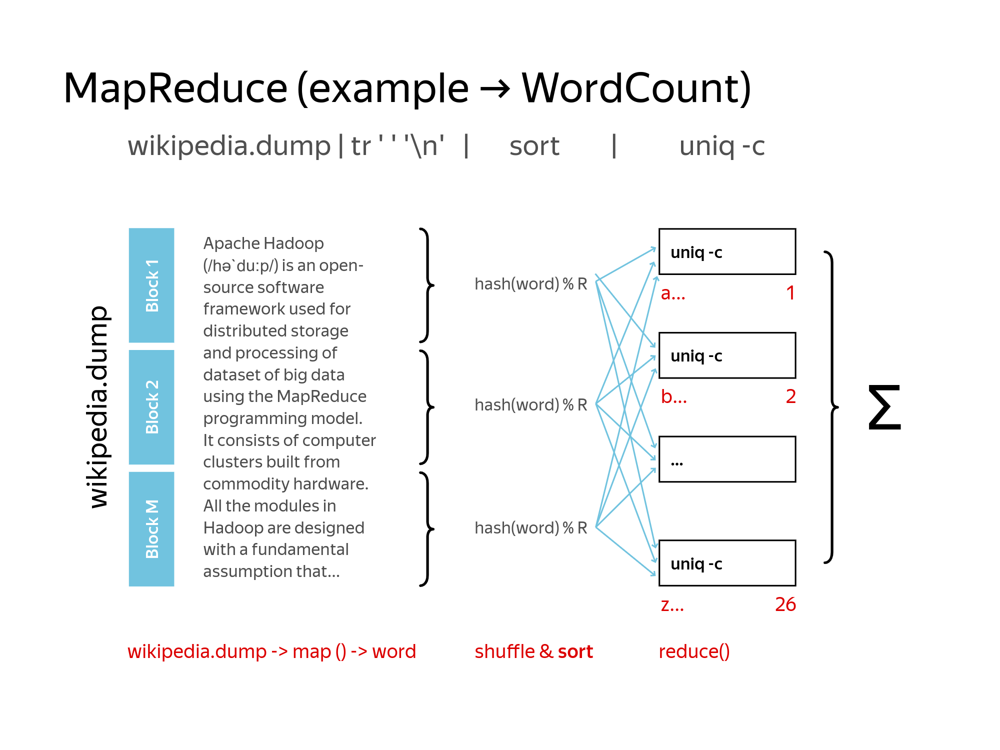
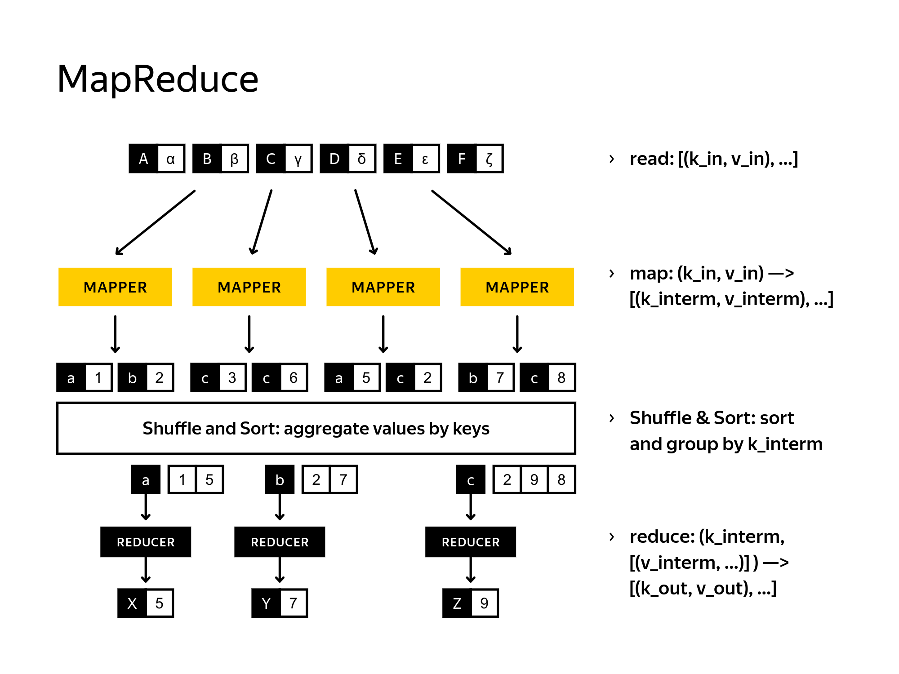


Base hadoop return sortet by key output
Moving on, if you see one reducer with default implementation which does nothing, then shuffle and sort phase will be executed.

Hadoop provides a reader of input records and passes the records into the stdin file descriptor of a mapper

mapper doesn’t usually group records by key because it works with unsorted input

### Distributed Cache
distributed cache uset To deliver the required files to the nodes


### Testing
Three cases for scripts are integrated with Hadoop MapReduce streaming API.:
- Validation of parse and non empty string,
- validation of parse and empty string, 
- validation of raising exception if there is no input at all.

If you provide a Hadoop empty config, then you execute the whole MapReduce application in a standalone mode. In this mode an HDFS client points out to a local file system, and a node manager is working on the same node. In this case, your streaming scripts will be able to communicate with MapReduce framework via environment variables. You will be able to read configuration of variables and validate counters correctness.

People can refer to this type of testing as a system person because you execute the whole pipeline end to end. Validation of your streaming scripts against a sample dataset is usually the final stage before shipping your code into the production system. If your testing dataset is small, then you should be able to compare result with Athlon solution. In addition to this, if your script contain bugs, then you will find them early without wasting your time and CPU cycles. This type of testing is usually referred to as an acceptance testing. 


## Hadoop MapReduce Application Tuning: Job Configuration, Comparator, Combiner, Partitioner

Three whales of MapReduce applications
### Combiner

To change the usage of these IO operations and network bandwidth, you can use combiner to squash several items into one.

combiner can be the same as reducer only if the reducer implements associative and commutative function. 


Combiner: 
- expects an input in the form of the reducer input and it has the same output signature as a mapper. 
- can be applied arbitrarily number of times between map and reduce phases. combiner is run zero or multiple times and this quantity is not adjustable in Hadoop.
- A combiner should not change a type and format of a key and value


In the word count application, there is no difference between the combiner and the reducer. So you can easily call it with the following arguments.


### Partitioner

Partitioner is used to calculate a reducer index for each (key, value) pair

To find collocations of size two in a data sets, you need to count Bigrams.

Mapper: The following mapper will emit a sequence of bigrams followed aggregation during their use phase.


Hadoop MapReduce frame work will distribute and sort data by the first word. Because everything before the first tab character is considered a key.

Reducer: To sort data by the second word, you can update reducer.py to count all bigrams for the first corresponding word in memory-->memory consuming.


output of these MapReduce application which validates that New York bigram is a collocation

In addition to the unnecessary memory consumption there would be uneven lot on the reducers.

The benefit of MapReduce: it provides functionality to parallelized work.

e.g. In a default scenario you will have the far more lot on the reducer that will be busy processing this article The. But you have no need to send all of the bigrams starting with The to one reducer as you do calculations for each pair of words independently.


** partitioner**: > In this case you would like to split the line into key value pairs by the second tab character.


- complete this MapReduce job faster due to better parallelism.
- bigrams starting with any arbitrary word allocated in different files.

You can specify what a delimiter is and set number of fields related to a key. MapReduce framework will substitute this particular delimiter between num and num+1 fields to a tab character without any changes in your streaming scripts.
comparator can be implemented only in Java

In this example, 
- I would like to split the output from the streaming mapper by the first dot. 
- And from the reducers stream and output, I substituted the next but one dot with a key value MapReduce delimiter, which is a tab character.


### Comparator

All the keys in MapReduce implement writable comparable interface.

Comparable means that you can specify the rule according to which one key is bigger than another.

By default, you have the keys sorted by increasing order. For some applications, you would like to store them in a reverse order.

comparator compares records for sorting, it is not an optimization

comparator can be implemented only in Java

Example: IPv4 network addresses
To sort octets of IPV4 address by the second octet in an increasing order, and by the third octate in a reverse order. KeyFieldBasedComparator: `-D keycomporator.objects -k2,4nr`


### Speculative Execution / Backup Tasks

One of the most common problems that causes a MapReduce application to wait longer for a job completion is a straggler--a machine that takes an unusually long time to complete one of the last few tasks in the computation.


The solution of straggler: Backup Tasks


Due to the deterministic behavior of the Mapper and Reducer, you can easily re-execute straggler body of work on other node.

In this case, the worker which processes data, they first outputs data to a distributed file system. All the other concurrent executions will be killed.

Of course, the MapReduce framework is not going to have a copy for each running task. It is only used when a MapReducer application is close to completion.

**Tuning:**


- Speculative Execution is set by default to true. set these flags to false if you don't allow multiple instances of some map or reduce task to be executed in parallel.


- These two flags can be used to specify the allowed number of running backup tasks at each point in the stream of the time and overall.


- you can tune timeouts in milliseconds that will limit the time of your waiting till the next round of speculation.

If you have successfully managed to speed up the process with speculation, then you should be able to find concurrent tasks killed by speculation on job trigger.


### Compression

You can balance the process and capacity by the data compression.

Data compression is essentially a trade-off between - the disk I/O required to read and write data - The network bandwidth required to send data across the network - the in-memory calculation capacity(speed and usage of CPU and RAM). - ability of archives to be splitted by Hadoop

The correct balance of these factors depends on the characteristics of your cluster, your data, your applications, or usage patterns, and the weather forecast.

Data located in HDFS can be compressed. There is a shuffle and sort phase between map and the reduce where you can compress the intermediate data.-->optimization


- Splittable column means that you can cut a file at any place and find the location for the next or the previous valid record.
- Native libraries that provide implementation of compression and decompression functionality, usually also support an option to choose a trade-off between speed or space optimization.


**Pros & Cons:** - gzip file is a deflate file with extra headers and a footer. - bzip is more aggressive for space requirements, but consequently, it's slower during the compression. - lzo files can be used where you read data far more frequently than write. - You can provide index files for lzo files to make them splittable. - Snappy,even more faster decompression, but you will only be able to split this file records.

A **Hadoop codec** is an implementation of a compression, decompression algorithm.


You can specify the compression parameters for intermediate data for output or for both


**Rules of thumb:** 
1. gzip or bzip are a good choice for cold data, which is accessed infrequently. 
2. bzip produce more compression than gzip for some kinds of files at the cost of some speed when compressing and decompressing. 
3. Snappy or lzo are a better choice for hot data, which is accessed frequently. 
4. Snappy often performs better than lzo. 
5. For MapReduce, we can use bzip and lzo formats, if you would like to have your data splittable. 
6. Snappy and gzip formats are not splittable at file level compression. But you can use block level compression and splittable container formats such as Avro or SequenceFile--> process the blocks in parallel using MapReduce
## Links

White, Tom. 2014. Hadoop: The Definitive Guide. O’Reilly Media, Inc.

Dral, Alexey A. 2014. Scaling Distributed File System. Big Data Essentials: HDFS, MapReduce and Spark RDD by Yandex. https://www.coursera.org/learn/big-data-essentials

