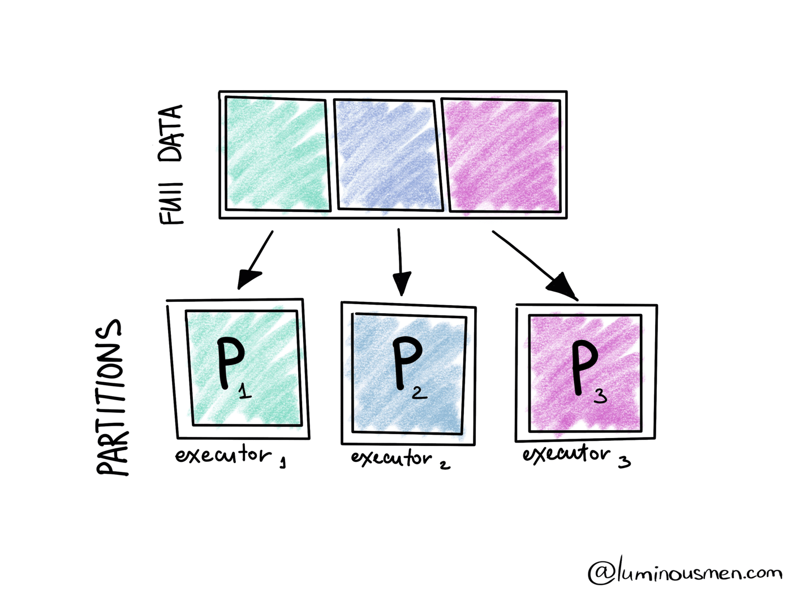
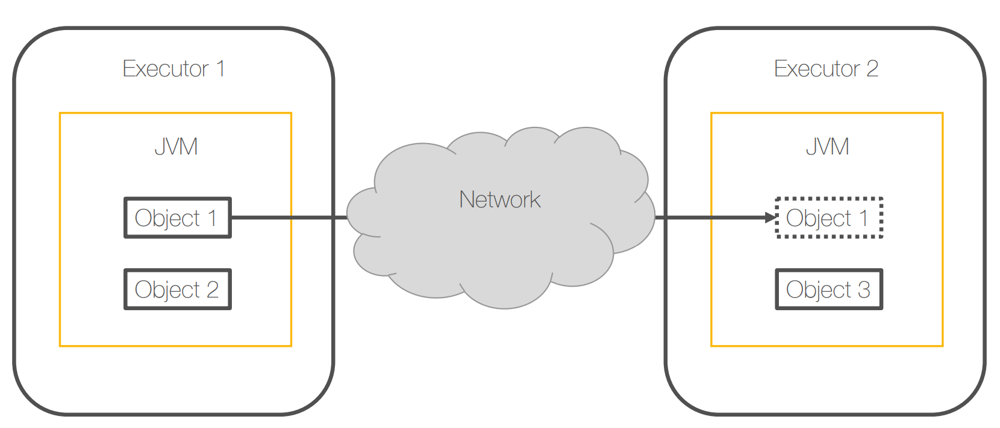
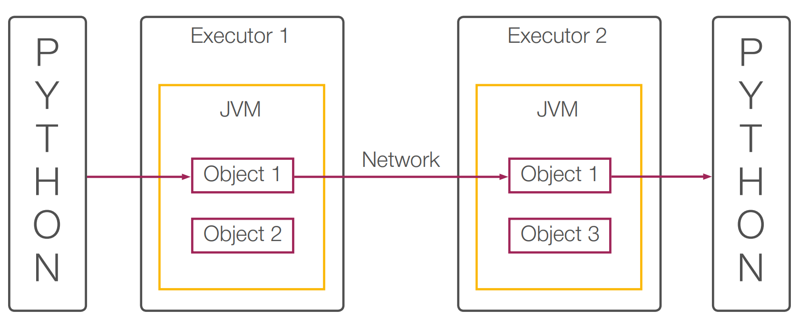
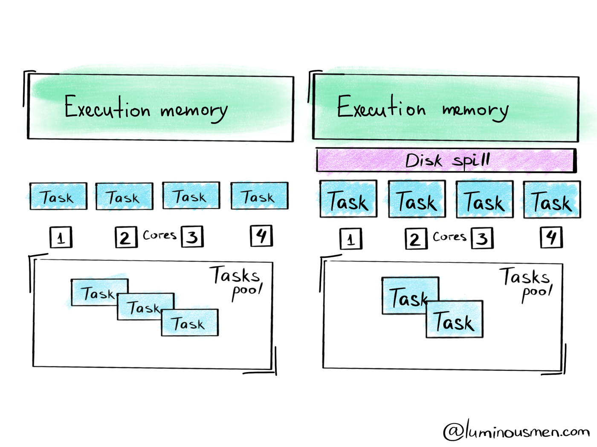
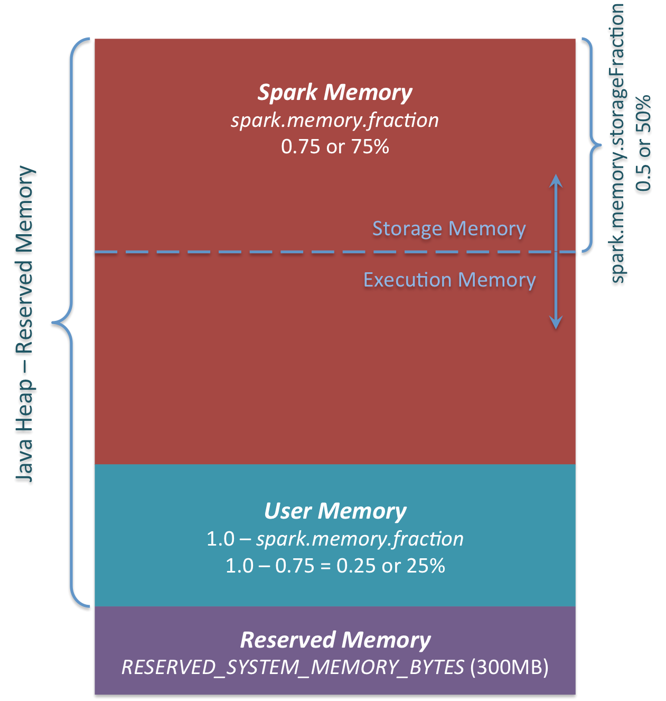
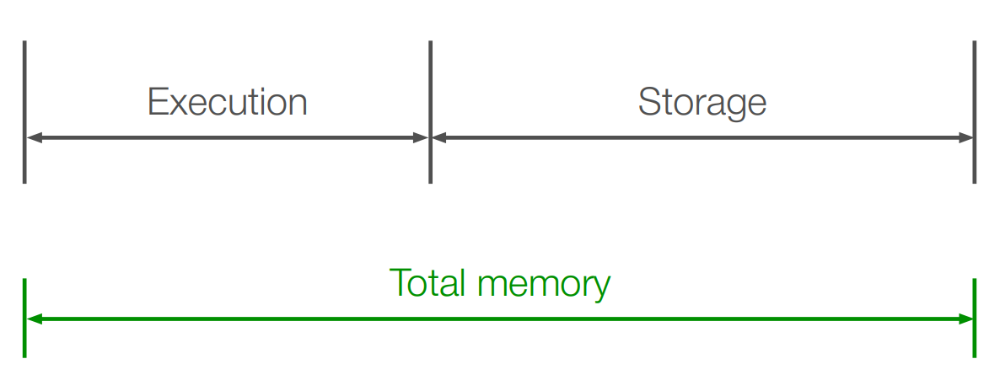

# Spark

## Recap

[Overview](./README.md)

Spark is built around the concepts of Resilient Distributed Datasets and Direct Acyclic Graph representing transformations and dependencies between them.


Spark Application (often referred to as Driver Program or Application Master) at high level consists of SparkContext and user code which interacts with it creating RDDs and performing series of transformations to achieve final result. These transformations of RDDs are then translated into DAG and submitted to Scheduler to be executed on set of worker nodes.

[How Spark Runs Your Applications](./spark_run_app.md)

## RDD: Resilient Distributed Dataset

Resilient Distributed Datasets (RDD) is a fundamental data structure of Spark. It is an *immutable distributed collection of objects*. Each dataset in RDD is divided into *logical partitions*, which may be computed on different nodes of the cluster. 
RDDs can contain any type of Python, Java, or Scala objects, including user-defined classes.

- **Resilient** means that we must be able to withstand failures and complete an ongoing computation. 
- **Distributed** means that we must account for multiple machines having a subset of data. 

**Formally, RDD is a read-only, distributed collection of objects. These objects are grouped into partitions (partitioned collection) which are stored and processed by executors.**

There are two ways to create RDDs − 
1. *parallelizing* an existing collection in your driver program
2. or *referencing* a dataset in an external storage system, such as a shared file system, HDFS, HBase, or any data source offering a Hadoop Input Format.


Spark represents the computation in the so-called lineage graph. It consists of a sequence of RDDs which are generated by the transformations and the dependencies between the RDDs.

[graph](../graphs/README.md)

***

RDD represents distributed immutable data (partitioned data + iterator) and lazily evaluated operations (transformations). As an interface RDD defines five main properties:
```Scala
//a list of partitions (e.g. splits in Hadoop)
def getPartitions: Array[Partition]

//a list of dependencies on other RDDs
def getDependencies: Seq[Dependency[_]]

//a function for computing each split
def compute(split: Partition, context: TaskContext): Iterator[T]

//(optional) a list of preferred locations to compute each split on
def getPreferredLocations(split: Partition): Seq[String] = Nil

//(optional) a partitioner for key-value RDDs
val partitioner: Option[Partitioner] = None  
```

Here's an example of RDDs created during a call of method `sparkContext.textFile("hdfs://...")` which first loads HDFS blocks in memory and then applies map() function to filter out keys creating two RDDs:


HadoopRDD:
    * getPartitions = HDFS blocks
    * getDependencies = None
    * compute = load block in memory
    * getPrefferedLocations = HDFS block locations
    * partitioner = None
MapPartitionsRDD
    * getPartitions = same as parent
    * getDependencies = parent RDD
    * compute = compute parent and apply map()
    * getPrefferedLocations = same as parent
    * partitioner = None

**Datasets must be typed**
**You can not modify data in-place in Spark. Datasets are immutable**


> https://luminousmen.com/post/spark-partitions
> https://sparkbyexamples.com/spark/spark-partitioning-understanding/


**Partitions** logical chunk of a large distributed data set. It provides the possibility to distribute the work across the cluster, divide the task into smaller parts, and reduce memory requirements for each node.
**Partition is the main unit of parallelism in Apache Spark.**
Spark partitions ≠ hive partitions (*Spark* splits data in order to process it in parallel *in memory*. *Hive* partition is *in the storage, in the disk, in persistence*.)



**Dependencies** (that models the relationships a RDD and its partitions and the partition which it was derived from)

**Function:** for comping the dataset based on its parent RDD

**Metadata** about its partitioning scheme and data placement


**a binary file in HDFS**

**partitions() -> Array[Partition]**
* lookup blocks information from the NameNode
* make a partition for every block
    * return an array of the partitions
**iterator(p: Partition, parents: Array[Iterator[_]]) -> Iterator[Byte]**
* parents are not used
* return a reader for the block of the given partition
**dependencies() -> Array[Dependency]**

**Example: an sliced* in-memory array**
* can be used to parallelize in-memory computations

**partitions() -> Array[Partition]**
* slice array in chunks of size N
* make a partition for every chunk
* return an array of a single partition with the source array of the
partitions
**iterator(p: Partition, parents: Array[Iterator[_]]) -> Iterator[T]**
* parents are not used
* return an iterator over the source array chunk in the given partition
**dependencies() -> Array[Dependency]**
* return an empty array (no dependencies)

### Operation mechanism of spark (General execution framework). stage, executor, driver

General execution framework of spark applications on distributed clusters. It is mainly composed of spark context, cluster manager and resource manager.


The main operation process of spark is as follows:

* After the application is submitted with spark submit, it initializes spark context in the corresponding position according to the deployment mode at the time of submission, that is, the running environment of spark, and creates DAG scheduler and task scheduler. The driver divides the whole program into multiple jobs according to the action operator according to the execution code of the application, and each job builds DAG diagram and DAG diagram The scheduler divides the DAG graph into multiple stages, and each stage is internally divided into multiple tasks. The DAG scheduler transfers the task set to the task scheduler, which is responsible for scheduling tasks on the cluster. As for the relationship between stage and task and how they are divided, we will talk about it in detail later.

* The driver applies for resources from the resource manager according to the resource requirements in the sparkcontext, including the number of executors and memory resources.

* After receiving the request, the resource manager creates the executor process on the work node that meets the conditions.

* After the executor is created, it will reverse register with the driver, so that the driver can assign tasks to him to execute.

* After the program is executed, the driver logs off the requested resource to the resource manager.

#### 1. Driver program

Driver is the spark application we write to create a spark context or spark session. 
The **driver will communicate with cluster manager and assign tasks to the executor for execution**

#### 2. Cluster Manager
It is responsible for the resource scheduling of the whole program
* YARN
* Spark Standalone
* Mesos

#### 3. Execuror

 Executor (execution process of a single node). Cluster manager is responsible for the unified resource management of the whole cluster. **Executor is the main process of application execution, which contains multiple task threads and memory space.**




**An executor** in Spark is just a JVM holding a **bunch of objects in its memory**. Spark has to do before mini shuffle, is having an object one in executor one, transfer it through the network through the JVM of the second executor.

Spark uses serialization.

> Serialization is the process of translating data structures or object state into a format that can be stored (for example, in a file or memory buffer, or transmitted across a network connection link) and reconstructed later in the same or another computer environment

Spark serializers:
* Java – slow, but robust
* Kryo – fast, but has corner cases
* ...


* PySpark context is a Python interpreter which communicates with the JVM using this socket, and Py4J library. 
* Py4J provides mechanism of calling Gela methods and wrapping objects. 
* On Spark workers, Python is just a protest which starts side by side with the JVM and communicates through Unix pipes.
* python always save serialized object. Scala|Java - not



At first Spark has to serialize Python objects and pass them through JVM, where they should be serialized again for Spark's execution model to work.

## Jobs, stages, tasks

* The SparkContext is the core of your application
* The driver communicates directly with the executors
* Execution goes as follows: **Action -> Job -> Job Stages -> Tasks**
* Transformations with narrow dependencies allow pipelining

[Action](####Actions)


Materialization happens when reading, shuffling or passing data to an action
* narrow dependencies allow pipelining
* wide dependencies forbid it

Example:
1. Invoking an action…
2. …spawns the job…
3. …that gets divided into the stages by the job scheduler…
4. …and tasks are created for every job stage.

### SparkContext – other functions

* Tracks liveness of the executors
    * required to provide fault-tolerance

* Schedules multiple concurrent jobs
    * to control the resource allocation within the application

* Performs dynamic resource allocation
    * to control the resource allocation between different applications

How does your application find out the executors to work with?
The SparkContext object allocates the executors by communicating with the cluster manager.


#### 4. Job
* Job is a complete processing flow of user program, which is a logical term.
* job is triggered by action, so
    * job contains one action and N transform operations;
* job executed *once* 
* job a *lazy evaluation* 
* job is a sequence of stages, triggered by an action such as `.count()`, `foreachRdd()`, `sortBy()`, `read()` or `write()`.

#### 5. Stage
* Job is *divided in smaller sets* of tasks called *stages*, which are serial
* The trigger of state is generated by some shuffle, reduce and save actions
* stage is a set of tasks that are divided due to shuffle operations. Stage is divided according to its *wide* and *narrow dependencies*;
* stage is a *pipelined computation* spanning between materialization boundaries
* *not immediately* executable
* Job is *spawned* in response *to a Spark action*

#### 6. Task
Task: the smallest execution unit, because each task is only responsible for the data of a partition
A stage can contain multiple tasks, such as sc.textFile (“/ XXXX”). Map (). Filter (), where map and filter are a task respectively. The output of each task is the output of the next task.

* Task is a *job stage* bound to particular partitions
* immediately executable
* Task is a *unit of work* to be done
* Tasks are *created by a job scheduler* for *every job stage*

#### 7. Partition
Partition is a part of the data source in spark. A complete data source will be divided into multiple partitions by spark so that spark can be sent to multiple executors to execute tasks in parallel.

#### 8. RDD
[Resilient Distributed Dataset](##RDD:-Resilient-Distributed-Dataset)
[RDD Operations](###RDD-Operations)
RDD is a distributed elastic data set. In spark, a data source can be regarded as a large RDD. RDD is composed of multiple partitions. The data loaded by spark will be stored in RDD. Of course, in RDD, it is actually cut into multiple partitions.

**How does a spark job execute?**

1) Our spark program, also known as the driver, will submit a job to the cluster manager
2) The cluster manager checks the local rows of data and finds the most suitable node to schedule the task
3) Jobs will be split into different stages, and each stage will be split into multiple tasks
4) The driver sends the task to the executor to execute the task
5) The driver will track the execution of each task and update it to the master node, which we can check on the spark master UI
6) When the job is completed, the data of all nodes will be aggregated to the master node again, including the average time consumption, maximum time consumption, median and other indicators.

#### 9. deployment mode and operation mode
The deployment mode refers to the cluster manager, which generally includes standalone and yarn, while the running mode refers to the running machine of drvier, the cluster or the task submitting machine, which correspond to the cluster and client modes respectively. The difference lies in the running results, logs, stability, etc.


### Prtition, transformation etc

#### Prtitioner

> https://luminousmen.com/post/spark-partitions

Once the user has submitted his job into the cluster, each partition is sent to a specific executor for further processing. 
*Only one partition is processed by one executor at a time*, so the size and number of partitions *transferred to the executor are directly proportional* to the time it takes to complete them. Thus the more partitions the more work is distributed to executors, with a smaller number of partitions the work will be done in larger pieces (and often faster).

Looking at the partition structure, we can see that our data is divided into four partitions (because my laptop has 4 cores and the spark created 4 executables in standalone mode), and if we apply the transformations on this data frame, the work of each partition will be done in a separate thread (and in my case on each individual processor core).

The partitioner defines how records will be distributed and thus which records will be completed by each task.

Interface with 2 methods:

1. `numPartitions` – number of partitions in RDD after partitioning
    ```python
    groupByKey(numPartitions=None,
        partitionFunc=<function portable_hash…>)
    ```
    Group the values for each key in the RDD into a single sequence. Hash-partitions the resulting RDD with numPartitions partitions.

2. `getPartition` – mapping from a key to the index of partition

**Spark partitioners**
* hash partitioner
* range partitioner (e.g. sorting) Range partitioning assigns records, whose keys are in the same region to the given partition. 

**Transformations preserving partitioning**
> Manual transformations have a preserves partitioning argument which is set to false by default. It becomes obvious for the map method for example, because map might spill not only new values but new keys. But if you are 100% sure that your keys don't modify, you can set preservesPartitioning to true, or use map values which preserves a partitioner. 

* `map(f, preservesPartitioning=False)`
* `flatMap(f, preservesPartitioning=False)`
* `mapPartitions(f, preservesPartitioning=False)`  iterator-to-iterator transformation
* `mapPartitionsWithIndex(f, preservesPartitioning=False)`
* `mapValues(f)`
* `flatMapValues(f)`

##### Co-*

* **RDDs** are **co-partitioned** if they are *partitioned by the same known partitioner* -> Co-partitioned RDDs *reduce* the volume of the *shuffle*

* Partitions are **co-located** if they are both *loaded into memory on the same machine* -> Co-located *RDDs don’t shuffle*

* Default partitioner uses key hashing

##### Shuffling

**Shuffling** means the *reallocation of data between multiple Spark stages*. 

*"Shuffle Write"* is the sum of all written serialized data on all executors before transmitting (normally at the end of a stage)

*"Shuffle Read"* means the sum of read serialized data on all executors at the beginning of a stage.

##### Repartitioning

*The first **way to manage partitions** is **repartition** operation.*

Under repartitioning meant the operation to *reduce or increase the number of partitions* in which the data in the cluster will be split. *This process involves a full shuffle.*

Consequently, it is clear that repartitioning is an expensive process. In a typical scenario, most of the data should be serialized, moved, and deserialized.

Example:
```python
repartitioned = transactions.repartition(8)
print('Number of partitions: {}'.format(repartitidoned.rdd.getNumPartitions()))
print('Partitions structure: {}'.format(repartitioned.rdd.glom().collect()))
```
In addition to specifying the number of partitions directly, you can pass in the name of the column by which you want to partition the data.

Example,
```python
repartitioned = transactions.repartition('country')
print('Number of partitions: {}'.format(repartitidoned.rdd.getNumPartitions()))
print('Partitions structure: {}'.format(repartitioned.rdd.glom().collect()))
```
We see that the number of partitions has become *200* and many of these partitions are completely empty. We will discuss this point a little further in the article.


##### Coalesce

*The second **way to manage partitions** is **coalesce**.*

This operation reduces the number of partitions and **avoids a full shuffle**. The executor can safely leave data on a minimum number of partitions, moving data only from redundant nodes. Therefore, it is better to use coalesce than repartition if you need to reduce the number of partitions.

```python
coalesced = transactions.coalesce(2)
print('Number of partitions: {}'.format(coalesced.rdd.getNumPartitions()))
print('Partitions structure: {}'.format(coalesced.rdd.glom().collect()))
```

##### Layers of partitions

>
> if you are **increasing** the number of partitions use `repartition()` (performing full shuffle)
>
> if you are **decreasing** the number of partitions use `coalesce()` (minimizes shuffles)
>
> `partitionBy()` used to partition based on one or multiple column values while writing DataFrame to Disk/File system.
>
> `repartitionByRange()` – Range Partition

There are three stages at the physical level where the number of partitions is important:

**input** - determining the number of partitions based on the size of the input dataset.

Let us imagine that the size of our input dataset is about 30 GB (~30000 MB) of an uncompressed text file on the HDFS which is distributing it on 10 nodes.

When Spark reads a file from HDFS, it creates a single partition for a single input split. Input split is set by the Hadoop `InputFormat` used to read this file. If you have a 30GB uncompressed text file stored on HDFS, then with the default HDFS block size setting (128MB) and default `spark.files.maxPartitionBytes(128MB)` it would be stored in 240 blocks, which means that the dataframe you read from this file would have 240 partitions.

This is equal to the Spark default parallelism (`spark.default.parallelism`) value.

If your data is not explodable then Spark will use the default number of partitions. When a job starts the number of partitions is equal to the total number of cores on all executor nodes.


**shuffle**

Shuffle partitions are partitions that are used at data shuffle for wide transformations. 

However, for wide transformations, the number of shuffle partitions is set to 200. It does not matter if your data is small or large, or if your cluster configuration has 20 executors, it is still 200. Yes, yes, that's what we saw in the repartition section, that's the mysterious number.


So the parameter that controls the parallelism that results from a shuffle is a parameter called spark.sql.shuffle.partitions.The reason why the default is 200 is from real-world experience that was found to be a very good default. But in practice, that value is usually always bad.

When dealing with small amounts of data, you should usually reduce the number of shuffle partitions otherwise you will end up with many partitions with small numbers of entries in each partition, which results in underutilization of all executors and increases the time it takes for data to be transferred over the network from the executor to the executor.



On the other hand, when you have too much data and too few partitions, it causes fewer tasks to be processed in executors, but it increases the load on each individual executor and often leads to memory errors. Also, if you increase the size of the partition larger than the available memory in the executor, you will get disk spills. Spills are the slowest thing you can probably be able to do. Essentially, during disk spills Spark operations place part of its RAM into a disk if it does not fit in memory, allowing Spark job to run well on any sized data. Even though it won't break your Pipeline it makes it super inefficient because of the additional overhead of disk I/O and increased garbage collection.

Therefore spark.sql.shuffle.partitions is one of the most frequently configured parameters when working with Spark.

**output**

Saving the partied data on the properly selected condition can significantly speed up the reading and retrieval of the necessary data in the future processing pipelines.

First, in some cases it is possible to use partition pruning after partition discovery of DataSource, it limits the number of files and partitions that Spark reads when querying. In some cases (for example AWS s3) it even avoids unnecessary partition discovery. It is also valuable with the concept of Dynamic Partition Pruning in Spark 3.0. But sometimes these optimizations can make things worse, e.g. recursive scanning of the file system for metadata to understand partitions for an initial query can take a long time(in case of a large number of partitions). Also, all table metadata must be materialized into the memory of the driver process and can significantly increase its memory burden.

Second, when saving DataFrame to disk, pay particular attention to partition sizes. During writing Spark will produce one file per task (i.e. one file per partition) and will read at least one file in the task while reading. The problem here is that if the cluster setup, in which DataFrame was saved, had more aggregate memory and thus could process large partitions sizes without any problems, then a smaller cluster may have problems with reading saved DataFrame.

##### How to Choose Spark Partition Column?

When using `partitionBy()`, you have to be very cautious with the number of partitions it creates, as having too many partitions creates too many sub-directories in a directory which brings unnecessarily and overhead to NameNode (if you are using Hadoop) since it must keep all metadata for the file system in memory.

Partition on zipcode may not be a good option as you might end up with too many partitions.

Another good example of partition is on the Date column. Ideally, you should partition on Year/Month but not on a date.

### RDD Operations

Operations on RDDs are divided into several groups:

Main - transformtions nd actions

#### Transformations

* RDD input, RDD output
* apply user function to every element in a partition (or to the whole partition)
* apply aggregation function to the whole dataset (`groupBy`, `sortBy`)
* introduce dependencies between RDDs to form DAG
* provide functionality for [repartitioning](#####Repartitioning) (`repartition`, `partitionBy`)
* filter records and group them by a key
* create new RDDs from existing RDDs by specifying how to obtain new items from the existing items
* all transformtions are lazy
Transformation is the primary way to “modify” data (given that RDDs are immutable)
* There are transformations with **narrow**(local) and **wide** **dependencies**(require data shuffling). The *transformation creates a new RDD every time*, so you can't produce a cyclic dependency graph by applying Spark transformations to RDDs
* MapReduce can be expressed with a couple of transformations
* Complex transformations (like `joins`, `cogroup`) are available

> Narrow and Wide dependencies
>
> Conceptually, **narrow** transformations are those in which each partition in the child RDD has simple finite dependencies on partitions in the parent RDD. 
> Dependencies are only narrow if they can be determined at their designed time, irrespective of the values of the records in the parent partitions and if each parent has at most one child partition. 
>  Specifically, partitions in narrow transformations can either depend on one parent, such as in the map operator, or a unique subset of the parent partitions that is known at designed time, like call ask. Thus, narrow *transformations can be executed on an arbitrary subset of the data without any information about other partitions.*
>  `join` *may be a narrow* transformation *if the partitions of the RDD are co-partitioned*.
>
> **wide** dependencies *cannot be executed on arbitrary rows* and instead, *require the data to be partitioned in a particular way*. 
> Transformations with wide dependencies include `sort`, `reduceByKey`, `groupByKey`, `join`, and anything that cause the repartition function.
> *Wide dependencies, which cause data shuffling, create new stages.*
>
> **The division into narrow and wide dependencies creates stages of execution.** 
> This means that the *sub-sequence* of a lineage graph *which has only narrow dependencies can be computed without any data transfer* in a nice pipelined fashion. 
> Wide dependencies cause data transfers which are called [shuffles](#####Shuffling
). Shuffles are expensive, so they should be avoided or the volume of the transfer data should be reduced.


it's possible to check if each keyA exists in B dataset, B in the memory on Map phase
each mapper doesn't store all the keys from A dataset. So you can't check if keyB exists in A

Freq used

› Def: `filter(p: T  Boolean): RDD[T]  RDD[T]`

    ›returns a filtered RDD with items satisfying the predicate p

› Def: `map(f: T  U): RDD[T]  RDD[U]`

    ›returns a mapped RDD with items f(x) for every x in the source RDD

› Def: `flatMap(f: T  Array[U]): RDD[T]  RDD[U]`

    › same as map but flattens the result of f

    › generalizes map and filter

**Filter**

› Y = X.filter(p) # where X : RDD[T]

    ›Y.partitions()  Array[Partition]

        › return the same partitions as X  

    ›Y.iterator(p: Partition, parents: Array[Iterator[T]])  Iterator[T]

        › take a parent iterator over the corresponding partition of X

        › wrap the parent iterator to skip items that do not satisfy the predicate

        › return the iterator over partition of Y

    ›Y.dependencies()  Array[Dependency]

        › k-th partition of Y depends on k-th partition of X

fiter() doesn't changes the inputRDD and returns the pointer to a new RDD

On closures
› Y = X.filter(lambda x: x % 2 == 0)

    ›predicate closure is captured within the Y (it is a part of the definition of Y)

    ›predicate is not guaranteed to execute locally (closure may be sent over the network to the executor)

**Partition dependency graph**

 Z = X.filter(lambda x: x % 2 == 0).filter(lambda y: y < 3)


Something that is not that obvious in the MapReduce paradigm is the **cogroup transformation**. 
Unlike the previous transformations, *cogroup operates on two keyed inputs*. The result is the keyed output with the value being a pair of arrays holding the values collected for the given key from the first and the second input.

Joins, GroupBy - shuffle

`union()` отличается от `filter()` тем, что принимает два на­ бора  RDD  вместо  одного.  Вообще,  преобразования  могут  опериро­ вать любым числом исходных наборов RDD.


#### Actions

* trigger job execution. So *Actions, together with a transformation code, are executed elsewhere*, not in your driver program. Your driver program receives only the outcome.
* used to *materialize computation results* - `collect`, `print`, `save`, and `fold` data.

* When running locally, the executors are collocated within the same process as the driver program.
* When running in a *cluster mode, the executors are located on the cluster machines*, thus allowing you to use the cluster for a computation.

Freq used ations: 
* `collect()`
    * collects items and passes them to the driver
    * for small datasets! all data is loaded to the driver memory
* `take(n: Int)`
    * collects only n items and passes them to the driver
    * tries to decrease amount of computation by peeking on partitions
* `top(n: Int)`
    * collects n largest items and passes them to the driver
* `reduce(f: (T, T)  T)`
    * reduces all elements of the dataset with the given associate, commutative binary function and passes the result back to the driver
* `saveAsTextFile(path: String)`
    * each executor saves its partition to a file under the given path with every item converted to a string and confirms to the driver
* `saveAsHadoopFile(path: String, outputFormatClass: String)`
    * each executor saves its partition to a file under the given path using the given Hadoop file format and confirms to the driver
* `foreach(f: T  ())`
    * each executor invokes f over every item and confirms to the driver
* `foreachPartition(f: Iterator[T]  ())`
    * each executor invokes f over its partition and confirms to the driver

#### Extra: persistence

* explicitly store RDDs in memory, on disk or off-heap (cache, persist)
* checkpointing for truncating RDD lineage

## Resilience

### Fault-tolerance in MapReduce

Two key aspects
* reliable storage for input and output data
* deterministic and side-effect free execution of mappers and reducers
### Fault-tolerance in Spark

Same two key aspects
* reliable storage for input and output data
* deterministic and side-effect free execution of transformations(including closures)

**Determinism** — every invocation of the function results in the same
returned value
>  e. g. do not use random numbers, do not depend on a hash value order

**Freedom of side-effects** — an invocation of the function does not change anything in the external world
> e. g. do not commit to a database, do not rely on global variables

### Fault-tolerance & transformations

* **Lineage** — a dependency graph for all partitions of all RDDs involved in a computation up to the data source

if the dependencies of a failed partition fails as well then Computation is restarted to recompute the dependencies first, and the partition afterwards.

### Fault-tolerance & actions

* Actions are side-effects in Spark
* Actions have to be idempotent that is safe to be re-executed multiple times given the same input

## Caching & Persistence

**Persist** - method to actually *store intermediate results* of a computation. 
It computes the whole lineage graph and then stores partitions of an RDD or dataframe in some place. 
When you call an action on a persistent data, nothing happens except computing this only action. And if you call collect, Spark doesn't have to recompute the whole thing, it just transfers data to your driver program. If that persistent is not a reliable method to store results but it is robust.

So, if you have a dataframe consisting of several partitions on different executors, if one or more executors fail and are restarted by the resource manager, Spark will recompute lost partitions but will not recompute those which are in order.


Performance may be improved by persisting data across operations
* in interactive sessions, iterative computations and hot datasets

You can control the persistence of a dataset
* whether to store in the memory or on the disk
* how many replicas to create

### Cache methods

Controlling persistence level
* `rdd.persist(storageLevel)`
    * sets RDD’s storage to persist across operations after it is computed for the first time
* `storageLevel` is a set of flags controlling the persistence, typical values are
    * 1lv MEMORY_ONLY
        – keep the data in the memory. 
        - executor has some reserved memory for persisting and when you choose MEMORY_ONLY, Spark tries to save partitions in this part of memory if there is enough space. 
    * 1lv MEMORY_ONLY_2
        – keep the data in the memory
        - provides a bit of redundancy by storing two replicas on different cluster nodes.
    * 2lv MEMORY_AND_DISK
        – keep the data in the memory; when out of memory – save it to the disk
        - Spark tries to store as much of data as possible in memory and if there is not enough space, it will spill records to disk. 
        - IO
    * 3lv DISK_ONLY
        – save the data to the disk, and doesn't store it in memory.
    * DISK_ONLY_2, MEMORY_ONLY_2, MEMORY_AND_DISK_2
        – same as about, but make two replicas <- improves failure recovery times!
* `rdd.cache() = rdd.persist(MEMORY_ONLY)`

### checkpoints

`checkpoint()` - as persistelce *provides ways to store intermediate results*. Spark writes partitions of an RDD or a dataframe to a reliable storage and this storage is HDFS.

*It turnkeys the whole lineage graph which produced this intermediate result.*
You need to specify a directory in HDFS where to store the data and then call checkpoint method of an RDD 
```python
sc.setCheckpointDir("/hdfs_directory/")
df.rdd.checkpoint()
```

**When to make a checkpoint:**
* Noisy cluster (Cluster with a lots of jobs and users which compete for resources and there are not enough resources to run all the jobs simultaneously.)
* Expensive and long computations
* No way to checkpoint Dataframe so you have to checkpoint the underlying RDD.

**Best practices:**
* For interactive sessions
    * cache preprocessed data

* For batch computations
    * cache dictionaries
    * cache other datasets that are accessed multiple times

* For iterative computations
    * cache static data

* Do benchmarks!

### Tips for persist and checkpoins

* `MEMORY_ONLY` if it fits
* Recomputing may be as fast as reading from disk
* Persist iterative algorithms (ML)
* Persisting is unreliable, checkpointing is reliable
* Checkpointing is slow, persisting may be slow

## Shared ariables

> https://spark.apache.org/docs/latest/rdd-programming-guide.html#shared-variables

Normally, when a function passed to a Spark operation (such as `map` or `reduce`) is executed on a remote cluster node, it works on separate copies of all the variables used in the function. 
These variables are *copied to each machine*, and no updates to the variables on the remote machine are propagated back to the driver program. 
Supporting general, read-write shared variables across tasks would be inefficient. However, Spark does provide two limited types of shared variables for two common usage patterns: broadcast variables and accumulators.


### Broadcast variables

Broadcast variables allow the programmer to keep a read-only variable cached on each machine rather than shipping a copy of it with tasks. 

They can be used, for example, to give every node a copy of a large input dataset in an efficient manner. 
Spark also attempts to distribute broadcast variables using efficient broadcast algorithms to reduce communication cost.


* Broadcast variable is a *read-only variable* that is *efficiently* shared among tasks
* variables cached in all the executors instead of shipping every time with the tasks
* *Distribution* is done by a *torrent-like* protocol (extremely fast!)
* Distributed efficiently *compared to captured variables*
* Useful to share dictionaries, models
* used as lookups without any shuffle, as each executor will keep a local copy of it, so no network I/O overhead is involved here. 

Example
```python
sc = SparkContext(conf=…)
# compute the dictionary
my_dict_rdd = sc.textFile(…).map(…).filter(…)
my_dict_data = my_dict_rdd.collect()
# distributed the dictionary via the broadcast variable
broadcast_var = sc.broadcast(my_dict_data)
# use the broadcast variable within the task
my_data_rdd = sc.textFile(…).filter(
    lambda x: x in broadcast_var.value)
```

Q is how big of a lookup dataset do you want to broadcast. The answer lies in the amount of memory you are allocating for each executor. 
If we broadly look at memory management in Spark, we'll observe that Spark keeps 75% of the total memory for its own storage and execution. Out of that 75%, 50% is allocated for storage purposes, and the other 50% is allocated for execution purposes. 



For example, if you allocate 10 GB memory to an executor, then according to the formula, you Spark storage memory would be :

`(“Java Heap” – 300MB) * 0.75 * 0.5 = 3.64GB(approx) [ 300MB is reserved memory ] `

Spark stores broadcast variables in this memory region, along with cached data.
There is a catch here. This is the initial Spark memory orientation. 
If Spark execution memory grows big with time, it will start evicting objects from a storage region, and as broadcast variables get stored with `MEMORY_AND_DISK` persistence level, there is a possibility that it also gets evicted from memory. So, you could potentially end up doing disk I/O, which is again a costly operation in terms of performance. 

[Spark memory management](###Memory)


### Accumulator variables

Accumulators are variables that are only “added” to through an associative and commutative operation and can therefore be efficiently supported in parallel. 

They can be used to implement counters (as in MapReduce) or sums.
Spark natively supports accumulators of numeric types, and programmers can add support for new types.


> https://dzone.com/articles/accumulator-vs-broadcast-variables-in-spark
> https://spark.apache.org/docs/2.2.0/rdd-programming-guide.html#accumulators
> https://spark.apache.org/docs/1.6.2/api/java/org/apache/spark/Accumulator.html

```scala
public class Accumulator<T>
extends Accumulable<T,T>
```

* Accumulator variable is a *read-write variable* that is shared among tasks
* *Writes are restricted to increments!*
    * increments only
    * i. e.: `var += delta`
    * addition *may be replaced by any associate, commutative operation*
* can use custom associative, commutative operation for the updates
* Reads are *allowed only* by the *driver* program!
* can read the *total value *only in the driver
* Useful for the *control flow, monitoring, profiling & debugging*
* named accumulators & unnamed accumulators
    * named accumulator shows on Spark web UI under the “Accumulator” tab. On this tab, you will see two tables; the first table “accumulable” – consists of all named accumulator variables and their values. And on the second table “Tasks” – value for each accumulator modified by a task.
    * unnamed accumulators are not shows on Spark web UI, For all practical purposes it is suggestable to use named accumulators.


When the accumulator gets incremented on the particular executor, the delta is sent back to the driver program together with a task outcome. Therefore, there is just one natural aggregation point where we can compute the total value, that is the driver. 
It is also important to note that *updates generated in actions are guaranteed to be applied **only once** to the accumulator*. This is because *successful actions are never re-executed* and Spark can conditionally apply the update.

For updates in transformation, there are no guarantees when they accumulate updates. Transformations can be recomputed on a failure on the memory pressure or in another unspecified codes like a preemption. Spark provides no guarantees on how many times transformation code maybe re-executed.

```python
val acc = sc.accumulator(v)
```

```scala
package org.spark.accumulator.crowd.now.aggregator.sample2
var lalaLines: Int = 0
sc.textFile(“some log file”, 4)
.forech { line =>
if (line.length() == 0) lalaLines += 1
}
println (s “ Lala Lines are from the above code = $lalaLines”)


package org.spark.accumulator.crowd.now.aggregator.sample2
var lalaLines = sc.accumulator(, “lala Lines”)
sc.textFile(“some log file”, 4)
.forech { line =>
if (line.length() == 0) lalaLines += 1
}
println (s “\tlala Lines are from the above code = $lalaLines.value”)
This code makes sure that the accumulator blankLine is up to date across each executor and relays back to the driver.
```

**Advantages and Uses of Spark Accumulator**
Memory access is very direct.
* Garbage values are least collected in processing overhead.
* Memory format is compact columnar.
* Query catalyst optimization.
* Code generation is the whole stage.
* Advantages of compile tile type by datasets over the data-frames.


**Use cases**
* Performance counters
    * of processed records, total elapsed time, total error and so on and so forth
* Simple control flow
* conditionals: stop on reaching a threshold for corrupted records
    * loops: decide whether to run the next iteration of an algorithm or not
* Monitoring
    * export values to the monitoring system
* Profiling & debugging

# Spark Execution Model & RDD Internals

**Spark application optimization.**

Read the log file, filter out rows that contain info substring, and finally, a typical MapReduce pattern to emit one for each key and reduceByKey.
```python
logs = sc.textFile("log.txt")
    .filter(lambda x: "INFO" not in x)
    .map(lambda x: (x.split("\t")[1], 1))
    .reduceByKey(lambda x, y: x + y)
logs.collect()
```

**Shuffle Write Size** - instrumentation mechanism to spot the shuffle, and to measure how much data it has transferred.
Check UI and DAG interface to check how its going

Preserve the partitioner to avoid shuffles

PySpark adds double serialization
Try to reduce serialization overhead by pipelining operations inside the Python interpreter. 
PySpark tries to reduce serialization by pipelining. This produces strange DAGs

Don’t initialize objects inside your functions

Broadcast variables to reduce initialization overhead
```python
rdd.mapPartitions(myfunc)
obj = sc.broadcast(SomeLongRunningInit())
def myfunc(row_iter):
    for row in row_iter:
        yield obj.value.apply(row)
```

Transform partitions, not rows

joins generaed shuffles

* Reduce shuffles!
* Explicit (known) partitioner
* Preserve partitioner
* Reduce shuffle volume
    * reduceByKey vs groupByKey

## Memory Management

> https://0x0fff.com/spark-memory-management/

3 main memory regions:

1. **Reserved Memory.**
This is the memory reserved by the system, and its size is hardcoded. 
As of Spark 1.6.0, its value is *300MB*, which means that this 300MB of RAM does not participate in Spark memory region size calculations, and its size cannot be changed in any way without Spark recompilation or `setting spark.testing.reservedMemory`, which is not recommended as it is a testing parameter not intended to be used in production. 
Be aware, this memory is only called “reserved”, in fact it is not used by Spark in any way, but it *sets the limit on what you can allocate for Spark usage*. Even if you want to give all the Java Heap for Spark to cache your data, you won’t be able to do so as this “reserved” part would remain spare (not really spare, it would store lots of Spark internal objects). 
For your information, if you don’t give Spark executor at least `1.5 * Reserved Memory = 450MB` heap, it will fail with “please use larger heap size” error message.

2. **User Memory.** 
This is the memory pool that *remains after the allocation of Spark Memory*, and it is completely up to you to use it in a way you like. You can store your own data structures there that would be used in RDD transformations. For example, you can rewrite Spark aggregation by using `mapPartitions` transformation maintaining hash table for this aggregation to run, which would consume so called User Memory. 
In Spark 1.6.0 the size of this memory pool can be calculated as `(“Java Heap” – “Reserved Memory”) * (1.0 – spark.memory.fraction)`, which is by default equal to `(“Java Heap” – 300MB) * 0.25`. 
For example, with `4GB` heap you would have `949MB` of User Memory. And again, this is the User Memory and its completely up to you what would be stored in this RAM and how, Spark makes completely no accounting on what you do there and whether you respect this boundary or not. Not respecting this boundary in your code might cause OOM error.

3. **Spark Memory.** 
This is the memory pool *managed by Apache Spark*. 
Its size can be calculated as `(“Java Heap” – “Reserved Memory”) * spark.memory.fraction`.
with Spark 1.6.0 defaults it gives us `(“Java Heap” – 300MB) * 0.75`. 
For example, with `4GB` heap this pool would be `2847MB` in size. This whole pool is split into 2 regions – **Storage Memory** and **Execution Memory** [Memory](###Memory), and the boundary between them is set by `spark.memory.storageFraction` parameter, which defaults to `0.5`. The advantage of this new memory management scheme is that this boundary is not static, and in case of memory pressure the boundary would be moved, i.e. one region would grow by borrowing space from another one. I would discuss the “moving” this boundary a bit later, now let’s focus on how this memory is being used:
    1. **Storage Memory**. 
    This pool is used for both storing Apache Spark cached data and for temporary space serialized data “unroll”. 
    Also all the *“broadcast” variables are stored there* as cached blocks. In case you’re curious, here’s the code of unroll. As you may see, it does not require that enough memory for unrolled block to be available – in case there is not enough memory to fit the whole unrolled partition it would directly put it to the drive if desired persistence level allows this. As of “broadcast”, all the broadcast variables are stored in cache with `MEMORY_AND_DISK` persistence level.
    2. **Execution Memory.** 
    This pool is used for *storing the objects required during the execution of Spark tasks*. 
    For example, it is used to store shuffle intermediate buffer on the Map side in memory, also it is used to store hash table for hash aggregation step. This pool also supports spilling on disk if not enough memory is available, but the blocks from this pool cannot be forcefully evicted by other threads (tasks).

### Memory

Two kinds of memory:
* Execution
    **Shuffles, joins, sorts and aggregations**
* Storage
    **Cache data**

* If execution memory is full – spill to disk
* If storage memory is full – evict LRU blocks
* It is better to evict storage, not execution
* If your app relies on caching, tune `spark.memory.storageFraction`



`spark.executor.memory = 1g` - Amount of memory to use per executor process
`spark.memory.fraction = 0.6` - Fraction of heap space used for execution and storage
`spark.memory.storageFraction = 0.5` - Amount of storage memory immune to eviction

**Memory management strategy**
* Evict storage, not execution!
* Minimum unevicatable amount of cached data

### Resource Allocation

What should I do?
```
pyspark --num_executors ??
        --executor-cores ??
        --executor-memory ??
```

* Least granular executors can’t use JVM parallelism
* Need to leave resources for OS and YARN daemons
* Need to leave resources for AM
* HDFS throughput is bounded by 5 cores
* Need to to leave resources for off-heap

Resource managers
* Spark standalone
* Mesos
* *YARN*

HDFS Throughput
* 15 cores per executor is bad for HDFS throughput
* Rule of thumb – 5 cores per executor

Final try
* 1 node = 16 - 1 cores, 64 - 1 G
* 1 executor = 5 cores (best HDFS throughput)
* 60 cores / 5 cores per executor = 12 executors
* 1 container for Appllication Master
* 63G / 3 executors per node = 21 * 0.9 (off-heap) = 19G
pyspark --num_executors 11
 --executor-cores 5
 --executor-memory 19G

### Dynamic Allocation

> https://www.slideshare.net/databricks/dynamic-allocation-in-spark
> https://www.slideshare.net/SparkSummit/spark-summit-eu-talk-by-luc-bourlier

* Spark uses long-running containers for speed
* This may cause underutilization
* Dynamic allocation starts executors when needed and releases when not needed
* Dynamic allocation requires tuning
* Shuffle results should be stored in an external service

MR uses short-lived containers for each task
Spark reuses long-running containers for speed

use cases
* Long-running ETL jobs
* Interactive application (Jupyter Notebook)
* Applications with large shuffles


`spark.dynamicAllocation.enabled = false` - Whether to use dynamic resource allocation
`spark.dynamicAllocation.executorIdleTimeout = 60s` -  If an executor has been idle for more than this duration, the executor will be removed
`spark.dynamicAllocation.cachedExecutorIdleTimeout = infinity` - If an executor which has cached data blocks has been idle for more than this duration, the executor will be removed
`spark.dynamicAllocation.minExecutors = 0` - Lower bound for the number of executors if dynamic allocation is enabled
`spark.dynamicAllocation.maxExecutors = infinity` - Upper bound for the number of executors if dynamic allocation is enabled

### Speculative Execution

MapReduce was designed to run on clusters of commodity hardware
Stragglers

**Configuring speculative execution:**
`spark.speculation = false` - If set to "true", performs speculative execution of tasks
`spark.speculation.interval = 100ms`
`spark.speculation.multiplier = 1.5`
`spark.speculation.quantile = 0.75` - fraction of tasks which must be complete before speculation is enabled for a particular stage

Example:
100 tasks, medium execution time = 120s
75 tasks should finish (100 * 0.75)
straggler > 180s (120 * 1.5)
`spark.speculation.multiplier = 1.5`
`spark.speculation.quantile = 0.75`

* Spark (as Hadoop) was built to run on commodity hardware
* Equal load, unequal resources cause stragglers
* Speculative execution may help
* Skew data causes false stragglers


## Streaming

> https://spark.apache.org/docs/latest/streaming-programming-guide.html


Spark Streaming is an extension of the core Spark API that enables scalable, high-throughput, fault-tolerant stream processing of live data streams. Data can be ingested from many sources like Kafka, Kinesis, or TCP sockets, and can be processed using complex algorithms expressed with high-level functions like map, reduce, join and window. Finally, processed data can be pushed out to filesystems, databases, and live dashboards. In fact, you can apply Spark’s machine learning and graph prochdessing algorithms on data streams.

