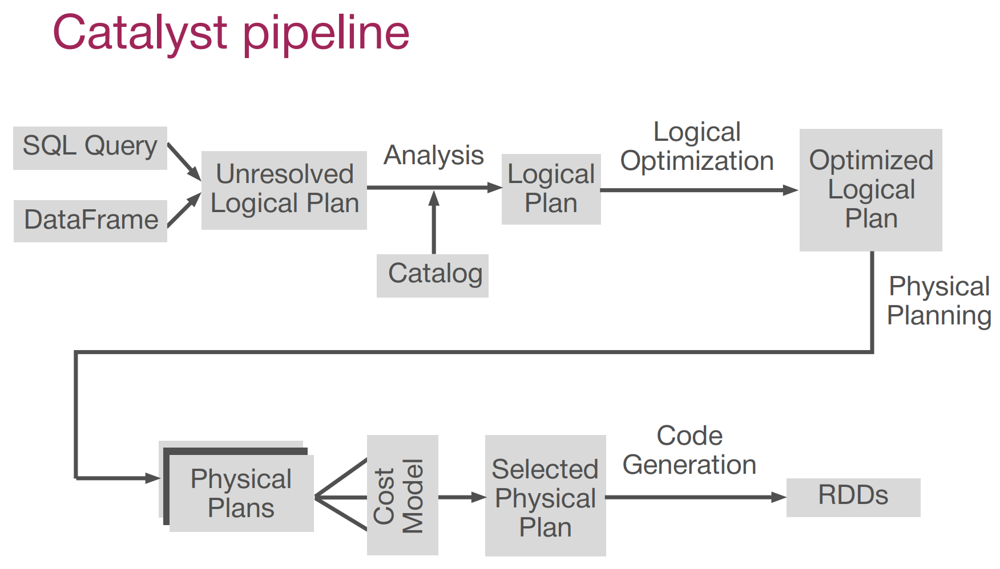
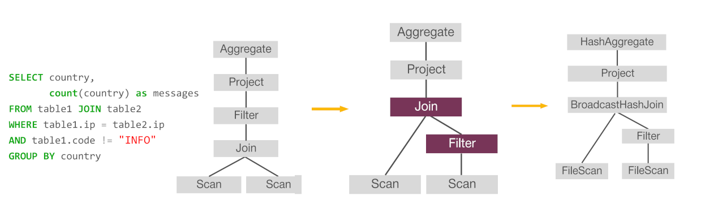

# Spark SQL

HIVE allows to process big data in a common SQL language. 
HIVE allowed to simplify data processing using MapReduce. 
HIVE users don't need to parse data on disk as it is already parsed and the structure saved in a separate database. 
They also don't have to write joints at MapReduce each time they need to merge data sets. 
HIVE could use SQL join cloud instead. 
- MapReduce framework is *quite slow*. It *stores intermediate and final results on the disk between different MapReduce steps*.
*Spark*
like hive but faster
* RDD API is imperative, when SQL is declarative
* faster and more easy than spark RDD
    * can catch intermediate results and memory
    * Structured data processing on Spark has advantages of transforming data using original algorithm. 
    * you don't have to parse data every time you need to work with it. Data structure simplifies your code and makes it more readable. 
    * your code is optimized before execution. all data processing steps will be done in Java without any overhead on parse and code execution.
    * Siplify syntax.
* allows to read/write data from any sources
    * you can read and write your data from another structured data sources like JSON files or any external databases.
* a new core API in spark 2.0

## DataFrame
Tables in Spark SQL are represented by DataFrame objects which allow you to access their data and processes.
Simular to View. every dataframe can be converted into SQL View.
`.createTempView()` - create DataFrame 

Spark DataFrame was inspired by Panda's DataFrame. It can transform Spark DataFrame to Panda's dataframe and back again. But be careful: The whole data that is stored in your data frame will be collected into your driver. And your program will run out of memory and crash.

Transformations return new dataframes. Are lazy as RDD storing its lineage.
select
where
Actions return something else or nothing.
show

## Spark SQL workong with Hive
Spark SQL and Hive can be used together
use `enableHiveSupport()`

```python
from pyspark.sql import SparkSession
spark_session = SparkSession\
 .builder\
 .enableHiveSupport()\
 .appName("spark sql")\
 .master("local")\
 .getOrCreate()
```

get hive output
`spark_session.sql("""show databases""").toPandas()`
`spark_session.catalog.listDatabases()`
`spark_session.catalog.listTables("web")`

The Spark SQL implementation is almost fully compatible with Spark SQL except some tweaky cases:
* 

**Export DataFrame in the Hive**
`geoip_df.createTempView("geoip")`
and 
```
In: spark_session.catalog.listTables("web")
Out:
[Table(name=u'access_log', database=u'web', description=None,
tableType=u'MANAGED', isTemporary=False),
 **Table(name=u'geoip', database=None, description=None,
tableType=u'TEMPORARY', isTemporary=True)]**
```
or
`spark_session.sql("""create table web.geoip as select * from geoip""")`
```
In: spark_session.catalog.listTables("web")
Out: 
[Table(name=u'access_log', database=u'web', description=None, tableType=u'MANAGED',
isTemporary=False),
 **Table(name=u'geoip', database=u'web', description=None, tableType=u'MANAGED',
isTemporary=False),**
 Table(name=u'geoip', database=None, description=None, tableType=u'TEMPORARY',
isTemporary=True)]
```
Check temporary flag.

**Save DataFrame to Hive** by using the 'CREATE TABLE AS SELECT' query.

## Reading and Writing Files

you can save the geoIP data frame into the Hive by SQL query. To do this, you should create a view from our data frame, and execute as a create table a select query on it. 
You can save data into Hive table by `.saveAsTable()` as table method. 
`.saveAsTable(mode='error')` - error if exist
`.saveAsTable(mode='overwrite')` - overwrite if exist
`.saveAsTable(mode='append')` - append if exist

`.save("some_filename")` - creates "some_filename" out folder in our house directory, and writes the data there. save in binry by defoult. can be changet like  `.save("some_filename", format='csv')`. If you try to save a data frame in the folders that already exist, you'll get an exception. To sole - mode error, overwrite, append.
`.write()`  - save data in any place . As `.save()` but `.write.csv("name", mode=...')`, `.write.parquet("name", mode=...')`, `.write.save("json_format", mode=...')` etc

`.read()` - read data from file. Columns read from JSON file will be permuted, because the columns in JSON don't have any order. Data from the CSV file returns the right order of columns, but names of columns should be provided `schema = StructType().add("ip", StringType()).add("code", StringType()).add("country", StringType())`. From the parquet file there are no issues, because each of names, orders are saved parquet files, stored in its own schema. 

Seach table in the Hive is saved in HDFS as a separate directory. Save data in table and save data in file are pretty similar.
`connection_string="jdbc:mysql://localhost:3306/demo?" "user=demo&" "password=demo"`
and next `geoip_from_jdbc = spark_session.read.jdbc(connection_string, "geoip")` or `geoip_df.write.jdbc(connection_string, "geoip")`

## Projection and Filtering

selections of columns is called projection

Exampes:
```python
access_log_df.select(access_log_df.ip,
 access_log_df.url.alias("url_part"))\
 .limit(3).toPandas()
```
```python
import pyspark.sql.functions as f
access_log_df.select(f.col("ip"),
 f.col("url").alias("url_part"))\
 .limit(3).toPandas()
```

***

rows - filtering

Exampes:
```python
spark_session.sql("""
select *
from web.access_log
where http_code<>'200'
""").limit(3).toPandas()
```
the same as
```python
access_log_df.where("http_code <> '200'").limit(3).toPandas()
```

```python
spark_session.sql("""
select *
from web.access_log
where http_code<>'200'
and user_agent like '%Android%'
""").limit(3).toPandas()
```
the same as
```python
access_log_df.where(
 (access_log_df.http_code <> '200') &
 (access_log_df.user_agent.like('%Android%')))\
 .limit(3).toPandas()
```

Also you can use pandas syntax like `access_log_df.[["url","ip"]].limit(3).toPandas()`

## Functions

scale functions are applied not to a single word here but all the words in the selected columns at once. It happens distributively on all nodes of the cluster.

3 types of the scale functions:

* Mapping
map one word from the source code into one word at the destination.

* Generating
transform each element into several ones. 

* Agregating
Used to create a new record from a group of existing ones.

### UDF

Use it if necessary, but not forget about overhead. This functions work much more slowly as functions written on Scala and Java.

[UDF](../MapReduce.md)

Define UDF
```python
def parse_user_agent(user_agent):
    user_agent = re.sub("/?[\d_.]+","", user_agent)
    user_agent = re.sub("[;\(\):,]","", user_agent)
    user_agent = user_agent.lower()
    user_agent = user_agent.split()
    return user_agent
parse_user_agent_udf = f.udf(parse_user_agent, t.ArrayType(t.StringType()))
```
Use like
```python
access_log.select(parse_user_agent_udf("user_agent").alias("words"))\
 .select(f.explode("words").alias("word"))\
 .groupBy("word")\
 .agg(f.count("*").alias("count"))\
 .orderBy(f.col("count").desc())\
 .limit(10).toPandas()
```

```python
spark_session.udf.register("parse_user_agent",
 parse_user_agent,
 t.ArrayType(t.StringType())
```

### Time processing

`f.datediff()`

### Window functions

Note about Sessions

Ex:
```python
access_log_ts.select(
 "ip",
 "time",
 f.count("*").over(Window.partitionBy("ip")).alias("cnt"))\
 .limit(5).toPandas()
```

Window functions are similar to aggregates but:
* the window is applied not to the whole table but to a separate column. 
* the number of values doesn't decrease as output, as an aggregation. 
* for window function, the grouping condition is written at the end. 
* The values in the window functions can be ordered and that can be used. 

Check lag, lead
```python
access_log_ts.select("ip", "unixtime",
 f.row_number().over(user_window).alias("count"),
 f.lag("unixtime").over(user_window).alias("lag"),
 f.lead("unixtime").over(user_window).alias("lead"),
 )\
 .limit(5).toPandas()
```

with sort
```
access_log_ts.select("ip",
 f.col("unixtime"),
 f.lead("unixtime").over(user_window).alias("lead"))\
 .select("ip","unixtime",
 (f.col("lead")-f.col("unixtime")).alias("diff"))\
 .where("diff >= 1800 or diff is NULL")\
 .groupBy("ip").count()\
 .orderBy(f.col("count").desc())\
 .limit(5).toPandas()
```

Use where
```python
access_log_ts.select("ip",
 f.col("unixtime"),
 f.lead("unixtime").over(user_window).alias("lead"))\
 .select("ip","unixtime",
 (f.col("lead")-f.col("unixtime")).alias("diff"))\
 .where("diff >= 1800 or diff is NULL")\
 .groupBy("ip").count()\
 .where("count = 3")\
 .limit(5).toPandas()
```

Visualize example
```python
event = access_log_ts[access_log_ts.ip=="185.8.139.237"].toPandas()
event = event.set_index("timestamp")
event["y"] = np.random.normal(1,0.05,size=len(event))
event["y"].plot(style=’b.’, ylim=[0.05,1.95])
```

### Two-Dimensional Distributions
It's available only in DataFrame API. 

`pivot(column, [values])` - construct two dimensional distribution using the pivot table. . `values` - optional, Without it all the distinct values will turn into new columns.

Example
```python
access_log.groupBy("ip")\
 .pivot("url", top_url_list)\
 .count()\
 .fillna(0)\
 .limit(5).toPandas()
```


## Connected component

A **connected component** of an *undirected graph* is a *subgraph* with any two *vertices connected* to each other by *paths*, whereas the subgraph itself is connected to no additional vertices in the supergraph.


Example:
```python
from graphframes import *
vertices = sparkSession.createDataFrame([
 ("1"."Alex", 28, "M","MIPT"),
 ("2","Emeli", 28, "F","MIPT"),
 ("3","Natasha", 27, "F","SPbSU"),
 ("4","Pavel", 30, "M","MIPT"),
 ("5","Oleg", 35, "M","MIPT"),
 ("6","Ivan", 30, "M","MSU"),
 ("7","Ilya", 29, "M","MSU")], ["id","name","age","gender","university"])
edges = sparkSession.createDataFrame([
 ("1","2","friend")
 ("1","4","friend")
 ("3","5","friend")
 ("3","6","friend")
 ("3","7","friend")
], ["src", "dst" , "type"])
g = GraphFrame(vertices, edges)

result = g.connectedComponents()
result.select("id", "component").orderBy("component").show()
```

“graphframes” - “Connected Components in MapReduce and Beyond” by Raimodas Kiveris et al.
“graphx” - GraphX

Checkpoint interval - number of iterations of connected components algorithm:
• helps recover from failures
• clean shuffle files
• shorten the lineage of the computation graph
• reduce the complexity of plan optimization

Checkpoint data:
• saved under `org.apache.spark. SparkContext.getCheckpointDir` with prefix "connected-components".
• If the checkpoint directory is not set, this throws a `java.io.IOException`.
• a nonpositive value to disable checkpointing.

**Broadcast threshold**
In propagating competent assignments default is 1 million. If a node degree is greater than the threshold at some iteration, its complement assignment will be collected, and then broadcasted back to propagate the assignment to its neighbors. Otherwise, the assignment propagation is done by a normal Spark join. This parameter is only used when the algorithm is set to GraphFrames.

### “Connected Components in MapReduce and Beyond” by Raimodas Kiveris et al.

> https://dl.acm.org/doi/pdf/10.1145/2670979.2670997
> [paper](2670979.2670997.pdf)
> [presentation](Extra_Connected Components in map reduce and beyond.pdf)
> [presentation2](Extra_graph_connected_components.pdf)
> [youtube](https://www.youtube.com/watch?v=Io1x6mQlh1E)

Finding Connected Components in MapReduce in Logarithmic Rounds

**New alternating algorithm**

• Strong theoretical guarantees
• Bounded communication cost
• Load balanced computation

Outperforms the best known state of the art
approaches.

• iteratively transforming the input graph over multiple map-reduce rounds.
• transforms the graph in a way that the number of edges never increases.
• local, with every node in the graph performing some rewiring decisions based solely on the structure of its neighbourhood

**Lemma 1**
Performing the large-star operation on all nodes in parallel preserves the connectivity of the graph.
**Lemma 2**
After one round of large-star the number of edges in the resulting graph is no larger than in the original graph.
**Lemma 3**
The small-star operation preserves connectivity and does not increase the number of edges.

**Lemma 8**
The Alternating algorithm converges.


#### Description
Computing Connected Components of a graph is a well studied problem in Graph Theory and there have been many state of the art algorithms that perform pretty well in a single machine environment.  But many of these algorithms perform poorly when we apply them in a distributed setting with hundreds of billions of nodes and edges.  Our first choice was to use, GraphX, the graph computing engine that comes with Apache Spark. Although, GraphX implementation of the algorithm works reasonably well on smaller graphs (we tested up to ~10 million nodes and ~100 million edges), but its performance quickly degraded as we tried to scale to higher numbers. 

We implemented connected component algorithm described in the paper [Connected Components in Map Reduce and Beyond](http://dl.acm.org/citation.cfm?id=2670997).  We liked its approach for two reasons - (1) the algorithm was well suited for our technical stack (Apache Spark on HDFS) (2) more over, other than typical computational complexity, the algorithm also took communication complexity and data skew into account.  The proposed algorithm is iterative but in practice with our dataset and scale, it was able to converge pretty fast with less than ten iterations. 

---
#### Implementation
We implemented the algorithm on Apache Spark on HDFS using Scala.  We also provide a sample graph generator and a driver program.  You can tune the parameters of this generator to change the characteristics of the generated graph.  The generator saves the generated graph on HDFS.  You can use the driver program to read the generated graph and run the algorithm.  The results of the algorithm is also stored on HDFS.  Alternatively, you can call directly call the API to run the algorithm.

In the implementation, we represent a node by a unique Long number.  Input to the algorithm is a List of Cliques.  A Clique is a list of nodes that are connected together.  For example, the cliques can be:
```
1:	List(1L, 2L, 3L)
2:	List(3L, 4L)
3:	List(1L, 5L)
4:	List(2L)
5:	List(6L)
6:	List(7L, 8L)
7:	List(6L, 8L)
8:	List(9L)
```

In this case, we have 8 cliques as the input.  As you can see that cliques 1, 2, 3, 4 form one connected component, cliques 5, 6, 7 form the second connected component, and clique 8 forms the third connected component.

The main API to drive the algorithm is 
```
ConnectedComponent.run(cliques:RDD[List[Long]], maxIterationCount: Int): (RDD([Long, Long)], Boolean, Int)
```
The API expects you to provide RDD of cliques and maximum number of iterations.  It returns ```RDD[(Long, Long)]``` i.e. a RDD of 2-tuple. The second element of the tuple is the minimum node in a connected component and the first element is another node in the same component.

We first build a List of nodePairs (```RDD[(Long, Long)]```), from the list of given cliques.  We then apply the Large Star and Small Star operations on the list of node pairs.  

We implemented the Large Star algorithm as follows:
```
LargeStar 
Input: List of nodePair(a, b)
Output: List of new nodePairs and change in totalConnectivityChangeCount

1: For every nodePair(a, b) emit nodePair(a, b) and nodePair(b, a).  We call the first element of the tuple-2 as self and the second element as its neighbor
2: Reduce on self to get a list of its neighbors.
3: For every self, apply Large Star operation on its neighbors.  The operation results in a list of new nodePairs.
4: Count the change in connectivity, connectivtyChangeCount, by subtracting the length of the list of neighbors in step 3 from the new list of neighbors in step 4
5: Sum this change for every self to get total change in connectivity, totalConnectivityChangeCount
6: Return the list of new nodePairs and totalConnectivityChangeCount
```
We implemented the Small Star algorithm as follows:
```
SmallStar 
Input: List of nodePair(a, b)
Output: List of new nodePairs and change in totalConnectivityChangeCount

1: For every nodePair(a, b) emit nodePair(a, b) if a > b else emit nodePair(b, a)
2: Rest of the steps are same as that of Large Star.
```
We call the Large Star and Small Star alternatively till the sum of the ```totalConnectivityChangeCount``` becomes zero.  The outputs are RDD of nodePairs, a flag to indicate whether the algorithm converged within the given number of iterations, and count of iterations it took the algorithm to converge.  In our experiments with various datasets, we observed that the algorithm was able to converge within 5 iterations. 

The second element of the resultant nodePair is the minimum node in the connected component.  To get all the nodes in a components, you will need to run reduce operation with second element as the key.  For example, to get all the connected components, you may use the following:
```
val (cc, didConverge, iterCount) = ConnectedComponent.run(cliques, maxIterCount)
If (didConverge) {
	val allComponents = cc.map(x => {
   		val minNode = x._2
		val otherNode = x._1
		(minNode, List(otherNode))
	}).reduceByKey((a, b) => b ::: a)
}
```

### GraphFrames implementation

```python
def run(graph, broadcastThreshold):
    g = prepare(graph)
    vv = g.vertices
    ee = g.edges.persist(StorageLevel.MEMORY_AND_DISK)

def prepare(graph):
    vertices = graph.vertices.indexedVertices
    .select(col("LONG_ID").as("ID"), col("ATTR"))

    edges = graph.indexedEdges
    .select(col("LONG_SRC").as("SRC"), col("LONG_DST").as("DST"))

    orderedEdges = {
    edges.filter(col("src") != col("dst"))
    .select(minValue(col("src"), col("dst")).as("src"),
    maxValue(col("src"), col("dst")).as("dst"))
    .distinct()
    }
    GraphFrame(vertices, orderedEdges)

def minNbrs(edges):
    symmetrized_edges = ee.unionAll(ee.select(col("dst").as("src"), col("src").as("dst")))
    symmetrized_edges.groupBy("src").agg(min(col("dst")).as("min_nbr"), count("*").as("cnt"))

def skewedJoin(edges, minNbrs, broadcastThreshold):
    hubs = {
        minNbrs.filter(col("cnt") > broadcastThreshold)
            .select("src")
            .as[Long]
            .collect()
            .toSet
        }
    GraphFrame.skewedJoin(edges, minNbrs, "src", hubs)


converged = False
iteration = 1
prevSum = None
while (!converged):
    # large-star step
    # compute min neighbors including self
    minNbrs1 = minNbrs(ee)
        .withColumn("min_nbr", minValue(col("src"), col("min_nbr")).as("min_nbr"))
        .persist(StorageLevel.MEMORY_AND_DISK)

    # connect all strictly larger neighbors to the min neighbor (including self)
    ee = skewedJoin(ee, minNbrs1, broadcastThreshold)
        .select(col("dst").as("src"), col("min_nbr").as("dst")) # src > dst
        .distinct()
        .persist(StorageLevel.MEMORY_AND_DISK)


# small-star step
 # compute min neighbors
 minNbrs2 = minNbrs(ee)
    .persist(StorageLevel.MEMORY_AND_DISK)
 # connect all smaller neighbors to the min neighbor
 ee = skewedJoin(ee, minNbrs2, broadcastThreshold)
    .select(col("min_nbr").as("src"), col("dst")) # src <= dst
 # connect self to the min neighbor
 ee = ee
    .unionAll(
        minNbrs2.select( # src <= dst
            minValue(col("src"), col("min_nbr")).as("src"),
            maxValue(col("src"), col("min_nbr")).as("dst")))
    .filter(col("src") !== col("dst")) # src < dst
    .distinct()
ee.persist(StorageLevel.MEMORY_AND_DISK)

#test convergence
(currSum, cnt) = ee.select(sum(col("src")), count("*")).rdd.first()
if (currSum == prevSum) {
 # This also covers the case when cnt = 0 and currSum is None, which means no edges.
    converged = true
} else {
    prevSum = currSum
}
iteration += 1

vv.join(ee, vv("id") === ee("dst"), "left_outer")
    .select(vv("attr"), when(ee("src").isNull, vv("id")).otherwise(ee("src")).
as("component"))
    .select(col(s"$ATTR.*"), col("component"))
```

## Page Rnk

Shizuo Kakutani. "A drunk man will find his way home, but a drunk bird may get lost forever."

matrix, V is the property where the sum of values in each row is equal to one is called a **Transition** matrix

graph where for each vertex sum of weights of all outgoing edges is equal to one is called **Stochastic**.


### Stationary distribution


Theorem
asserting that if a stochastic graph satisfies two conditions:
1. There is a path from every node to every node 
2. The greatest common divider of all the cycle lengths is 1
then there is a unique stationary probability distribution 


What conditions should THE GRAPH satisfy FOR ITS UNIQUE STATIONARY DISTRIBUTION TO EXIST ?
* There is a path from every node to every node
* The greatest common divider of all the cycle lengths is 1
* Graph is Stochastic

The stationary distribution at a vertex is related:
*To the probability of getting to a certain vertex after quite a big amount of steps.
*To the amount of time a random walker spends visiting that vertex.

What property should a matrix have to be called a transition for the stochastic graph:
The sum of the values in each row is equal to one


### Page Rank Algorithm

PageRank of E denoted by PR(E)


**damping factor**

What does a damping factor at any step mean?
The probability that the surfer won’t get bored and will continue surfing.


Is a formula uses a model of a random surfer who gets bored after several clicks and switches to random page. The PageRank of page reflect the chance that the random surfer land on that page by clicking on the link.

Google recalculates PageRanks course, it's time it crawls the World Wide Web and rebuilds its index. As Google increases the number of documents in this collection, the initial approximation of PageRank decreases for all the documents.


### RDD Implementation

```python
def parseNeighbors(urls):
    """Parses a urls pair string into urls pair."""
    parts = re.split(r'\s+', urls)
    return parts[0], parts[1]
    # Loads in input file. It should be in format of:
    # URL neighbor URL
    # URL neighbor URL
    # URL neighbor URL
    # ...
    lines = sparkSession.read.text(sys.argv[1]).rdd.map(lambda r: r[0])
    # Loads all URLs from input file and initialize their neighbors.
    links = lines.map(lambda urls: parseNeighbors(urls)) \
    .distinct() \
    .partitionBy(100) \
    .cache() \

def computeContribs(urls, rank):
    """Calculates URL contributions to the rank of other URLs."""
    num_urls = len(urls)
    for url in urls:
        yield (url, rank / num_urls)
    # Loads all URLs with other URL(s) link to from input file and initialize ranks of them to one.
    ranks = links.mapValues(lambda url_neighbors: (url_neighbors[0], 1.0))
    # Calculates and updates URL ranks continuously using PageRank algorithm.
    for iteration in range(int(sys.argv[2])):
    # Calculates URL contributions to the rank of other URLs.
        contribs = links.join(ranks).flatMap(
            lambda url_urls_rank: computeContribs(url_urls_rank[1][0], url_urls_rank[1][1]))
    # Re-calculates URL ranks based on neighbor contributions.
    ranks = contribs.reduceByKey(add).mapValues(lambda rank: rank * 0.85 + 0.15)
    # Collects all URL ranks and dump them to console.
    for (link, rank) in ranks.collect():
        print("%s has rank: %s." % (link, rank))


# Loads all URLs from input file and initialize their neighbors.
links = lines.map(lambda urls: parseNeighbors(urls)) \
    .distinct() \
    .partitionBy(100) \
    .cache() \
# Loads all URLs with other URL(s) link to from input file and initialize ranks of them to one.
ranks = links.mapValues(lambda url_neighbors: (url_neighbors[0], 1.0))
# Calculates and updates URL ranks continuously using PageRank algorithm.
for iteration in range(int(sys.argv[2])):
 # Calculates URL contributions to the rank of other URLs.
    contribs = links.join(ranks).flatMap(
        lambda url_urls_rank: computeContribs(url_urls_rank[1][0], url_urls_rank[1][1]))
 # Re-calculates URL ranks based on neighbor contributions.
    ranks = contribs.reduceByKey(add).mapValues(lambda rank: rank * 0.85 + 0.15)
# Collects all URL ranks and dump them to console.
for (link, rank) in ranks.collect():
    print("%s has rank: %s." % (link, rank))
```

### Page Rank GraphFrames API

The first implementation uses the standalone GraphFrame interface and runs PageRank for a fixed number of iterations. 
This version of the algorithm can run by a certain parameter, maxIter, in meta PageRank code. The second implementation uses the org.apache.spark.graphx.Pregel interface and runs PageRank until convergence. This version of the algorithm can run by a certain parameter, tol, in meta PageRank code. 
Note that this is not the normalized PageRank and the consequence is pages that have no inlinks will have a PageRank of alpha. In particular, the PageRanks may have some values greater than one.


```python
#Fixed number of iterations
PR = [1.0 / n]*n
oldPR =[1.0 / n]*n
for iter in xrange(maxIter);
    swap(oldPR, PR)
    for i in xrange(n):
        PR[i]=(1-alpha)/n+alpha * sum(map(lambda j:oldPR[j]/outDeg[j], inNBRS[i]))

# Until Convergence
PR = [1.0 / n]*n
oldPR =[1.0 / n]*n
while abs(PR-oldPR) >tol;
    swap(oldPR,PR)
    for i in xrange(n):
        PR[i]=(1-alpha)/n+alpha * sum(map(lambda j:oldPR[j]/outDeg[j], inNBRS[i]))
```


Why does the Page Rank Algorithm take into account the direction of each edge?
Because vertices are not equal in terms of influence to other vertices: some vertices have a lot of outgoing edges, and some  - few. So an “influential” vertex, pointing to the normal vertex, impacts the page rank of the normal one stronger than the normal vertex, pointing to the “infuential” one.

```python
from graphframes.examples import Graphs
vertices = sparkSession.createDataFrame([
 ("1"."Alex", 28, "M","MIPT"),
 ("2","Emeli", 28, "F","MIPT"),
 ("3","Natasha", 27, "F","SPbSU"),
 ("4","Pavel", 30, "M","MIPT"),
 ("5","Oleg", 35, "M","MIPT"),
 ("6","Ivan", 30, "M","MSU"),
 ("7","Ilya", 29, "M","MSU")], ["id","name","age","gender","university"])
edges = sparkSession.createDataFrame([
 ("1","2","friend"),("2","1","friend"),
 ("1","3","friend"),("3","1","friend"),
 ("1","4","friend"),("4","1","friend"),
 ("2","3","friend"),("3","2","friend"),
 ("2","5","friend"),("5","2","friend"),
 ("3","4","friend"),("4","3","friend"),
 ("3","5","friend"),("5","3","friend"),
 ("3","6","friend"),("6","3","friend"),
 ("3","7","friend"),("7","3","friend"),
], ["src", "dst" , "type"])
g = GraphFrame(vertices, edges)
# Run PageRank until convergence to tolerance "tol".
results = g.pageRank(resetProbability=0.15, tol=0.01)
results.vertices.show()
results.edges.show()
# Run PageRank for a fixed number of iterations.
results2 = g.pageRank(resetProbability=0.15, maxIter=10)
results2.vertices.show()

```

### Label Propagation Algorithm (LPA)


The taste graph is an oriented graph with waves associated to it's edges, capturing all the information mined from the system. Formally, taste graph G can be defined as a foreign tuple. Where, V is a field known to a set of vertices. Tv is a field known entry set or vertex types. 
Zero balancing vertex data plays an interesting role. In the taste graph the number of outgoing edges might vary from vertex to vertex.  This vertex does not match any of the object and has only a self outgoing edge. But each time when the amount of outgoing edges of type T vertex V is below limit and edge for V to theta is edited to drain weight from the existing edges. 
Tv is a mapping function measuring each lyrics to it's type.
Teta belonging to V is a zero balancing vertex used to compensate impact of the vertices with a small amount of outgoing edges. 
E is a field non-empty set of edges. T sub E is a field non-empty set of edge types. And T sub E is a median function measuring each edge to its type.
R is a function matching each edge to its start vertex and end vertex. Edges leading to data are zero balancing edges. 
Omega is an great function matching each edge to it's weight. A set of outgoing edges of a type T from a vertex V is defined as out of V in two. 


The balancing function must satisfy the following condition. Giving the balancing and function beta, it's possible to define a balanced wave function omega sub beta S. It's clear that under the weight function, omega sub beta graph G is a stochastic graph. First of all, the role of introducing non-standard construct should be explained. Split of the vertices and edges to different types and partial stochastic, allows different parts of the taste graph to be constructed independently and then combined.


* increasing the weight of user–track links we increase the impact of collaborative recommendations
* decreasing the impact of social recommendations.

The taste graph is partly stochastic?
If you take only the edges of the same type from a taste graph then you will receive a stochastic graph

Under the weight function \omega_{\beta}  graph G is a stochastic graph beсause
For each vertex sum of weights of all the outgoing edges is equal to one

Taste graph
• users’ preferences
    • history of user playbacks aggregated at daily basis
    • 1000 last played tracks
• artists’ similarity
    • a set of all artist’s representative tracks
    • playbacks for these tracks are aggregated in order to get user–artist matrix
    • using a simple correlation measure artist–artist matrix is constructed
    • for each artist the top similars are selected.
• tracks’ similarity
    • the amount of users who were listening to these two tracks together in the limited time window is counted for each pair of tracks
    • results are normalized on overall tracks’ popularities
    • outliers filtration is applied and the top similars are selected
• artists’ tracks
    • the music catalog meta data which keeps mapping from track to its main artist
    • overall rating of the tracks in the system is used as a weighting function

[Graph based recommendations algorithm](week4_lesson3_part3.pdf)


## Optimisation

When using RDD, Spark knows nothing about your data. If you consider this SQL query in the context of a database management system, the DBMS knows what columns your tables have and what are their types, thus reducing unnecessary reads and redundant computations.

using the RDD API, Spark knows nothing about your computations as well. is that Spark gets your lambdas as serialized byte arrays. And the best it can do is just apply it to each row or partition of the data. 

RDD is imperative and low-level. This means that you must specify each step of your computation, and there is no way to optimize these steps by rerouting or substitution. 
opaque computations and data.

Spark SQL, which restricts you to using operators and expressions provided by the API, and which enforces you to specify the schema of your data, has all the knowledge to generate the best possible execution plan.

### Catalyst

**Catalyst is the Spark SQL query optimizer**
Catalyst can optimize Dtasets, DataFrame and SQL, but can't optimize programs with RDDs.
Catalyst starts with a SQL query or a computation written using the DataFrame API, which is then, parsed into unresolved logical plan.

**There are 4 types of plans**
```
spark.sql(query).explain(True)
== Parsed Logical Plan ==
...
== Analyzed Logical Plan ==
...
== Optimized Logical Plan ==
...
== Physical Plan ==
...
```



To make optimizations, Catalyst uses any abstraction of user's programs using trees. And all that optimizations are done, as in most cases, simple transformations of one tree to another.


**Execution plans are represented as trees**
**Optimizations are transformations of trees**
* a general library for representing trees and applying rules to manipulate them
* libraries specific to relational query processing (e.g., expressions, logical query plans)
* several sets of rules that handle different phases of query execution

The main data type in Catalyst is a tree composed of node objects:
* Literal(value: Int)
* Attr(name: String)
* Add(left: TreeNode, right: TreeNode)

Example `x + (1 + 2)`
```
tree.transform {
 case Add(Literal(c1), Literal(c2)) => Literal(c1+c2)
}
```



**Examples of transformations:**
    * Constant folding
    * Filter pushdown - is the transformation of one tree into the other. Works in Optimized logical plan and in Physical plan

BroadcastHashJoin - the fastest algorithm to perform because it does not do any shuffle.

* Always look at the execution plan
* Check filter pushdown
    * spark.sql.parquet.filterPushdown
    * spark.sql.orc.filterPushdown
* Check join physical plan
* Check pruned columns

### SQL query

#### Window functions

> https://issues.apache.org/jira/browse/SPARK-8638
> https://medium.com/analytics-vidhya/solving-complex-big-data-problems-using-combinations-of-window-functions-deep-dive-in-pyspark-b1830eb00b7d

**Window functions also have the ability to significantly outperform your groupBy if your DataFrame is partitioned on the partitionBy columns in your window function.** This will allow your window function to *only shuffle your data once(one pass).*

In a real world big data scenario, the **real power of window functions is in using a combination of all its different functionality** to solve complex problems.

* Window with **sum function** allows you to **get a sum of the entire window** or **an incremental/cumulative sum of the window if an orderBy clause is specified**. If you are doing a cumulative sum of a column over an orderBy column that has all unique values in a window group like `[a,b,c,d,e]`, then you **will not need to specify a rowsBetween clause** to ensure that it works properly, however, if you are ordering by `[a,a,a,b,b]` and you need an incremental/cumulative sum then you would need to specify **rowsBetwen(Window.unboundedPreceding, 0)**.An incremental sum can be a **powerful tool for calculating the rate of increase of a particular value**. It can also be used in **combination with other window functions**, for example, to **populate dynamic partitions**. We can also apply other functions on the step by step movement of a window frame.

* If you have a column with window groups that have values [0,0,0,0,5,0,0,0] (basically, all zeros except for one value) and for some reason you would like the window group to have [5,5,5,5,5,5,5,5], you can use sum(columntosum).over(Window().partitionBy(groupingcol/ id)) . This works as a total of that column grouping 5 will be computed, and as there is no orderBy clause, it will be basically broadcasted to the entire window. Similarly, if your column has groups like [null,null,null,5,null], you can use both sum and mean, to broadcast the value to[ 5,5,5,5,5].

* When dealing with nulls in a window partition, you can use an orderBy clause with asc_nulls_first() or desc_nulls_first() so that your nulls can take all rows at the top. It can come in handy when trying to impute values to nulls using window functions.

* There are certain window aggregation functions like max or last which require the window frame to unbounded otherwise they will not work properly. Therefore, if you have written a window with orderBy but without: rowsBetween(Window.unboundedPreceding,Window.unboundedFollowing), than your max/last function will not give its desired output. Reference to StackOverflow question I answered: https://stackoverflow.com/questions/60327952/pyspark-partitionby-leaves-the-same-value-in-column-by-which-partitioned-multip/60344140#60344140.
> Another way to make max work properly would be to only use a partitionBy clause without an orderBy clause. The max function doesn’t require an order, as it is computing the max of the entire window, and the window will be unbounded.

* Just like we used sum with an incremental step, we can also use collect_list in a similar manner if we would like our collected list from the window to be collected in the order specified in the orderBy clause(orderBy clause can take multiple columns for the order). Refer to Example 1. Spark2.4 does provide new Array functions and Higher Order functions which allow us to sort arrays in a scalable manner, but it might just be better to collect them in the right order from the window.

* We can also use when & otherwise clauses inside aggregation functions like sum and collect_list over a window in order to isolate certain rows of the window if they do not meet the condition in the clause. One use case could be to use when isNull() or isNotNull() to sum/collect list over a window partition.

* Another way to deal with nulls in a window partition is to use the functions first and last, which have a parameter called IgnoreNulls which takes a boolean value(by default it is set to False). Basically you can compute first non null or last non null value in your window.

* If you have a requirement or a small piece in a big puzzle which basically requires you to populate a window partition with the max row_number(from an ordered window) you can use row_number() and max() in conjunction but on different windows. It would look something like this: `df.withColumn("xyz", F.max(F.row_number().over(w)).over(w2))`
Max would require the window to be unbounded. This may seem rather vague and pointless which is why I will explain in detail how this helps me to compute median(as with median you need the total n number of rows). It will also help keep the solution dynamic as I could use the entire column as the column with total number of rows broadcasted across each window partition. Refer to Example 3 for more detail and visual aid.

* One use case of using combinations of different window functions is when there is a need to create new partitions inside the partitioned window. This could be true if the partitioning window provided by the partitionBy columns is not enough to get the desired output. Once those new groups inside the larger group partition are computed, that new column can be added to the partitionBy clause of a new window function which will be more dynamic as it goes deeper into the groupings. This will make more sense in my explanation of Example 2.

* This is not specific to problems involving window function but sometimes when creating new columns with different window functions and trying to compute your desired output, you could run in to a situation where the when/otherwise clause which basically gives 2 outcomes(you can use &,| etc operators in when clause but it will still lead to 1 outcome) will not be enough to get your desired output. In these situations, you could chain your when/otherwise clauses like when(…).when(….).when(…).otherwise(…).

* Spark window functions are very powerful if used efficiently however there is a limitation that the window frames are inherently not dynamic. Meaning that the rangBetween clause can only take literal long(bigInt) values that does not change with every different window frame. Initially, I was expecting the window frame rangeBetween to accept a column as the preceding argument, however that is not possible, it gives an error that it only takes a literal value. Therefore, if you want to develop a dynamic window you are going to have compute it differently using logic that will be specific to each use case. First time I faced this issue when I was tasked to compute an YearToDate summation of a column based on dates which basically meant that with each and every date that the window goes over the window frame would have to change and compute a new date range for it go YearToDate. It would be easy if I could just compute a column which had the number of days from the start of the year, and then just put that column in the rangeBetween clause but that was not possible. One way to circumvent this roadblock, is to create new columns from the date, of year, month and day, and then create a window function with partitionBy as year, and orderBy month and day and rowsBetween(Window.unboundedPreceding, Window.currentRow). You could apply a similar logic to make this work for MonthToDate as well.Will go deeper into how this would work in Example 6.
Also using this logic is highly optimized as stated in this Spark update: https://issues.apache.org/jira/browse/SPARK-8638

> “1.Much better performance (10x) in the running case (e.g. BETWEEN UNBOUNDED PRECEDING AND CURRENT ROW).”


### Join

**Nested loop join**
inner loop to iterate through the rows of the second table.
Universal
does not use any extra memory
O(m*n)

**hash join**
obvious optimization of the nested loop algorithm.
Hash map
O (n + m)
Only equijoin
Hash table uses memory

**sort-merge join** - dafault for spark
```
i, j = 0, 0
while(i < len(sorted1) and j < len(sorted2)):
if sorted1[i].join_key < sorted2[j].join_key:
 i += 1
elif sorted1[i].join_key == sorted2[j].join_key:
yield sorted1[i] + sorted2[j]
 i += 1
 j += 1
else:
 j += 1
```

it consists of two steps:
    1. sorts values of the columns used in the join predicate.
    2. loops through both tables simultaneously, merging the appropriate rows. 
O(n * log(n) + m * log(m))
Can be used for huge tables
Not only equijoins
Join keys must be sortable
does not need to use an extra data structure.

#### Optimizing join in spark

Types of physical plans

##### Shuffle hash join
* spark.sql.join.preferSortMergeJoin is False

```scala
def canBuildLocalHashMap(plan: LogicalPlan): Boolean = {
    // returns through if the estimated side of the one side of the plan is smaller than the product of the number of partitions used to perform the join and the threshold for that automatic broadcast.
    plan.statistics.sizeInBytes < conf.autoBroadcastJoinThreshold
    * conf.numShufflePartitions
}


def muchSmaller(a: LogicalPlan, b: LogicalPlan): Boolean = {
    // returns true if the estimated size of the one side of the join is three times smaller than the other side.
    a.statistics.sizeInBytes * 3 <= b.statistics.sizeInBytes
}
```

If you're absolutely sure that using the shuffle hash join is good for the performance of your app, but Catalyst thinks differently, you can treat Catalyst by changing the values of their spark.sql.autoBroadcastJoinThreshold, which is 10 megabytes by default, or by changing the default number of partitions for joins. 

`spark.sql.autoBroadcastJoinThreshold = 10485760` - Configures the maximum size in bytes for a table that will be broadcast
`spark.sql.shuffle.partitions = 200` - Configures the number of partitions to use when shuffling data for joins or aggregations

* One side is ”much smaller” than the other

* Can build hash map

* You can force shuffle hash join if you are sure


##### Sort-merge join

* spark.sql.join.preferSortMergeJoin is True

* Default join implementation

* Keys must be sortable

```
log.join(ips, on="ip", how="inner").explain(True)

== Physical Plan ==
*Project [ip#0, code#1, msg#2, country#9]
+- *SortMergeJoin [ip#0], [ip#8], Inner
    :- *Sort [ip#0 ASC NULLS FIRST], false, 0
    : +- Exchange hashpartitioning(ip#0, 200)
    : +- Scan ExistingRDD[ip#0,code#1,msg#2]
    +- *Sort [ip#8 ASC NULLS FIRST], false, 0
        +- Exchange hashpartitioning(ip#8, 200)
        +- Scan ExistingRDD[ip#8,country#9]
```

##### Broadcast nested loop join

##### Broadcast join

* does not perform any shuffle at all. 

* Can broadcast?
>Spark has to figure out if it can broadcast one side of a join at all. If it can, then the broadcasting happens, and map side join is performed.
`spark.sql.autoBroadcastJoinThreshold = 10485760` - Configures the maximum size in bytes for a table that will be broadcast

* Broadcast smaller dataframe

* Perform map side join

**Broadcast hint**

```python
spark.conf.set("spark.sql.autoBroadcastJoinThreshold", 10485760)
from pyspark.sql.functions import broadcast
df1.join(broadcast(df2), on="join_column")
```

```
from pyspark.sql.functions import broadcast
log.join(broadcast(ips), on="ip", how="inner").explain(True)
== Physical Plan ==
*Project [ip#0, code#1, msg#2, country#9]
+- *BroadcastHashJoin [ip#0], [ip#8], Inner, BuildRight
    :- Scan ExistingRDD[ip#0,code#1,msg#2]
    +- BroadcastExchange HashedRelationBroadcastMode(List(input[0,string, false]))
        +- Scan ExistingRDD[ip#8,country#9]
```
#### Parallelism
`spark.sql.shuffle.partitions (default: 200)`
Does not help with skewed data

`repartition(numPartitions, *cols)`
Shuffles data uniformly

* Tune parallelism for large joins

### UDF optimization
* Spark SQL avoids almost all communication with Python
* Spark SQL can be extended via UDFs/UDAFs
* UDFs in Python forces serialization
* Use non-Python UDFs:
    * `pyspark.sql.functions` - these functions are just wrappers to the functions implemented in Scala
    * Hive UDFs/UDAFs
    * Scala or Java -  implement it in Java or Scala and use in pyspark. ou can't use a UDF implemented in such a way in the data frame API. The only option available is to use it in a SQL query. 
    Example for ip2int:
        ```python
        spark.sql("CREATE TEMPORARY FUNCTION ip2int as 'ru.mipt.udfs.IPToInt'")
        table1.createOrReplaceTempView("table1")
        table2.createOrReplaceTempView("table2")
        query = """
            select * from
            (select ip2int(ip) as ip2int from table1) t1
            join
            (select ip2int(ip) as ip2int from table2) t2
            on t1.ip2int = t2.ip2int
        """
        spark.sql(query).count()
        ```


