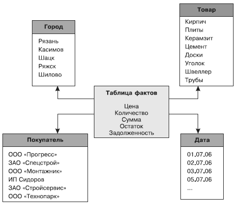
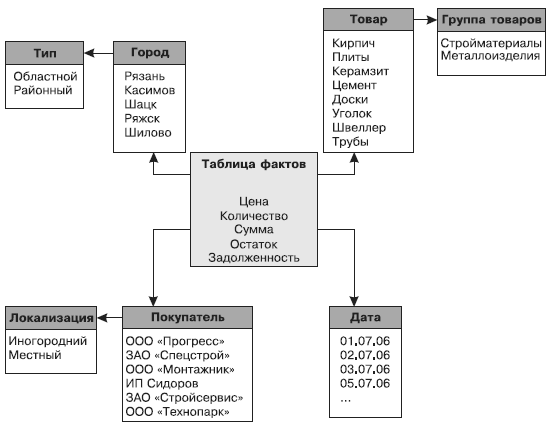

# Topology

## Звезда
При использовании схемы «звезда» центральной является таблица фактов, с которой связаны все таблицы измерений. Таким образом, информация о каждом измерении располагается в отдельной таблице, что упрощает их просмотр, а саму схему делает логически прозрачной и понятной пользователю.

+ простоту и логическую прозрачность модели;
+ более простую процедуру пополнения измерений, поскольку приходится работать только с одной таблицей.
- медленная обработка измерений, поскольку одни и те же значения измерений могут встречаться несколько раз в одной и той же таблице;
- высокая вероятность возникновения несоответствий в данных (в частности, противоречий), например, из-за ошибок ввода.

## Снежинка Star Schema

> Book: Star Schema the Complete Reference by Christopher Adamson

Для более эффективной работы с иерархическими измерениями была разработана модификация схемы «звезда», которая получила название «снежинка». Главной особенностью схемы «снежинка» является то, что информация об одном измерении может храниться в нескольких связанных таблицах. То есть если хотя бы одна из таблиц измерений имеет одну или несколько связанных с ней других таблиц измерений, в этом случае будет применяться схема «снежинка».

+ она ближе к представлению данных в многомерной модели;
+ процедура загрузки из РХД в многомерные структуры более эффективна и проста, поскольку загрузка производится из отдельных таблиц;
+ намного ниже вероятность появления ошибок, несоответствия данных;
+ большая, по сравнению со схемой «звезда», компактность представления данных, поскольку все значения измерений упоминаются только один раз. Недостатки схемы «снежинка»:
+ достаточно сложная для реализации и понимания структура данных;
+ усложненная процедура добавления значений измерений.
