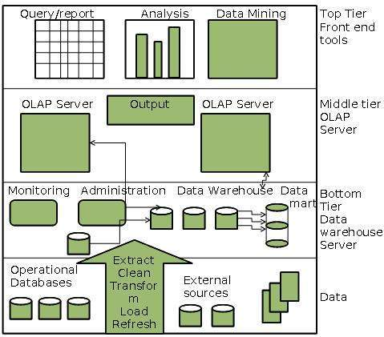

# Warehouse

Generally a data warehouses adopts three-tier architecture. Following are the three tiers of the data warehouse architecture.

* Bottom Tier - The bottom tier of the architecture is the data warehouse database server. It is the relational database system. We use the back end tools and utilities to feed data into the bottom tier. These back end tools and utilities perform the Extract, Clean, Load, and refresh functions.
* Middle Tier - In the middle tier, we have the OLAP Server that can be implemented in either of the following ways.
    * By Relational OLAP (ROLAP), which is an extended relational database management system. The ROLAP maps the operations on multidimensional data to standard relational operations.
    * By Multidimensional OLAP (MOLAP) model, which directly implements the multidimensional data and operations.
* Top-Tier - This tier is the front-end client layer. This layer holds the query tools and reporting tools, analysis tools and data mining tools.

