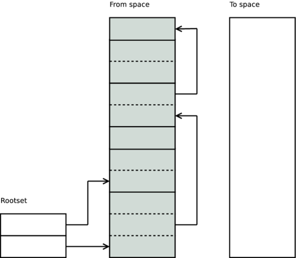

# Garbage Collector

## Data

Terms are created on the heap by evaluating expressions. There are two major types of terms: immediate terms which require no heap space (small integers, atoms, pids, port ids etc) and cons or boxed terms (tuple, big num, binaries etc) that do require heap space. Immediate terms do not need any heap space because they are embedded into the containing structure.

If there is not enough space available on the heap to satisfy the test_heap instructions request for memory, then a garbage collection is initiated. It may happen immediately, or it can be delayed until a later time depending on what state the process is in. If the garbage collection is delayed, any memory needed will be allocated in heap fragments. Heap fragments are extra memory blocks that are a part of the young heap, but are not allocated in the contigious area where terms normally reside.

## Collector

Erlang has a copying semi-space garbage collector. This means that when doing a garbage collection, the terms are copied from one distinct area, called the from space, to a new clean area, called the to space. The collector starts by scanning the root-set (stack, registers, etc).

## Generational Garbage Collection
In addition to the collection algorithm described above, the Erlang garbage collector also provides generational garbage collection. An additional heap, called the old heap, is used where the long lived data is stored. The original heap is called the young heap, or sometimes the allocation heap.

## Young Heap

In addition to the collection algorithm described above, the Erlang garbage collector also provides generational garbage collection. An additional heap, called the old heap, is used where the long lived data is stored. The original heap is called the young heap, or sometimes the allocation heap.

## Links
https://www.erlang-solutions.com/blog/erlang-garbage-collector.html