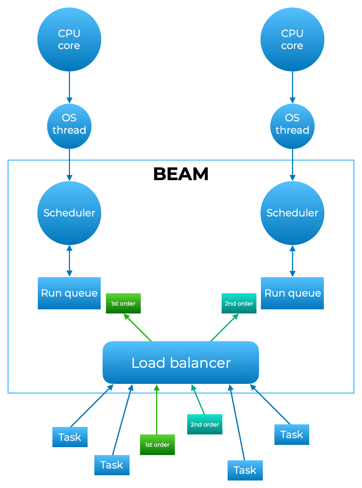

# OTP

OTP is a set of Erlang libraries, which consists of the Erlang runtime system, a number of ready-to-use components mainly written in Erlang, and a set of design principles for Erlang programs.
It contains:
 * an Erlang interpreter (which is called BEAM);
 * an Erlang compiler;
 * a protocol for communication between servers (nodes);
 * a CORBA Object Request Broker;
 * a static analysis tool called Dialyzer;
 * a distributed database server (Mnesia); and
 * many other libraries.

 OTP also encompasses the Erlang Run Time System (ERTS). That means that the OTP framework includes the BEAM. So, when we talk about the BEAM, we are talking about a virtual machine built into the OTP distribution.

The OTP components can be divided into six categories:

* Basic Applications - Basic Erlang/OTP functionality.
    * Compiler A compiler for Erlang modules.
    * Kernel Functionality necessary to run Erlang/OTP itself.
    * SASL (System Architecture Support Libraries) A set of tools for code replacement and alarm handling etc.
    * Stdlib The standard library.

* Operations and Maintenance - OAM both of the system developed by the user and of Erlang/OTP itself.
    * EVA A multi-featured event and alarm handler.
    * OS_Mon A monitor which allows inspection of the underlying operating system.
    * SNMP SNMP support including a MIB compiler and tools for creating SNMP agents.

* Interface and Communication - Interoperability and protocols support.
    * Asn1 Support for ASN.1.
    * Comet A library that enables Erlang/OTP to call COM objects on windows
    * Crypto Cryptographical support
    * Erl_Interface Low level interface to C.
    * GS A graphics system used to write platform independent user interfaces.
    * Inets A set of services such as a web server and a FTP client.
    * Jinterface Low level interface to Java.
    * SSL Secure Socket Layer (SSL),interface to UNIX BSD sockets

* Database Management.
    * QLC Query language support for Mnesia DBMS.
    * Mnesia A heavy duty real-time distributed database.
    * ODBC ODBC database interface.
* Tools.
    * Appmon A utility used to view OTP applications.
    * Debugger For debugging and testing of Erlang programs.
    * Parsetools A set of parsing and lexical analysis tools.
    * Pman A process manager used to inspect the state of an Erlang/OTP system.
    * Runtime_Tools Tools to include in a production system.
    * Toolbar A tool bar simplifying access to the Erlang/OTP tools.
    * Tools A set of programming tools including a coverage analyzer etc.
    * TV An ETS and Mnesia graphical table visualizer.

## BEAM

The BEAM (Bogdan/Björn's Erlang Abstract Machine) is the Erlang virtual machine. In this post, we'll refer to BEAM and Erlang VM interchangeably.
BEAM executes bytecode which is converted to threaded code at load time. It also includes a native code compiler on most platforms, developed by the High Performance Erlang Project (HiPE) at Uppsala University.
As part of the ERTS, the BEAM is responsible for scheduling Erlang processes. This is where the concurrency magic happens.

The BEAM creates a thread per core, a scheduler per thread and a run queue per scheduler. It is also responsible for populating all of the run queues with processes for the schedulers to execute in parallel. This is managed by the BEAM's Load Balancer. The load balancer implements migration logic to allocate processes between the run queues on the separate cores. This logic helps the load balancer take jobs away from overloaded queues ("task stealing") and give them to empty or underloaded ones ("task migration"). The load balancer aims to keep the maximum number of run-able processes equal across schedulers.

* BEAM uses exactly one Operating System Thread from each processor’s core.
* On each thread, BEAM runs its own scheduler.
* Each scheduler has its own run queue.
* Data is not shared between queues.
* Processes (queues) do not share memory, allowing you to replicate your data for resilience and distribute it for scale.
* run queue contains awaiting processes which are pulled by the scheduler so they can be run.
* Schedulers don’t have delays due to slowly running processes.
* Load Balancer is responsible for distributing processes between run queues on the separate cores:
    * task stealing
    * Task migration

### Scheduler

### Registers
The BEAM Virtual Machine uses the following registers:
 - HTOP - top-of-heap pointer
 - E - top-of-stack pointer
 - CP - return-address pointer (where to go when a function is ready executed)
 - I - next-instruction pointer
 - x(N) - argument registers (to pass function parameters), x(N) are also used to hold temporal variables
 - y(N) - local variables (y(N) are not real registers, they reside in a local frame and are accessed by integer offset from a top-of-stack pointer)
 - fcalls - number of reductions done (to check for suspension while doing function call)

To call an Erlang function we pass parameters by loading argument registers, x(N), and update the return-address register, CP. On function return the return value is stored in x(0).

Erlang processes are dynamically spawned and killed during the execution. Each process has its own heap and stack area. For concurrency purposes the Erlang BEAM provides suspension and scheduling mechanisms. A suspending process stores its current state in its suspension record and is added to a scheduler queue. To guarantee a fair scheduling a process is suspended after a fixed number of reductions and then the first process from the queue is resumed.
To receive messages each process has its own local message queue. Sending a message results in copying the message into the receiver heap and storing the message reference in the receiver message queue. While waiting for messages to be received a process is swapped out, and is added to the scheduler queue only when a new message is received (i.e. the addition is done by a process sending the message), or a time-out occurs.

### Procedural Instructions
> http://www.cs-lab.org/historical_beam_instruction_set.html

C: Call a local Erlang function. A local function is the one which reside in the same module as the function caller.
CO: Call a local Erlang function. The continuation program pointer (CP register) is already set.
ResC: Call a resident Erlang function. A resident Erlang function is a local function which cannot be called from and return to other modules. The instruction is used to optimize control handling when a threaded-code Erlang function cannot be mixed with other Erlang functions compiled into C code.
CL: Discard the current stack frame. Call a local Erlang function.
TrC: A traced version of the C instruction.
TrCO: A traced version of the CO instruction.
TrCL is a traced version of the CL instruction.
CEx: Set the continuation program pointer at the next instruction, increment number of reductions and check for suspension (if suspending, generate the current module, function and arity information using &FuncBegin), check if the called function is loaded, if yes branch to the called function (the address is taken from the export-function table), if not call an error handler.
TrCEx: The same semantics as CEx but some trace information (the called function: module, name, arity) is sent to a tracing Erlang process.
CExL: Copy the continuation program pointer from the current stack frame into CP, discard the frame, increment number of reductions and check for suspension, check if the called external function is loaded, branch to the function.
TrCExL: The same semantics as CExL but some trace information (the called function: module, name, arity) is sent to a tracing Erlang process.
R: Restore the next instruction pointer from the current stack frame. Return control to the function caller.
ResR: Go to instruction which address is stored in the CP register.
TrR: A traced return from an Erlang function call.
ERR_ACT: Generate the FUNCTION_CLAUSE error (there are no Erlang clauses matching a given function call).
A: Allocate/ Check for required stack space, call garbage collection if necessary. Allocate a new stack frame (of frame_size). Update the stack-top pointer E. Copy the continuation program pointer CP into the new frame.
I: Initialize a local variable y(n).
D: Copy the continuation program pointer from the current stack frame into CP, discard the frame. Update the stack-top pointer E.
...

## Concurrency and parallelism BEM vs JVM

The BEAM provides light-weight processes to give context to the running code. These processes, also called actors, don’t share memory, but communicate through message passing, copying data from one process to another. Message passing is a feature that the virtual machine implements through mailboxes owned by individual processes. The message passing is a non-blocking operation, which means that sending a message to another process is almost instantaneous and the execution of the sender is not blocked. The messages sent are in the form of immutable data, copied from the stack of the sending process to the mailbox of the receiving one. This is achieved without the need for locks and mutexes among the processes, only a lock on the mailbox in case multiple processes send a message to the same recipient in parallel.

BEAM:
* BEAM is built for concurrency
* BEAM has the ability to break a program into small, light-weight processes. Managing these processes is the task of the scheduler. 
* BEAM comes with its own scheduler.
* GC: Data is copied, not mutated and the fact that processes do not share memory removes any process interdependencies, which, as a result, do not need to be managed.
* Garbage collection is run only when needed, on a per process basis, without affecting other processes waiting in the run queue. VM is never stopped as a whole - only specific processes are, and never all of them at the same time. In practice, it is just part of what a process does and treated as another reduction. 
*  Under the hood the VM allocates big chunks of memory and uses custom allocators to store the data efficiently and minimise the overhead of system calls. This has two visible effects:
    1) The used memory decreases gradually after the space is not needed
    2) Reallocating huge amounts of data might mean doubling the current working memory.
* Hot Code Loading

Do not use BEAM ifyou need to:
* handling a few events in parallel, and having to handle them fast
* number crunching

JVM:
* The JVM is built for parallelism
* JVM - maps its threads to OS threads and lets the operating system schedule them, the 
* GC: JVM is the ability to swap garbage collectors, so by using a commercial GC, it is also possible to achieve non-stopping GC in the JVM.

## Links

https://github.com/erlang/otp

http://erlang.org/doc/system_architecture_intro/sys_arch_intro.html

https://learnyousomeerlang.com/content

https://medium.com/@patrykbak/concurrency-and-parallelism-with-elixir-and-beam-c683b2215c38

https://www.theerlangelist.com/article/spawn_or_not

https://www.erlang-solutions.com/blog/optimising-for-concurrency-comparing-and-contrasting-the-beam-and-jvm-virtual-machines.html