# Drug Design

Основные компьютерные методы, используемые в драг-дизайне, это:

* молекулярное моделирование (ММ);
* виртуальный скрининг;
* дизайн новых лекарственных препаратов de novo;
* оценка свойств «подобия лекарству»;
* моделирование связывания лиганд-мишень.

## на структуре лиганда
В случае, если ничего не известно про трехмерную структуру мишени (что случается достаточно часто), прибегают к методикам создания новых соединений исходя из информации о структуре уже известных лигандов и данных по их активности.

Подход основывается на общепринятой в химии и биологии парадигме, гласящей, что структура определяет свойства. Основываясь на анализе корреляций между структурой известных соединений и их свойствами, можно предсказать структуру нового соединения, обладающего желаемыми свойствами (или же, наоборот, для известной структуры предсказать свойства). Причем, этот подход используется как при модификации известных структур с целью улучшения их свойств, так и при поиске новых соединений используя скрининг библиотек соединений.

Методы определения похожести молекул (или методы отпечатков пальцев) состоят в дискретном учете определенных свойств молекулы, называемых дескрипторами (например, число доноров водородной связи, число бензольных колец, наличие определенного заместителя в определенном положении и т.д.) и сравнивании получившегося «отпечатка» с отпечатком молекулы с известными свойствами (используемой в качестве образца). Степень похожести выражается коэффициентом Танимото, изменяющимся в диапазоне 0–1. Высокая похожесть предполагает близость свойств сравниваемых молекул, и наоборот.

Методы, основывающиеся на известных координатах атомов лиганда, называются методами количественной связи между структурой и активностью (QSAR, Quantitative Structure-Activity Relationship). Один из наиболее используемых методов этой группы — метод сравнительного анализа молекулярных полей (CoMFA, Comparative Molecular Field Analysis). Этот метод заключается в приближении трехмерной структуры лиганда набором молекулярных полей, отдельно характеризующих его стерические, электростатические, донорно-акцепторные и другие свойства. CoMFA модель строится на основании множественного регрессионного анализа лигандов с известной активностью и описывает лиганд, который должен хорошо связываться с исследуемой мишенью, в терминах молекулярных полей. Полученный набор полей говорит, в каком месте у лиганда должен быть объемный заместитель, а в каком — маленький, в каком полярный, а в каком — нет, в каком донор водородной связи, а в каком — акцептор, и т.д.

Модель может использоваться в задачах виртуального скрининга библиотек соединений, выступая в данном случае аналогом фармакофора. Самым главным недостатком этого метода является то, что он обладает высокой предсказательной силой лишь на близких классах соединений; при попытке же предсказать активность соединения другой химической природы, чем лиганды, использовавшиеся для построения модели, результат может оказаться недостаточно достоверным.

## на структуре белка
В связи с растущим потенциалом структурной биологии, все чаще можно установить экспериментальную трехмерную структуру мишени, или построить ее молекулярную модель, основываясь на гомологии с белком, чья трехмерная структура уже определена.

Наиболее часто используемые методы определения трехмерной структуры биомакромолекул с высоким разрешением (Часто, когда экспериментальная структура мишени все же недоступна, прибегают к моделированию на основании гомологии — методу, для которого показано, что построенная им модель обладает достаточно высоким качеством, если гомология между структурным шаблоном и моделируемым белком не ниже 40%.

Особенно часто к моделированию по гомологии прибегают при разработке лекарств, направленных на G-белок сопряженные рецепторы, так как они, будучи мембранными белками, очень плохо поддаются кристаллизации, а методу ЯМР пока недоступны такие большие белки. Для этого семейства рецепторов известна структура только одного белка — бычьего родопсина, полученная в 2000 г. в Стэнфорде, которая и используется в качестве структурного шаблона в подавляющем числе исследований [6].

Обычно при исследовании, базирующемся на структурных данных, учитывают также данные по мутагенезу мишени, чтобы установить, какие аминокислотные остатки наиболее важны для функционирования белка и связывания лигандов. Эти сведения особенно ценны при оптимизации построенной модели, которая, будучи лишь производной от структуры белка-шаблона, не может учитывать всей биологической специфики моделируемого объекта.

Трехмерная структура мишени, кроме того, что может объяснить молекулярный механизм взаимодействия лиганда с белком, используется в задачах молекулярного докинга, или компьютерном моделировании взаимодействия лиганда с белком. Докинг использует в качестве стартовой информации трехмерную структуру белка (на данном этапе развития технологии, как правило, конформационно неподвижную), и структуру лиганда, конформационная подвижность и взаиморасположение с рецептором которого моделируется в процессе докинга. Результатом докинга является конформация лиганда, наилучшим образом взаимодействующая с белковым сайтом связывания, с точки зрения оценочной функции докинга, приближающей свободную энергию связывания лиганда. Реально, в силу множества приближений, оценочная функция далеко не всегда коррелирует с соответствующей экспериментальной энергией связывания.

Докинг позволяет сократить затраты средств и времени за счет проведения процедуры, аналогичной высокопроизводительному скринингу, на компьютерных комплексах. Эта процедура называется виртуальным скринингом, и основным ее преимуществом является то, что для реальных фармакологических испытаний нужно приобретать не целую библиотеку, состоящую из миллиона соединений, а только «виртуальные прототипы». Обычно же, с целью избежания ошибок, скрининг и докинг используются одновременно, взаимно дополняя друг друга

Одно из явлений, иллюстрирующих несовершенство алгоритмов докинга, — парадокс похожести. Этот парадокс заключается в том, что соединения, структурно совсем немного различающиеся, могут иметь драматически различную активность, и в то же время с точки зрения алгоритмов докинга быть практически неразличимыми.

## «Волшебные пули Эрлиха»

## Рак от вирусов
К тому же, открытие в 1910 году вирусологом Пейтоном Раусом вируса, способного вызывать рак у птиц, послужило мощной предпосылкой для создания совершенно иной теории опухолевого генеза — вирусной. Вирус саркомы Рауса (RSV), вызывающий опухоли у цыплят, был первым, но лишь одним из многих открытых позже вирусов, способных вызывать рак у животных. Эти открытия легли в основу представлений о раке как об инфекционной болезни [7] и, как выяснилось, ─ такие представления были не лишены смысла.

Еще в 1970–1980-е годы известный немецкий ученый, вирусолог Гарольд Цур Хаузен показал, что рак шейки матки может вызываться вирусом папилломы человека. Сейчас известно несколько вирусов, способных провоцировать рак у человека, — это так называемые онкогенные вирусы, внедряющие в геном здоровых человеческих клеток свои гены, приводя к опухолевому перерождению. Известны и более экзотические случаи, когда инфекционным агентом, вызывающим рак, становятся сами опухолевые клетки .

ключевое различие между вариациями гена src в нормальных и опухолевых клетках определяется его мутацией. Был также раскрыт механизм злокачественного перерождения клетки при мутации в гене src.

## Обучение нейронок на антибиотики

Первоначально исследователи обучили нейронную сеть предсказывать способность веществ ингибировать рост E. coli на молекулах, бактерицидное действие которых на клетки E. coli уже хорошо известно. Тренировочная выборка включала 2335 веществ разнообразной химической структуры, причем соединение считалось успешно прошедшим скрининг, если оно ингибировало рост E. coli на 80% и более. Далее исследователям предстояло научить алгоритм выявлять соединения с потенциальной бактерицидной активностью на основании их химической структуры. Не вдаваясь в тонкости машинного обучения, можно сказать, что на этапе предсказания химические связи в молекуле представляли как векторы, соединяющие между собой различные функциональные группы и атомы. Итеративно проходя по всем векторам (то есть связям в молекуле), модель ищет в молекуле мотивы, которые могут придавать ей бактерицидные свойства. В конечном счете, исследователи получили модель, которая способна более-менее успешно предсказывать бактерицидные свойства веществ по их структурной формуле (рис. 1).

ученые пустили обученную нейросеть в бой, применив ее для предсказания антибактериальных свойств соединений библиотеки Drug Repurposing Hub. В процессе обработки содержимого библиотеки каждому соединению присваивался некий балл, отражающий его потенциальные свойства как антибиотика. После обработки ученые отобрали 99 соединений с лучшими баллами, которые содержались только в библиотеке Drug Repurposing Hub. Их экспериментально проверили на способность подавлять рост E. coli. Проверка показала, что 51 вещество действительно способно ингибировать рост E. coli. Но хороший антибиотик не только должен подавлять рост бактерий — он должен быть минимально токсичен для человека. Поэтому 51 потенциальный антибиотик проверили на токсичность для человека, опять же используя методы машинного обучения, причем предпочтения отдавали соединениям, которые уже находятся на стадии доклинических или клинических испытаний и минимально близки структурно к веществам, которые входили в тренировочную выборку, чтобы снизить риск переоткрытия уже описанного антибиотика. Всем этим критериям, как оказалось, удовлетворяет только одно вещество — ингибитор N-концевой киназы c-Jun с кодовым названием SU3327, который проходил клинические испытания как препарат для лечения диабета. Авторы работы дали ему название галицин. Структурно галицин наиболее близок к азотсодержащим антипаразитарным препаратам и антибиотику метронидазолу (рис. 2).

***

# Агрегация биологических и химических данных в DL

> https://youtu.be/ib8W0akY5mM

## Decagon

> [Modeling polypharmacy side effects with graph convolutional networks](https://academic.oup.com/bioinformatics/article/34/13/i457/5045770)

Decagon: граф из белков и лекарств

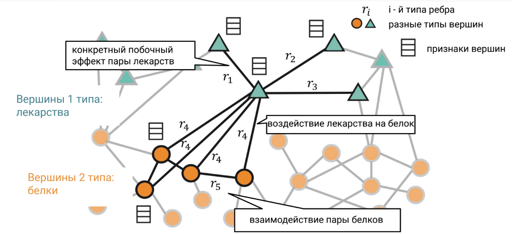

Задача - для каждой пары вершин (лекарств) предсказать вероятности различных типов ребер (побочек)
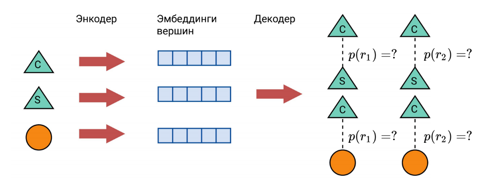

Для создания эмбединга вершины надо агрегировать информацию с ее и соседей, трансформировать и передавать дальше
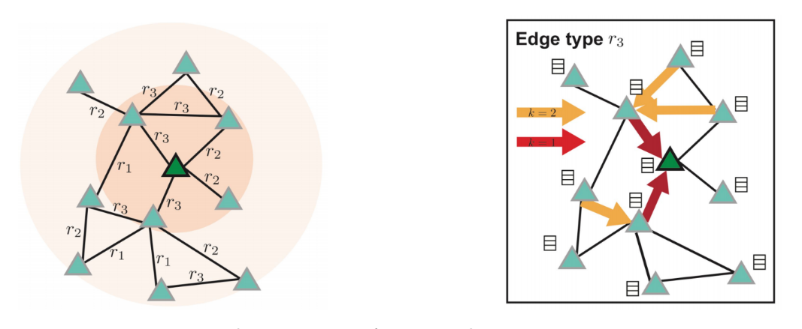

Агрегирование информации с соседей
Вход: граф векторы признаков вершин 
Выход: эмбеденги всех вершин графа
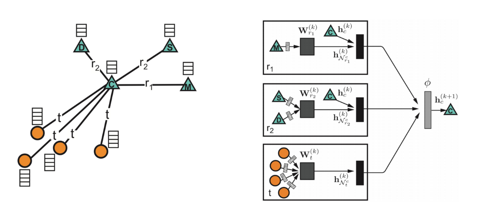

Обновление эмбедингов
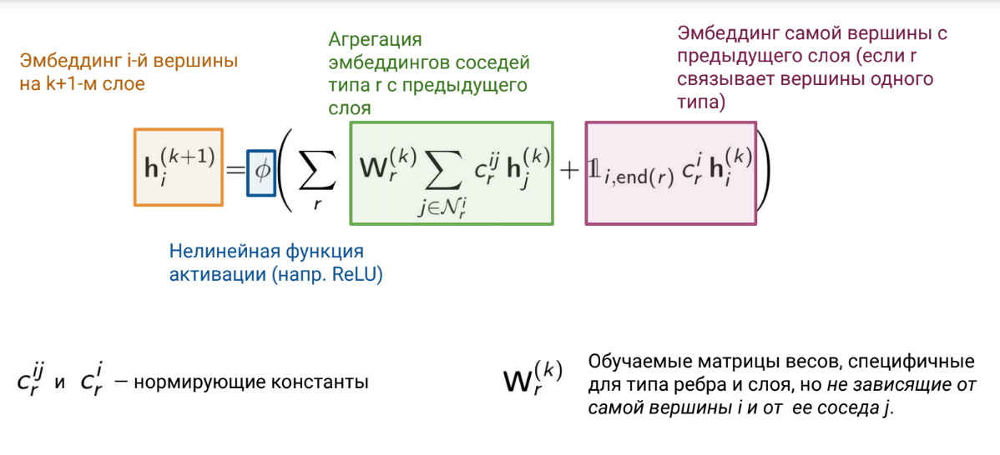

Декодер - тензорное разложение
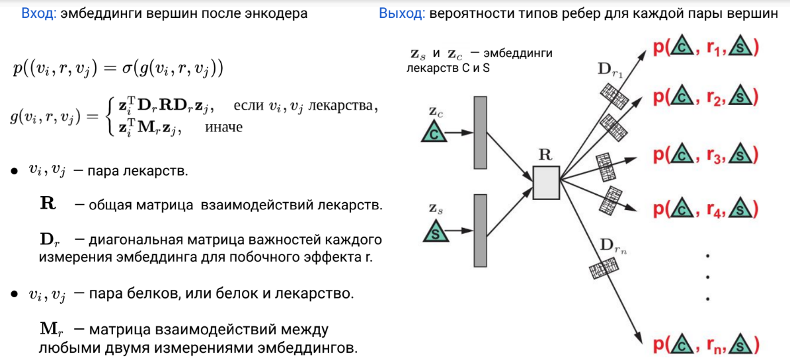

## DeepMetabolism

(DeepMetabolism: A Deep Learning System to Predict Phenotype from Genome Sequencing (preprint))[https://arxiv.org/abs/1705.03094]

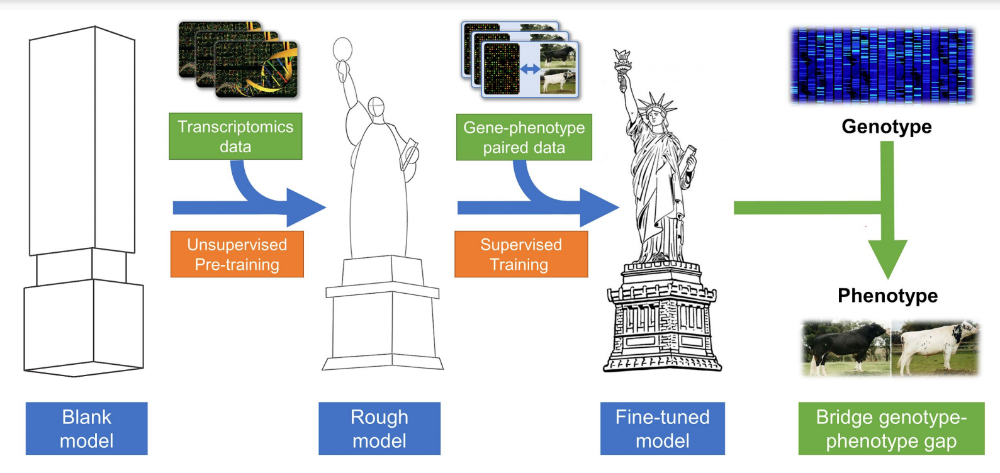

Идея: построить автоэнкодер, учитывающий биологическое знание
Сеть не полносвязная

Первые два слоя автоэнкодера дообучаются по профилям экспрессии генов и значениям составляющих фенотипа.
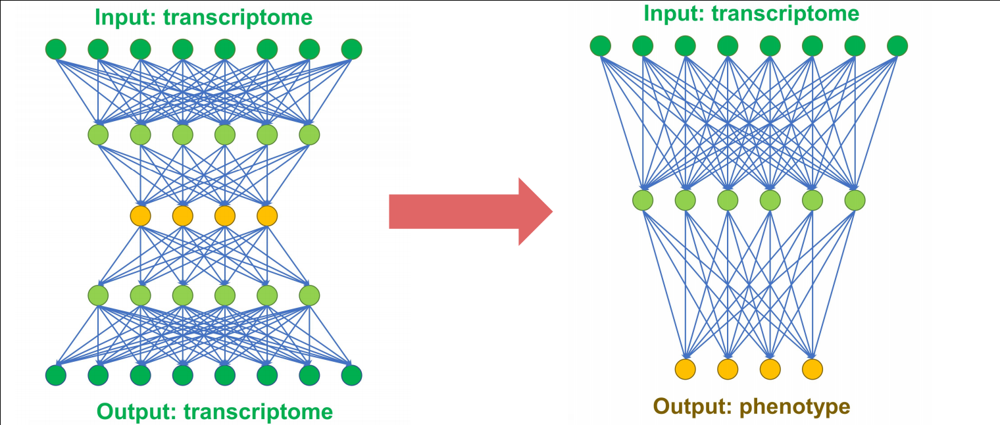

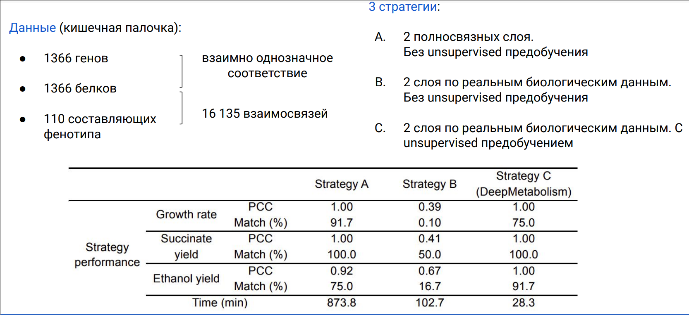

## De novo generation of hit-like molecules from gene expression signatures using artificial intelligence (Nature Communications 2020)

Задача: генерация молекул с заданной биологической активностью

### GAN (Generative adversarial network)
2 нейронные сети:
● Генератор: принимает шум,генерирует данные.
● Дискриминатор - принимает данные, пытается отличить реальные данные от сгенерированных.

Обучение сетей:
● Максимизируем вероятность правильной классификации D(x)
● Максимизируем ошибку D(x) на сгенерированных примерах

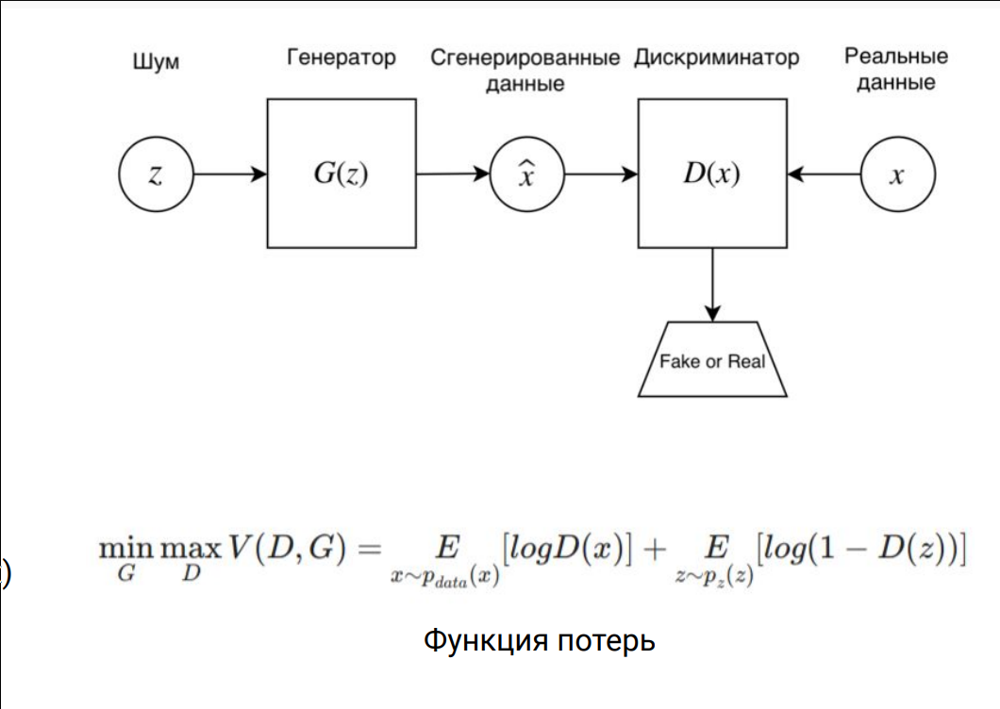

### Conditional GAN (CGAN)

Генератор CGAN использует вектор случайного шума `z` и метку `y` (одна из n возможных меток) в качестве входных данных. Создает фальшивый пример, который стремится одновременно выглядеть реалистично и убедительно соответствовать метке `y`.
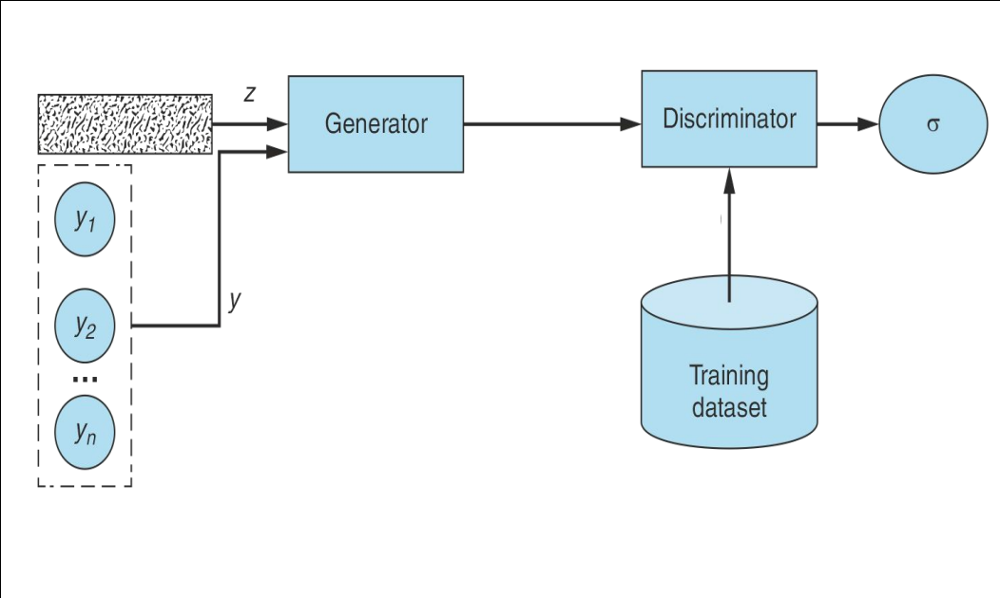

### WGAN-GP (Wasserstein GAN with Gradient Penalty)

Проблема GAN:
● Дискриминатор обучить проще, чем генератор.
● Если дискриминатор обучился быстрее генератора, то градиент генератора зануляется. 

WGAN-GP
● Использует в качестве функции потерь расстояние Вассерштейна.
● Gradient penalty помогает обеспечить ||f||L ≤ 1

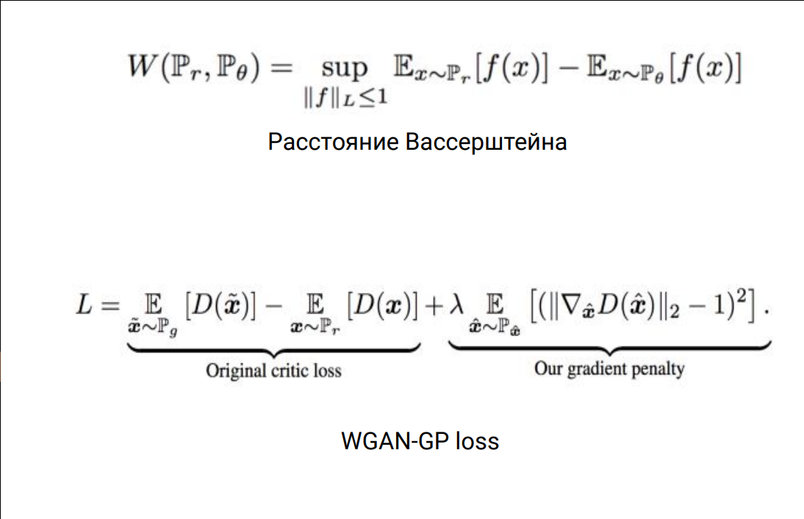

Векторное представление молекул получают с помощью модели SMILES-to-grammar.
● Около 20.000 молекул в тренировочной выборке.
● Gene expression signatures из L1000 (~1000landmark генов), около 31.800 образцов в тренировочной выборке. Предобработка с помощью нейронной сети.

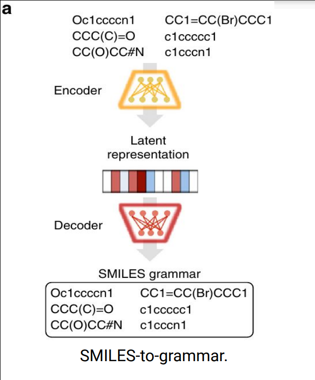

сгенерировать максимально близкий по профилю экспрессии. 2 сеть - опитимизация
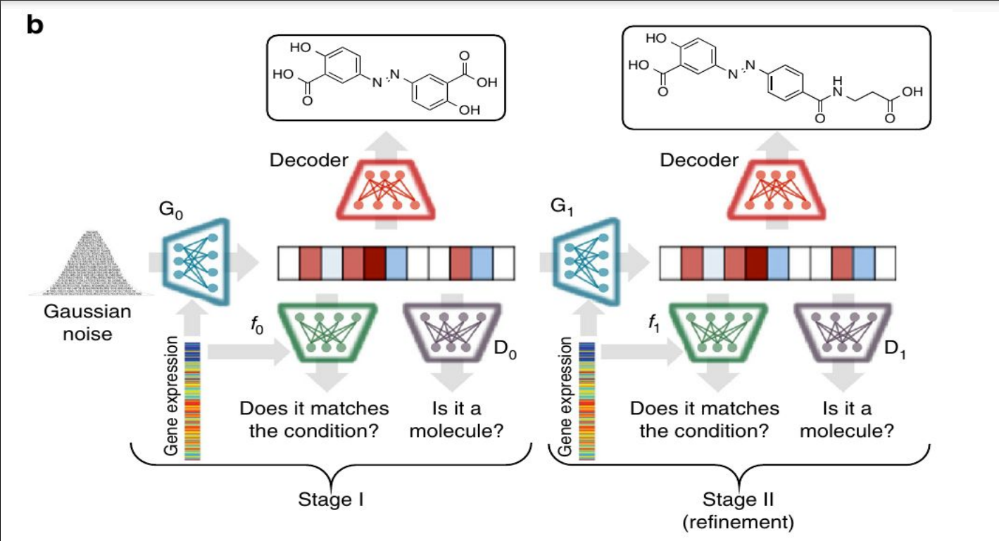

фильтр нереальных и слишком сложных для синтеза молекул
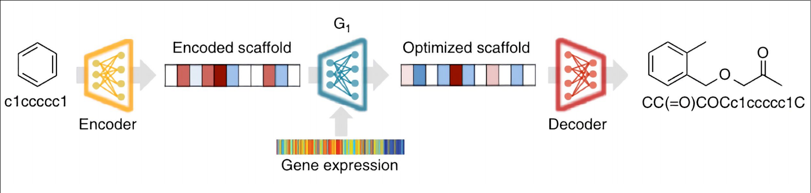
Всего около 10% синтезированных молекул синтезируемы и валидны, но с высокой вероятностью генерируют молекулы именно отвечающий за данный профиль экспрессии

## Chemical Checker (Nature Biotechnology, May 2020)

Задача: единообразно агрегировать большое количество различных данных.
Уровни данных:
1. Химия (2D and 3D fingerprints, scaffolds, structural keys, физ-хим. параметры)
2. Белки-мишени (белки, участвуящие в метаболизме лекарств, связывание белков,
биологическая активность из PubChem Bioassays)
3. Сети взаимодействий (small-molecule role, metabolic pathways, signaling pathways, biological
processes, interacomes)
4. Клетки (экспрессия генов, раковые клеточные линии, chemical genetics, morphology)
5. Клинические данные (области применения лекарств, показания к лекарствам, побочные
эффекты, фенотипы заболеваний, drug-drug interaction (DDI))
Всего использовалось 25 типов данных (по 5 различных представлений на каждый из 5 уровней
данных).

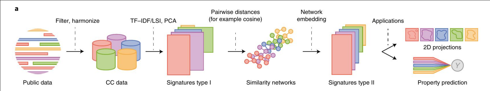
1. Сборка и фильтрация данных
2. Векторизация данных (signatures type 1)
3. Построение simularity networks
4. Получение ÿмбеддингов (node2vec)

**Преобразование дискретных данных:**
● Данные представляятся в виде набора “терминов” (белки, сигнальные пути, chemical fingerprints и т.д.)
● Подсчитывается частота терминов в тексте. Очень редкие и очень частые термины удаляятся. Применяется преобразование TF-IDF.
● К полученному корпусу применяется LSI (метод сокращения размерности, используящий SVD). 
● Используятся компоненты LSI, которые обüясняят не менее 90% дисперсии данных.

**Преобразование числовых данных:**
● Robust scaling
● Применяется PCA. Используятся компоненты LSI, которые обüясняят не менее 90% дисперсии данных.

● CCweb - веб ресурс, позволяющий искать близкие по CCрепрезентации молекулы к заданной.
● Близость измеряется по близости проекций в 25 СС пространствах.

***

Машинное обучение в разработке малых молекул в фармацевтике
> https://youtu.be/rFnRlLvaPOo

разработка молекулы -> тест на активность -> тест на токсичность -> доклинические испытания -> клинические испытания -> рынок

Drug-design - разработка молекулы.

Реактант -> продукт
Свойства активности

Чистка данных:
* Чистка неправильных молекул
* Трансформация данных к одному виду. Например запись бензола с ароматической связью
* Фичеризация молекулы, запись в текстовом представлении
* Физико-химические дескрипторы (не уникальный)
* Фрагментные дескрипторы Ex.: ECFP description 

**Computing Extended Connectivity Fingerprints**
> https://depth-first.com/articles/2019/01/11/extended-connectivity-fingerprints/
> https://docs.chemaxon.com/display/docs/Extended+Connectivity+Fingerprint+ECFP#:~:text=Extended%2DConnectivity%20Fingerprints%20(ECFPs),a%20wide%20variety%20of%20applications.

Обычно радиус 3-4. На основе данных о связах составляем Хэш и преобразуем в вектор где 1 - есть 0 нет. 

Не можем строить на все реакции. 
Одна модель - один тип реакции

Набрать датасет положительных примеров - идет реакция на фрагменте. Отрицательные примеры - 
нет нужной подструктуры для реакции - плохой пример
Брать только фичи продукта

Стандартно тестовая обучающая выборка
Генерируем дескриптор (SVM например)

Проверка результатов | валидация метрики | данные

Отобрать реакции пойдут не пойдут - 
Метрика TPR(TruePositive/Positive) FPR(FalsePositive/Negative)
Тестовая выборка -> взять отрицательные -> in-house реакции
Комбинаторная генерация - как проверка на отсейку бреда. + Проверка (разметка) на живых химиках.
imagenet, protein-protein benchmark -  как проверка. Бенчмарк не всегда можно ибо данные - собственносить кампани.

***

Представления химических молекул, основанные на грамматиках. SELFIES как новый формат представления молекул
> https://youtu.be/EOC_z5Gl0gk

Проблема человекочитаймного представления и представления для обучения.
Перевести в строковый формат.

SMILES (simplified molecular-input line-entry system):

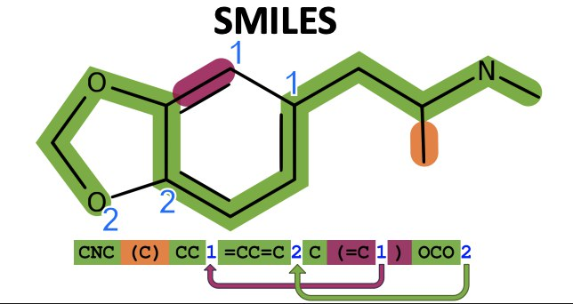

DeepSMILES:

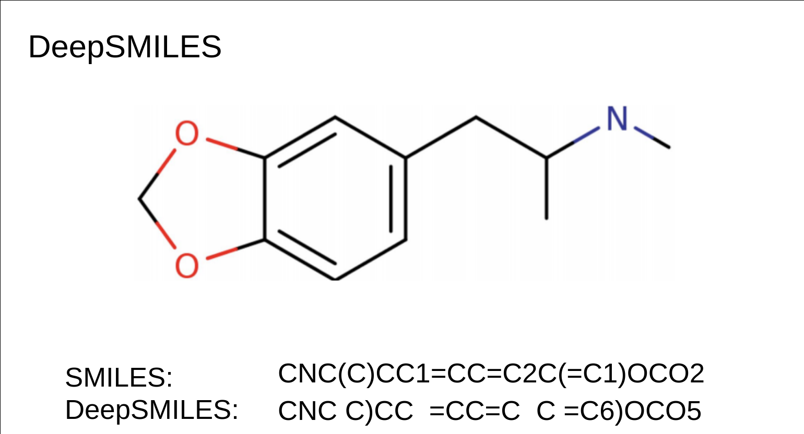

Плюсы:
* Упрощает генерацию веток и колец
* Быстро применяется
Минусы:
* Отсутствуют гарантии на корректность вообще

VAE (variational autoencoder)
Семплировать новые молекулы прогонять через энкодер декодер

Grammar VAE
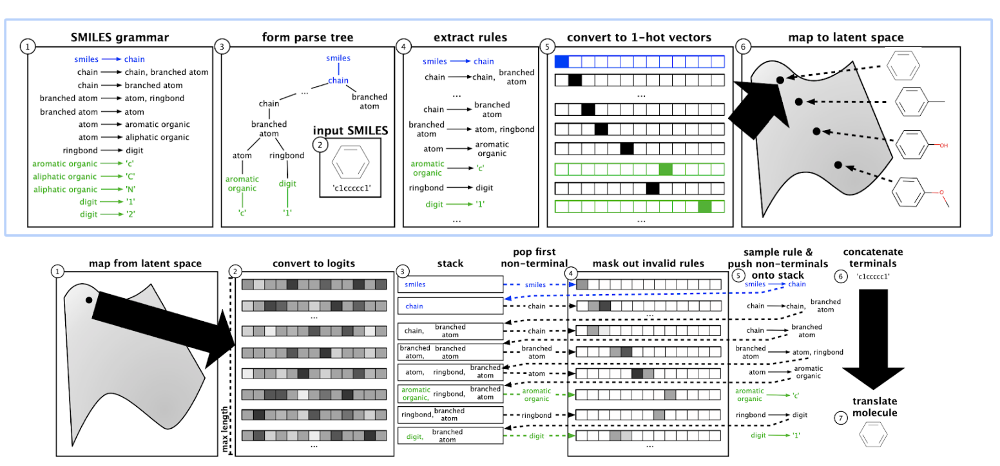

Плюсы:
* Гарантирует синтаксическую корректность молекул
Минусы:
* Химическая корректность не достигается
* Не проверяются валентности
* Грамматике не важно, какая цифра стоит у цикла

SELFIES

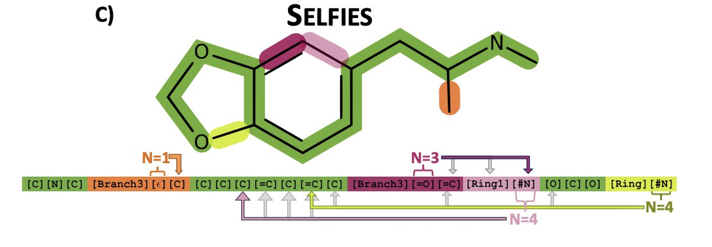

Попытка решить проблемы Grammar VAE

Плюсы:
* Гарантирует полную корректность даже рандомных молекул
* Относительно быстро применяется
Минусы(?):
* Искусственное приведение к корректному виду
* Если стоит #N, но валентность не позволяет сделать такую связь, оставляется =N
* Невозможные циклы игнорируются
* Символы, кодирующие атомы, используются и для цифр
* При маленькой валентности игнорируются ветви

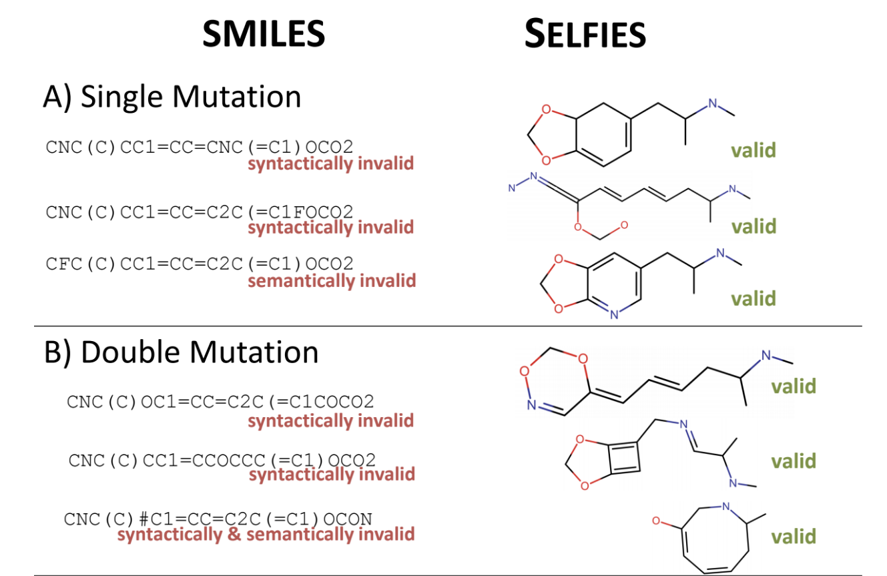

***

Модель All SMILES VAE, с помощью которой удалось достичь SOTA в задачах поиска молекул, оптимизирующих метрики QED и logP.
> https://youtu.be/kSfziroKvqg

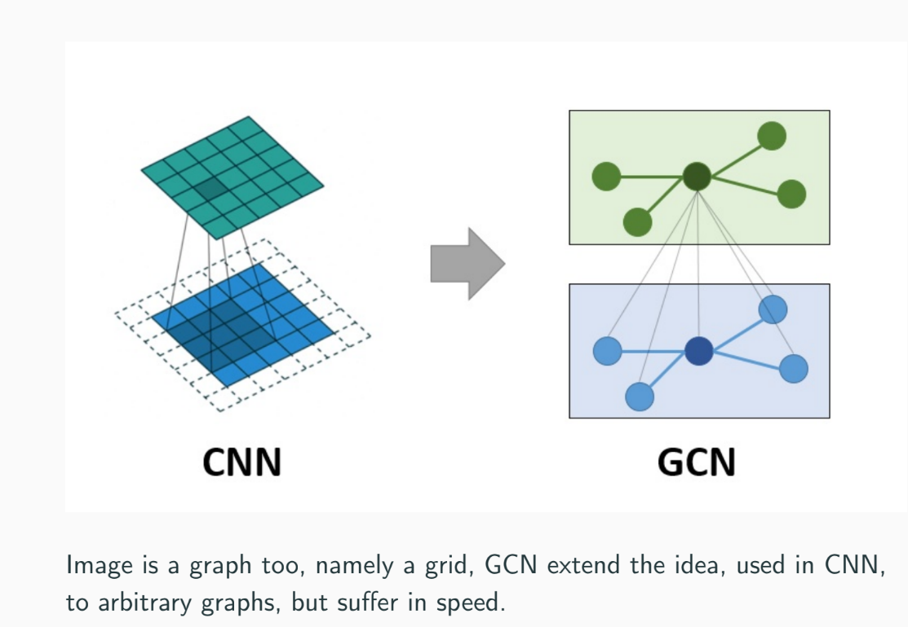

**VA**E

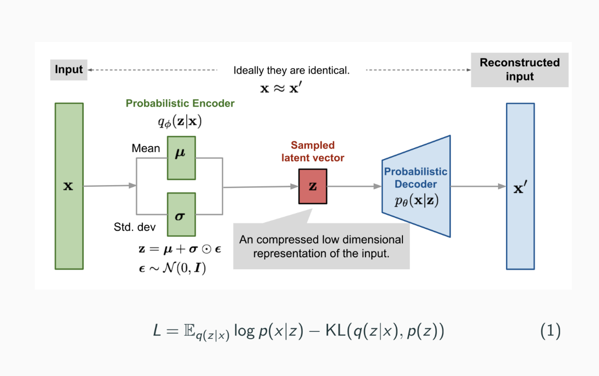

**all smiles archiecture**

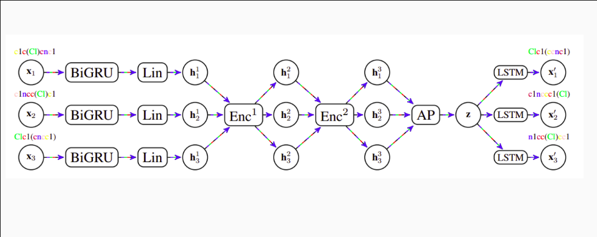

**Encoder block**

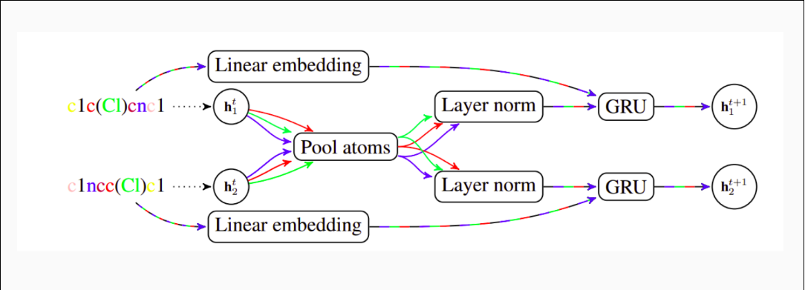

**Homologous atom pooling**

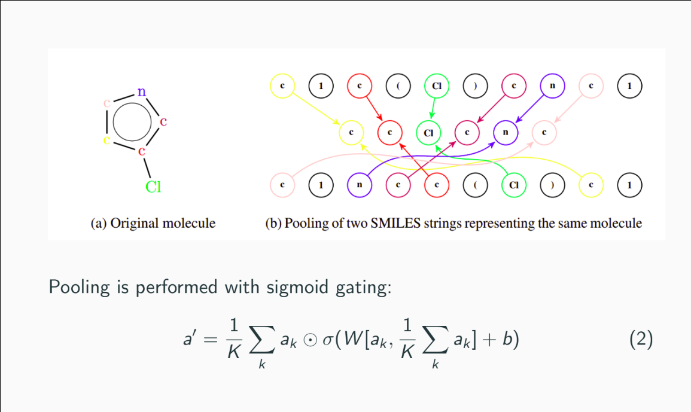

**Latent space**

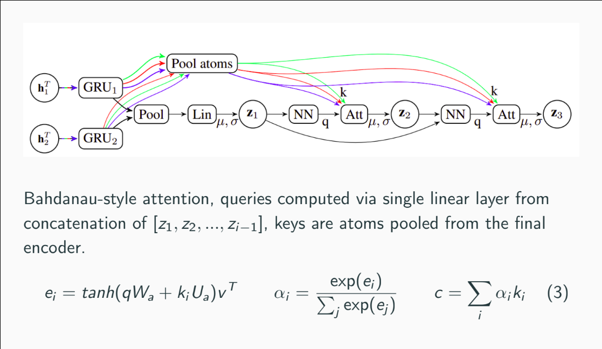

**Decoding**

Single layer LSTM. 
Important notion: VAE was trained to reconstruct SMILES strings different from the input ones 

**Property regressors** 

Trained jointly with the VAE. 
Metrics of interest: 
• logP 
• Molecular weight 
• QDE 
• 12 binary measures of toxicity 

**Data**
* ZINC database, 250 000 and 310 000 subsets 
* Tox21 dataset 

**Molecular optimisation**

## Other notes

**lead** -  вещество, отобранное из множества **hit**, то есть веществ, проявивших активность против мишени, обладающее наилучшими характеристиками. В дальнейшем подвергается оптимизации, чтобы получить лекарственный кандидат.
**milestone** - значимая «веха» на пути разработки лекарства, например, завершение одной из фаз клинических исследований. При достижении майлстоуна решается вопрос о дальнейшей разработке или остановке проекта.
**Food and Drug Administration** - Управление по санитарному надзору за качеством продуктов и медикаментов США. Американский регулятор, выдает разрешения на проведение клинических исследований и на коммерциализацию лекарств.
**IPO** or **Initial Public Offering** - начальное публичное размещение акций компании.
**M&A** or **merger & acquisition** - слияние и поглощение, покупка одной компанией всех акций другой.
**R&D** or **research & development** - исследования и разработки.

***

**лиганд** - соединением, специфическим образом взаимодействующим с активным сайтом рецептора. В отсутствие лиганда рецептор характеризуется собственным уровнем клеточного ответа — так называемой базальной активностью.

По типу модификации клеточного ответа лиганды делят на три группы (рис. 3):

* Агонисты увеличивают клеточный ответ.
* Нейтральные агонисты связываются с рецептором, но не изменяют клеточный ответ по сравнению с базальным уровнем.
* Обратные агонисты, или антагонисты понижают клеточный ответ.

***

Существует несколько методов экспериментальной валидации мишеней:
* геномные методы заключаются в подавлении синтеза мишени в тестовой системе путем получения мутантов с генным нокаутом (в которых ген мишени попросту отсутствует) или использования РНК-антисмысловых последовательностей, «выключающих» тот или иной ген;
* мишени можно инактивировать с помощью моноклональных антител или облучая мишень, модифицированную хромофором, лазерным излучением;
* мишени можно инактивировать с помощью низкомолекулярных лигандов-ингибиторов;
* также можно непосредственно производить валидацию мишени, устанавливая ее взаимодействие с тем или иным соединением методом плазмонного резонанса.

Когда мишень уже найдена и проверена на валидность, начинаются непосредственные исследования, результатом которых являются многочисленные структуры химических соединений, лишь немногим из которых суждено стать лекарствами.

Исследование всех возможных с химической точки зрения лигандов («химическое пространство») невозможно: простая прикидка показывает, что возможно не менее 1040 различных лигандов, в то время как с момента возникновения вселенной прошло лишь ~1017 секунд. Поэтому на возможную структуру лигандов накладывается ряд ограничений, который существенно сужает химическое пространство (оставляя его, тем не менее, совершенно необъятным). В частности, для сужения химического пространства накладываются условия подобия лекарству (drug-likeness), которые в простом случае можно выразить правилом пяти Липинского, согласно которому соединение, чтобы «быть похожим» на лекарство, должно:

* иметь менее пяти атомов-доноров водородной связи;
* обладать молекулярным весом менее 500;
* иметь липофильность (log P — коэффициент распределения вещества на границе раздела вода-октанол) менее 5;
* иметь суммарно не более 10 атомов азота и кислорода (грубая оценка количества акцепторов водородной связи).

***

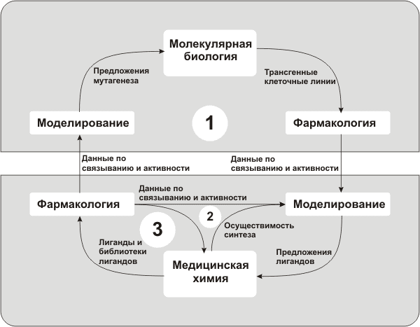
Фармакологический цикл. Группа молекулярной биологии отвечает за получение мутантных мишеней, группа фармакологии — за измерение данных по активности и аффинности синтезированных лигандов на мишенях дикого типа и мутантных, группа моделирования — за построение моделей мишеней, предсказание их мутаций и предсказание структур лигандов, группа медицинской химии — за синтез лигандов.

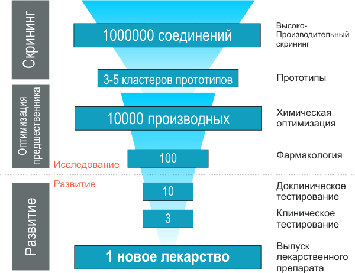
Роль высокопроизводительного скрининга в разработке нового лекарственного препарата. Скрининг, будь то его лабораторный (in vitro) или компьютерный (in silico) вариант, — главная и наиболее ресурсоемкая процедура по выбору стартовых структур лекарств (прототипов) из библиотек доступных соединений. Выходные данные скрининга часто являются отправной точкой для дальнейшего процесса разработки лекарства.

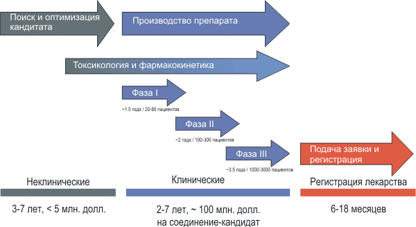
Процесс разработки нового лекарства занимает от 5 до 16 лет. Затраты на клиническое тестирование одного соединения-кандидата составляют более 100 миллионов долларов США. Суммарная стоимость разработки, с учетом препаратов, не достигших рынка, часто превышает 1 миллиард долларов.

***

Вычислительные методы в DD

* молекулярное моделирование (ММ);
* виртуальный скрининг;
* дизайн новых лекарственных препаратов de novo;
* оценка свойств «подобия лекарству»;
* моделирование связывания лиганд-мишень.

## Методы ММ, основывающиеся на структуре лиганда
> Подход основывается на общепринятой в химии и биологии парадигме, гласящей, что структура определяет свойства. 

**Методы определения похожести молекул (или методы отпечатков пальцев)** состоят в дискретном учете определенных свойств молекулы, называемых дескрипторами (например, число доноров водородной связи, число бензольных колец, наличие определенного заместителя в определенном положении и т.д.) и сравнивании получившегося «отпечатка» с отпечатком молекулы с известными свойствами (используемой в качестве образца). Степень похожести выражается коэффициентом Танимото, изменяющимся в диапазоне 0–1. Высокая похожесть предполагает близость свойств сравниваемых молекул, и наоборот.

**Методы, основывающиеся на известных координатах атомов лиганда, называются методами количественной связи между структурой и активностью (QSAR, Quantitative Structure-Activity Relationship).** Один из наиболее используемых методов этой группы — метод сравнительного анализа молекулярных полей (CoMFA, Comparative Molecular Field Analysis). Этот метод заключается в приближении трехмерной структуры лиганда набором молекулярных полей, отдельно характеризующих его стерические, электростатические, донорно-акцепторные и другие свойства. CoMFA модель строится на основании множественного регрессионного анализа лигандов с известной активностью и описывает лиганд, который должен хорошо связываться с исследуемой мишенью, в терминах молекулярных полей. Полученный набор полей говорит, в каком месте у лиганда должен быть объемный заместитель, а в каком — маленький, в каком полярный, а в каком — нет, в каком донор водородной связи, а в каком — акцептор, и т.д.

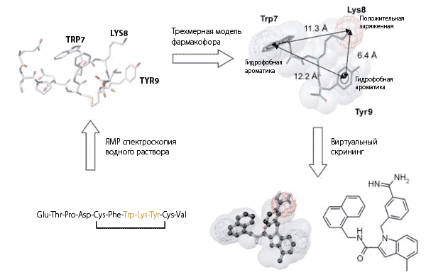

## Методы ММ, основывающиеся на структуре белка

**методы определения трехмерной структуры биомакромолекул с высоким разрешением**

**моделированию на основании гомологии** — методу, для которого показано, что построенная им модель обладает достаточно высоким качеством, если гомология между структурным шаблоном и моделируемым белком не ниже 40%.

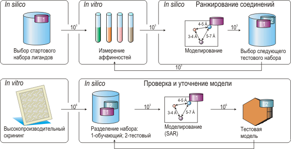

***

## Links

https://biomolecula.ru/articles/drag-dizain-kak-v-sovremennom-mire-sozdaiutsia-novye-lekarstva
https://biomolecula.ru/articles/gennye-i-kletochnye-lekarstva-slozhnoe-regulirovanie-dlia-slozhnykh-produktov
https://biomolecula.ru/articles/targetnaia-terapiia-pritselnyi-udar-po-bolezni?fbclid=IwAR2xRUWHCrzu5-09QhR1RsVWcvAJr0MSZ_yZ4C916dNpVmrSkwR80NNdQF4