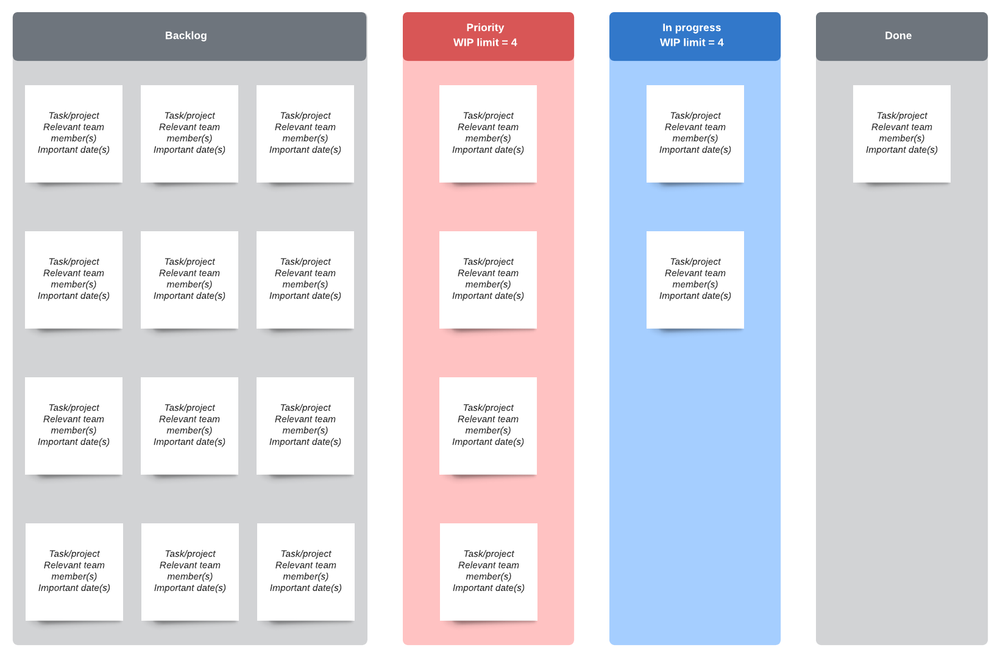
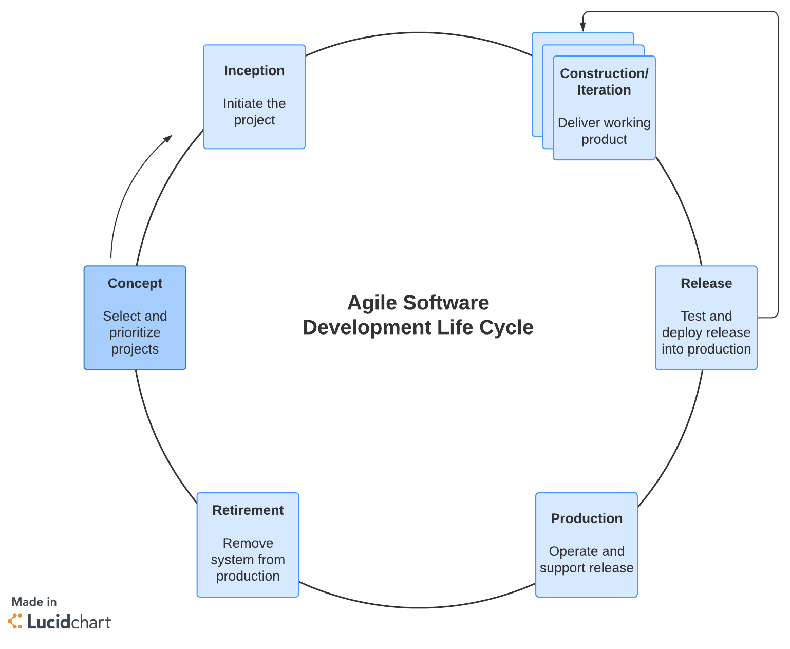
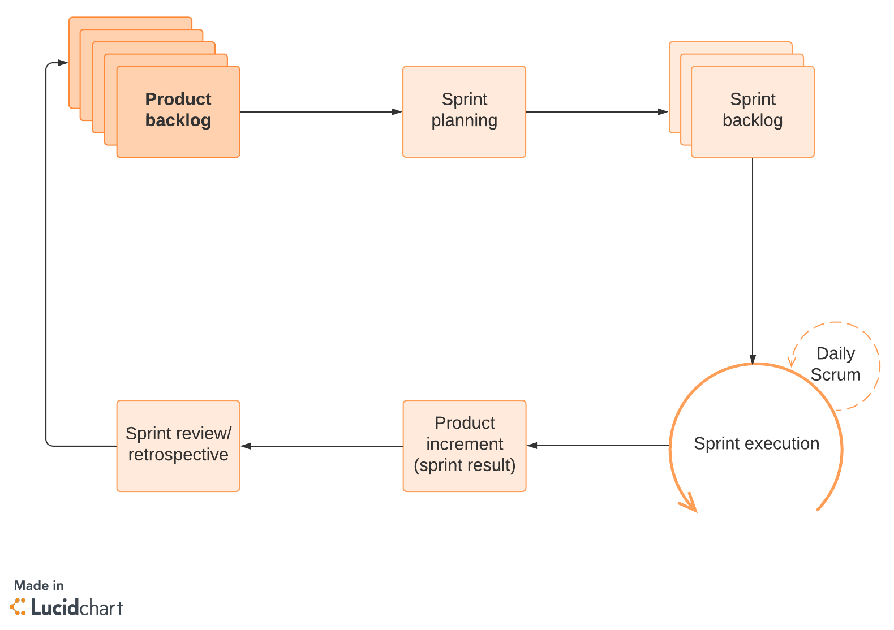
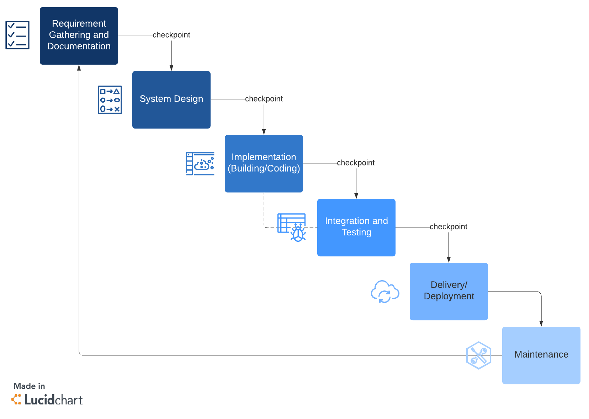

# Software Development Methodologies

## Acceptance Test Driven Development (ATDD)
> ATDD is closely related to test-driven development (TDD).[7] It differs by the emphasis on developer-tester-business customer collaboration. ATDD encompasses acceptance testing, but highlights writing acceptance tests before developers begin coding.

## Behavior-driven development (BDD)
> BDD is also referred to as Specification by Example.

* A team using BDD should be able to provide a significant portion of “functional documentation” in the form of User Stories augmented with executable scenarios or examples.
* Instead of referring to “tests”, a BDD practitioner will prefer the terms “scenario” and “specification”. As currently practiced, BDD aims to gather in a single place the specification of an outcome valuable to a user, generally using the role-feature matrix of (User Stories), as well as examples or scenarios expressed in the form given-when-then; these two notations being often considered the most readable.
* In emphasizing the term “specification”, the intent of BDD is to provide a single answer to what many Agile teams view as separate activities: the creation of unit tests and “technical” code on one hand, the creation of functional tests and “features” on the other hand. This should lead to increased collaboration between developers, test specialists, and domain experts.
* Rather than refer to “the unit tests of a class”, a practitioner or a team using BDD prefers to speak of “the specifications of the behavior of the class”. This reflects a greater focus on the documentary role of such specifications: their names are expected to be more expressive, and, when completed with their description in given-when-then format, to serve as technical documentation.
* Rather than refer to “functional tests”, the preferred term will be “specifications of the product’s behavior”. The technical aspects of BDD are placed on an equal footing with techniques encouraging more effective conversation with customers, users and domain experts.
* In addition to refactoring techniques already present in TDD, the design philosophy in BDD pays particular attention to appropriate distribution of responsibilities among classes, which leads its practitioners to emphasize “mocking”.

## Test-Driven Development (TDD)

“Test-driven development” refers to a style of programming in which three activities are tightly interwoven: coding, testing (in the form of writing unit tests) and design (in the form of refactoring).

It can be succinctly described by the following set of rules:
* write a “single” unit test describing an aspect of the program
* run the test, which should fail because the program lacks that feature
* write “just enough” code, the simplest possible, to make the test pass
* “refactor” the code until it conforms to the simplicity criteria
* repeat, “accumulating” unit tests over time

## Domain Driven Development (top-down) (DDD)
> concept that the structure and language of software code (class names, class methods, class variables) should match the business domain. For example, if a software processes loan applications, it might have classes such as LoanApplication and Customer, and methods such as AcceptOffer and Withdraw.

## Databse first (bottom-up)

The Database First Approach provides an alternative to the Code First by creating POCO classes from the existing database.

## Kanban

A specific type of Agile methodology. Kanban strives to better coordinate and balance work with the capacity and bandwidth among workers. It uses the Agile methodology principles discussed above but implements them in a particular way.

## Agile

The Agile Unified Process (AUP) is a software engineering methodology, created by Scott Ambler. It presents yet another attempt at simplifying the RUP, describing an easy to understand approach to developing business application software using agile techniques and concepts. Yet it still aims to remain true to the ideas behind the RUP.

It is a collaborative, self-organizing, cross-functional approach to completing work and requirements.

## Feature Driven Development (FDD)
Feature Driven Development is a software engineering methodology, devised by Jeff De Luca and influenced by Peter Coad’s approach to object modeling. 

FDD is a model-driven process, distinguishing itself from some other agile methods by explicitly allowing time for the creation of an up-front design. It also applies a refreshingly nonconformist approach to code ownership and several other development practices.

## Microsoft Solutions Framework (MFS)
Microsoft Solutions Framework is a software engineering framework, created by Microsoft. As always, Microsoft has its own alternative stance on the subject of developing software. 

MSF provides a metamodel of descriptive components, and it contains two out-of-the-box templates as prescriptive implementations: MSF for Agile Software Development and MSF for Capability Maturity Model Integration.

## Rational Unified Process (RUP)

Iterative software development process framework created by the Rational Software Corporation, a division of IBM since 2003.[1] RUP is not a single concrete prescriptive process, but rather an adaptable process framework, intended to be tailored by the development organizations and software project teams that will select the elements of the process that are appropriate for their needs. RUP is a specific implementation of the Unified Process.

## S.O.L.I.D. principles

## Scrum

Another Agile methodology that uses an incremental approach to work in order to complete projects more quickly. Scrum methodology typically tackles complex knowledge work, such as software development. If you're looking at Kanban vs. Scrum, Kanban is primarily concerned with process improvements, while Scrum is concerned with getting more work done faster. 

Scrum uses two-week sprints to get work done. These sprints are planned in advance, executed, and then reviewed at the end of the two-week period. During sprint planning, the team creates a sprint backlog. The team completes these backlog tasks during the sprint, managing the work among themselves.

Team members also hold a 15-minute Scrum meeting each day of the sprint. During this time, contributors discuss any potential roadblocks interfering with project success. They also review the previous day’s work and plans for the upcoming day’s tasks. This Scrum meeting ensures the team works collaboratively and stays in sync.

## Waterfall

Projects are broken down into linear and sequential stages, where every piece of the project relies on the completion of preceding deliverables.

## Dynamic Systems Development Method (DSDM)
Dynamic Systems Development Method is a agile project management methodology, created and maintained by the UK-based DSDM Consortium, which includes both vendors and experts. 
It was originally based upon the concepts of Rapid Application Development.
DSDM finds itself on the same level as Scrum, meaning that it lists a small number of practices for project management of software development, while leaving the details of the real work (building a product) to be filled in by the development teams.

## Lean Software Development (LSD)
Lean Software Development is an agile project management framework, translated from lean manufacturing to the software development domain. 
Originally promoted by Mary Poppendieck and Tom Poppendieck, Lean Software Development is adapted from the Toyota product development system, and it is the embodiment of the “lean” subculture that exists within the agile community (and that has by now become big enough not to be able to call itself lean anymore). It is said that the lean and agile concepts form a perfect match.

## Extreme Programming (XP)

Extreme Programming (XP) is an agile software development framework that aims to produce higher quality software, and higher quality of life for the development team. XP is the most specific of the agile frameworks regarding appropriate engineering practices for software development.

It is a set of best practices of which some are taken to an “extreme” level. As with other agile methods, XP regards ongoing changes to requirements as a natural and desirable aspect of software development. In the selection of its practices XP leans towards the daily software engineering activities of developers. XP is often seen as complementary to Scrum, filling most of the holes that Scrum leaves wide open.