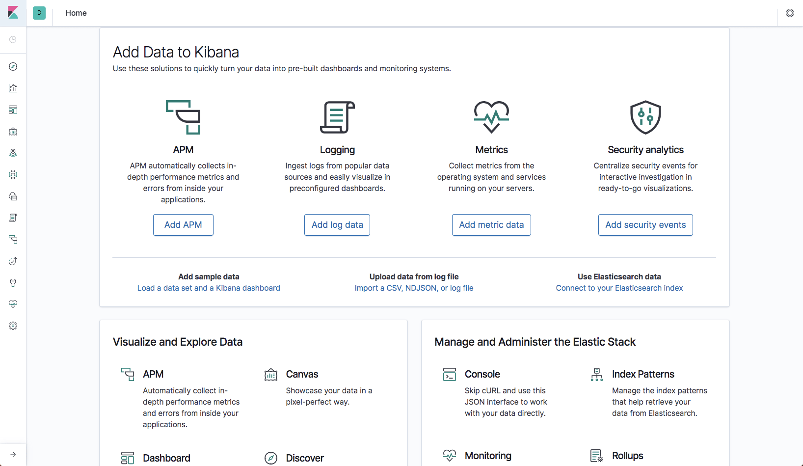

# Kibana

Kibana is the visualization layer (interfce for elasticsearch) of the ELK Stack—the world’s most popular log analysis platform which is comprised of Elasticsearch, Logstash, and Kibana.

Kibana is an analytics and visualization platform that builds on Elasticsearch to give you a better understanding of your data. 

## Interface

The Kibana interface is divided into four main sections:

* Discover
* Visualize
* Dashboard
* Settings

In Kibana, go to Management → Kibana Index Patterns, and Kibana will automatically identify the new “logstash-*” index pattern.  

### Discover

By default, this page will display all of your ELK stack’s most recently received logs. Here, you can filter through and find specific log messages based on Search Queries, then narrow the search results to a specific time range with the Time Filter.

Kibana Discover interface elements:
* Search Bar: Directly under the main navigation menu. Use this to search specific fields and/or entire messages
* Time Filter: Top-right (clock icon). Use this to filter logs based on various relative and absolute time ranges
* Field Selector: Left, under the search bar. Select fields to modify which ones are displayed in the Log View
* Date Histogram: Bar graph under the search bar. By default, this shows the count of all logs, versus time (x-axis), matched by the search and time filter. You can click on bars, or click-and-drag, to narrow the time filter
* Log View: Bottom-right. Use this to look at individual log messages, and display log data filtered by fields. If no fields are selected, entire log messages are displayed

#### Search Syntax

Kibana querying KQL (Kibana Querying Language - default language for querying since version 7.0) is an art unto itself, and there are various methods for performing searches on your data. 

Free text search works within all fields — including the _source field, which includes all the other fields. If no specific field is indicated in the search, the search will be done on all of the fields that are being analyzed.

The search syntax is pretty self-explanatory, allows boolean operators, wildcards, and field filtering. 
For example: `"nginx-access" AND agent: "chrome"` find Nginx access logs that were generated by Google Chrome users.

After creating query you can save it by pushing the **Save** buton.

Saved searches can be opened at any time by clicking the **Load Saved Search** icon.

##### Tips and gotchas

* Not case sensitive

* Wildcard symbols and search
Kibana wildcard searches – you can use the wildcard symbols [*] or [?] in searches. [*] means any number of characters, and [?] means only one character

* Field-Level Searches
Another common search in Kibana is field-level queries, used for searching for data inside specific fields. To use this type of search that, you need to use the following format: `<fieldname>:search`

* Kibana special characters
All special characters need to be properly escaped. The following is a list of all available special characters: `+ – && || ! ( ) { } [ ] ^ ” ~ * ? : \`

* Logical Statements
`AND; OR; (USA AND Firefox) OR Windows; +USA; -USA / !USA / NOT USA`
Note that you use capital letters for logical terms, -

* Proximity searches
Proximity searches are an advanced feature of Kibana that takes advantage of the Lucene query language.
[categovi~2] means a search for all the terms that are within two changes from [categovi]. This means that all category will be matched.

* You can use autocomplite

#### How to search

1. Set up your index pattern
The first thing to do in Discover is to select an index pattern, which defines the data you want to explore and visualize.

2. Set a time filteredit
By default, Discover shows data for the last 15 minutes. If you have a time-based index, and no data displays, you might need to increase the time range.

3. Search your dataedit
You can search your data using the Kibana Query language, which offers a simplified query syntax. For example, if you search for day_of_week : Friday, you’ll get a list of all documents in which day_of_week is set to Friday. If you prefer Lucene query syntax, you can access it from the KQL menu.

4. Filter your search resultsedit
When you click on a name in the field list, you’ll see the top five values for the field, the number of documents that contain the field, and the percentage of documents that contain each value. From this view, you can use the (+) magnifier icon to quickly find all documents that have that value, or (-) to exclude all documents with that value. For more filter options, see filtering by field.

5. Add and remove fieldsedit
The sortable documents table lists the documents that match your search. By default, the table includes columns for the time field and the document _source. To zero in on a specific field, click add next to the field name. For example, if you add the currency, customer_last_name, and day_of_week fields, the document table includes columns for those three fields.

6. Examine document contentsedit
> https://www.elastic.co/guide/en/kibana/current/document-data.html

From the documents table, you can expand a document to examine its field data in either table or JSON format. The table view provides yet another filtering option—filtering for whether the field is present.

    * Modify the document tableedit
        - Add a field column:
        Hover over the list of Available fields and then click add next to each field you want to include as a column in the table. The first field you add replaces the _source column.
        - Change sort order:
        By default, columns are sorted by the values in the field. If a time field is configured for the current index pattern, the documents are sorted in reverse chronological order.
        To change the sort order, hover over the column and click sort icon. The first click sorts by ascending order, the second click sorts by descending order, and the third click removes the field from the sorted fields.
        - Move a field column: 
        Hover over the column header and click the (<<) or (>>) icons.
        - Remove a field column: 
        Hover over the list of Specified fields and then click remove. Or, use the (x) control in the column header.

7. View a document in contextedit
> https://www.elastic.co/guide/en/kibana/current/document-context.html

Suppose you’re troubleshooting your data, and you’ve narrowed down your results to a single document. Now you want to to see the events that occurred just before and after the document that you are looking at. You can do that by expanding the document and clicking View surrounding documents.

To configure the Context view, use these settings in [Advanced Settings](https://www.elastic.co/guide/en/kibana/current/advanced-options.html).

> The Advanced Settings UI enables you to edit settings that control the behavior of Kibana. For example, you can change the format used to display dates, specify the default index pattern, and set the precision for displayed decimal values.

The filters you applied in Discover are carried over to the Context view. Pinned filters remain active, while normal filters are copied in a disabled state. You can re-enable these filters to refine your context view.

8. Save and share your searchedit
Finally, its time to save and share your data. You can export your data as a CSV file or create a direct link to share. The Save and Share actions are in the menu bar.

### Visualize

The Kibana Visualize page is where you can create, modify, and view your own custom visualizations. 

If this is your first time using Kibana visualizations, you must reload your field list before proceeding. Instructions to do this are covered in the Reload Field Data subsection, under the Kibana Settings section.

Types:
* Vertical Bar Chart
* Pie charts
* Tile maps (for displaying data on a map) 
* Data tables

### Dashboard

The Kibana Dashboard page is where you can create, modify, and view your own custom dashboards. 
With a dashboard, you can combine multiple visualizations onto a single page, then filter them by providing a search query or by selecting filters by clicking elements in the visualization.

### Settings

The Kibana Settings page lets you change a variety of things like default values or index patterns. In this tutorial, we will keep it simple and focus on the Indices and Objects sections.

#### Reload Field Data

When you add new fields to your Logstash data, e.g. if you add a filter for a new log type, you may need to reload your field list. It is necessary to reload the field list if you are unable find filtered fields in Kibana, as this data is only cached periodically.

To do so, click the Settings menu item, then click “logstash-*” (under Index Patterns):

#### Edit Saved Objects

The Objects section allows you to edit, view, and delete any of your saved dashboards, searches, and visualizations.

To get there, click on the Settings menu item, then the Objects sub-menu.

Here, you can select from the tabs to find the objects that you want to edit, view, or delete

## Links

https://www.elastic.co/kibana
https://www.elastic.co/guide/en/kibana/current/index.html