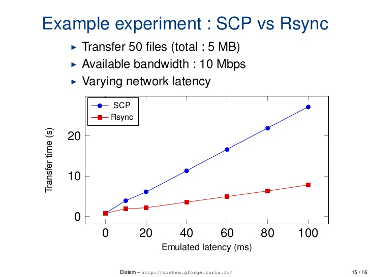

# `rsync` vs `scp`



tl;dr
scp == small scale (with room to build compressed files on the same drive)
rsync == large scale (with the necessity to backup large data and no room left)

## RSYNC

* `rsync` also copies files locally or over a network. But it employs a special delta transfer algorithm and a few optimizations to make the operation a lot faster. Consider the call.

* `rsync` will check files sizes and modification timestamps of both A and B, and skip any further processing if they match.

* If the destination file B already exists, the delta transfer algorithm will make sure only differences between A and B are sent over the wire.

* `rsync` will write data to a temporary file T, and then replace the destination file B with T to make the update look "atomic" to processes that might be using B.

* `rsync` has a plethora of command line options, allowing the user to fine tune its behavior. It supports complex filter rules, runs in batch mode, daemon mode, etc. scp has only a few switches.

* When dealing with large files, use rsync with the -P option. If the transfer is interrupted, you can resume it where it stopped by reissuing the command.

* `rsync` is comparatively more optimise and speed

* recurring tasks, like `cron` jobs, use `rsync`. As mentioned, on multiple invocations it will take advantage of data already transferred, performing very quickly and saving on resources. It is an excellent tool to keep two directories synchronized over a network.

* rsync : If the above rsync session itself gets interrupted, you can resume it as many time as you want by typing the same command. rsync will automatically restart the transfer where it left off.

1. incrementanl data's
2. rsync will not be faster but data's integrity and If you repeat the copy, rsync may be faster as it only transfers differences in files.
3. rsync isn't necessarily encrypted and not more secure if want use rsync -avze ssh, then rsync would be as secure
4. Before a file is transferred rsync takes the checksums,After a file is transferred the receiver verifies the data integrity
5. rsync can also exclude certain subdirectories/files using the --exclude flag, scp can't do that.
6. `-P` flag which will display a progress. same as --partial --progress, allowing rsync to work with partially downloaded files. The --rsh=ssh option tells rsync to use ssh as a remote shell.
7. it automatically verifies if the transferred file has been transferred correctly. Scp will not do that,

Example:
Sending folder to remote location using rsync 
```bash
rsync -avzWe ssh --include 'R*' --exclude '*' --progress oracle@192.168.2.181:/home/oracle
rsync -avzWe ssh   --progress /home/oracle/database oracle@192.168.2.181:/home/oracle/
```

W-you can see the bandwidth

## SCP

scp basically reads the source file and writes it to the destination. It performs a plain linear copy, locally, or over a network.

use `scp` for your day to day tasks. Commands that you type once in a while on your interactive shell. It's simpler to use, and in those cases rsync optimizations won't help much.

* `scp` is relatively less optimise and speed
* `scp` command line tool cannot resume aborted downloads from lost network connections
* scp is more secure. You have to use rsync --rsh=ssh to make it as secure as scp.


1. Overwrite the data's
2. scp will be faster
4. scp does not have such checksums mechanism
5. not having --exclude flag option
6. Here is not flag option's.
7. scp not verifies if the transferred file has been transferred correctly.

Example:
Sending folder to remote location using SCP

Remote to local copy:
```bash
scp -r username@hostname:/home/oracle/database /local/path
```
Loacl to remote Copy:
```bash
scp -r /home/oracle/database oracle@192.168.2.181:/home/remote/path
```

## Links 
man document to know more :

scp : http://www.manpagez.com/man/1/scp/
rsync : http://www.manpagez.com/man/1/rsync/